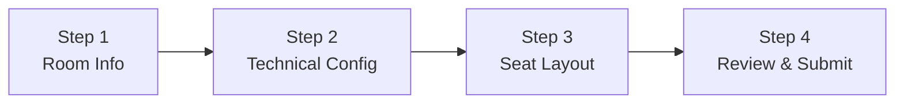
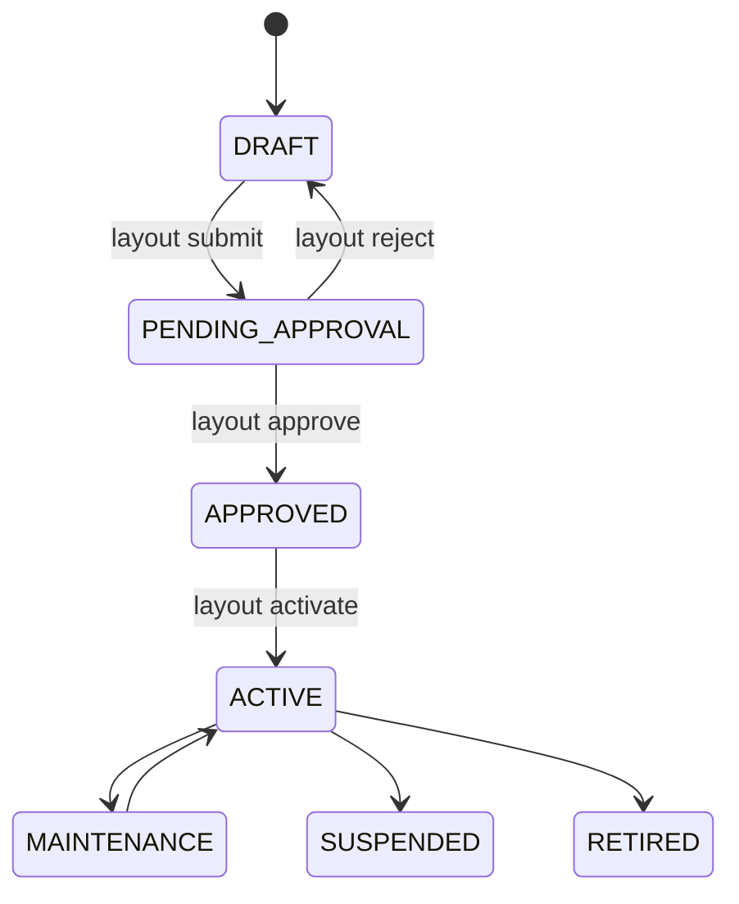
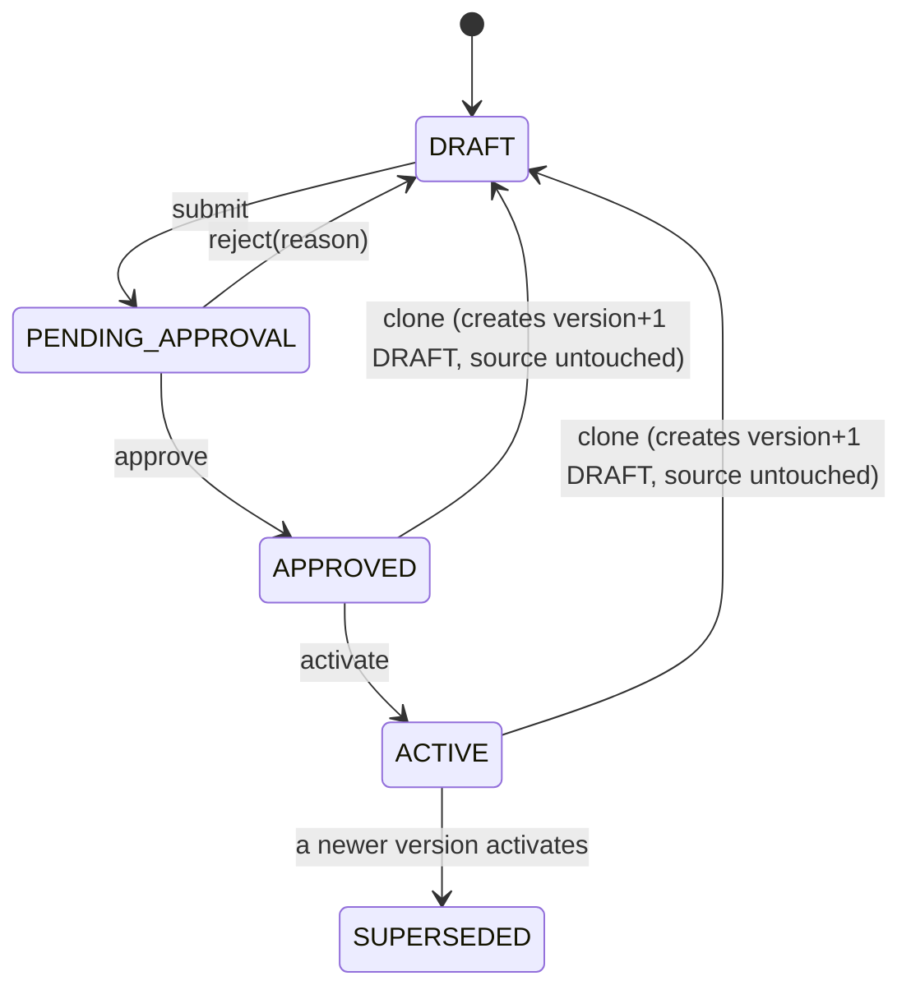

# Cinema Room Creation Flow

> Scope: the wizard-based Cinema Room creation flow added on top of `movie-service`'s
> existing quick-create path (`AddCinemaRoomModal` — now removed from the UI but the
> backend endpoint it used still works unchanged). Covers the 4-step wizard, the
> Room/Layout approval state machines, layout versioning, and capacity semantics.
>
> Related: [`CINEMA_ROOM_BUSINESS_RULES.md`](./CINEMA_ROOM_BUSINESS_RULES.md),
> [`api-specs/movie-service/API_CONTRACT.md`](./api-specs/movie-service/API_CONTRACT.md).

## 1. Why this exists

The previous "Add Cinema Room" modal captured only row/zone *percentages*
(`standardRowCount` / `vipRowCount` / `coupleRowCount`) and generated seats in one
shot from a hard-coded `RoomType` (`STANDARD` / `LARGE` / `IMAX`) that also capped
capacity. There was no per-seat authoring, no aisles/exits/empty space, no couple
seat *grouping* (just a `colSpan=2` seat type), and no approval workflow before a
room went live.

This feature adds an **additive** authoring layer: a new `room_layout` /
`room_layout_position` table pair that the wizard edits, versioned and
approval-gated, which only gets synced into the existing operational `seat` table
when a layout version is explicitly **activated**. Nothing about the legacy
quick-create flow, `Seat`, `ShowTime`, or `ShowtimeSeat` was changed in a
backward-incompatible way — see [Compatibility](#7-backward-compatibility) below.

## 2. The 4-step wizard

### P1 quick-start paths

Clicking **Add Room** first opens a creation-method dialog with two safe paths:

- **Create new room:** opens the editor, where a database template fills commercial tier, projection, resolution, audio,
  2D/3D flags, seat-grid defaults and layout-generation rules, then generates a
  complete local draft. Templates come from `room_configuration_template` via
  `GET /api/cinema-room-master-data`; the frontend does not hardcode the combinations.
- **Duplicate existing room:** copies the same technical fields plus the source
  room's active layout before opening the editor. The selected source is carried
  by `/rooms/new?duplicateFrom={roomId}`, making reload behavior deterministic.

Both paths deliberately preserve Room Code, Room Name, room dimensions and
screen measurements. Those values identify a specific physical auditorium and
must be confirmed from engineering data. The duplicate choice is explicit in the
entry dialog; applying a database template over existing editor work still requires
confirmation. Nothing is persisted until the operator chooses **Save Draft**.

### P0 presentation and audio visualization

`Presentation System` is stored independently from projection technology. P0
supports `STANDARD`, `IMAX`, `DOLBY_CINEMA`, and `SCREENX`: ScreenX renders
three conceptual display surfaces, while IMAX and Dolby Cinema remain a single
screen even when the installed system may contain multiple projectors. Audio
5.1, 7.1, and Atmos render conceptual coverage zones around the authored seat
map. These indicators are not an engineering installation plan; visualization
metadata remains frontend-owned until the P1 master-data profile rollout.

The `Premium Laser` reference starts with 11 rows (A-K) and 14 physical positions
per row: two seats, aisle, eight seats, aisle, two seats; rows A-D are Standard,
E-J are VIP and K is Couple. Couple-aware aisle generation always leaves even
seat runs, so `Luxury Atmos` cannot generate a stranded half of a Couple group.

Route: `/admin/clusters/:clusterId/rooms/new` (draft in progress: `/admin/clusters/:clusterId/rooms/:roomId/edit`,
which the wizard navigates to automatically once Step 1 is saved, so a page reload
resumes the same draft instead of losing it).

### Step 1 — Room Info

Cluster (read-only — rooms are always created inside the cluster you opened the
wizard from), room code (trimmed + uppercased), room name, commercial service
tier (`STANDARD` / `PREMIUM` / `LUXURY` / `PRIVATE`, supplied as
`auditoriumClassId` master data), length/width/clear height in meters. The
service tier is for display/filtering/reporting and never determines seat mix,
capacity, projection or audio. Floor area
(`length × width`) is computed and read-only. "Continue" persists the room as a
new `DRAFT` room via `POST /api/cinema-rooms` (`wizardMode: true`), which also
creates an empty `room_layout` version 1 shell.

### Step 2 — Technical Config

Projection technology, resolution, screen width/height, audio format (all master
data or plain numbers), 2D/3D support checkboxes. Aspect ratio
(`screenWidth / screenHeight`) is computed live with a non-blocking hint when it's
close to 1.85 (Flat) or 2.39 (Scope). Screen dimensions exceeding the room's
width/clear height from Step 1 are flagged inline (still enforced authoritatively
server-side — see business rules).

### Step 3 — Seat Layout

Generator inputs (expected rows, max positions/row, first row label, numbering
direction) build an initial all-Standard-seat grid client-side
(`generateInitialGrid` in `wizardUtils.ts`, mirroring the backend's Excel-style row
labeling). The grid is then edited directly:

- Click a cell to select it; **Ctrl/Cmd-click** to add/remove individual cells;
  **Shift-click** to select a range within the same row; click a row label to
  select the whole row.
- A toolbar assigns the selection to Standard / VIP / Couple / Wheelchair
  (`ACCESSIBLE`) / Aisle / Exit / Empty space. **Couple** requires exactly 2
  adjacent same-row cells and assigns them a shared `seatGroupId`
  (`crypto.randomUUID()`), satisfying the "couple seats are an atomic pair"
  requirement.
- Undo/redo via toolbar buttons or Ctrl+Z / Ctrl+Shift+Z / Ctrl+Y, backed by an
  in-memory snapshot history inside `SeatGridEditor`.
- A live stats panel (Standard/VIP/Couple-groups/Couple-capacity/Wheelchair,
  total person capacity, sellable units) is computed client-side for immediate
  feedback — explicitly labeled an estimate, since the backend recomputes
  authoritatively on save (see [Capacity semantics](#5-capacity-semantics)).

"Continue" / "Save Draft" persists the grid via
`PUT /api/cinema-rooms/{roomId}/layouts/{layoutId}`.

### Step 4 — Review & Submit

Read-only summary of everything captured, the same seat grid rendered read-only
(`SeatGridEditor ... readOnly`), and a validation summary (empty layout, missing
room code/auditorium class, zero sellable seats). No status dropdown — the only
actions are Back / Save Draft / Submit for Approval.

## 3. State machines

### Room status

`CinemaRoomStatus` also keeps its pre-existing legacy operational values
(`ACTIVE`, `MAINTENANCE`, `TEMPORARILY_UNAVAILABLE`, `CLOSED`) used by the
quick-create flow and the maintenance-report feature — those are untouched.

Room status is **driven by its current layout's lifecycle**: submitting,
approving, or activating a `RoomLayout` also transitions the parent `CinemaRoom`
(see `RoomLayoutService.submit/approve/activate`). `MAINTENANCE` / `SUSPENDED` /
`RETIRED` remain settable afterward via the existing
`PATCH /api/cinema-rooms/{id}/status` endpoint.

### Layout status

Authorization mirrors `CinemaClusterController`'s pattern exactly: create /
update / save / submit / clone are `ADMIN` or `EMPLOYEE`; approve / reject /
activate are `ADMIN` only (activate has real operational impact — it syncs the
`seat` table — so it's stricter than submit). Every transition is guarded
server-side (`RoomLayoutService`, throwing `ROOM_LAYOUT_INVALID_TRANSITION` /
`ROOM_INVALID_TRANSITION` on an illegal jump) and logged to
`room_layout_audit_log`, mirroring `cluster_audit_log`.

## 4. Layout versioning

- First room creation → layout **version 1**, `DRAFT`.
- Editing while `DRAFT` never bumps the version — `PUT .../layouts/{layoutId}`
  replaces the position set in place.
- `APPROVED` / `ACTIVE` layouts are immutable
  (`ROOM_LAYOUT_NOT_EDITABLE` if you try to `PUT` one). To change an
  active/approved layout, **clone** it — `POST .../layouts/{layoutId}/clone`
  creates version *N+1* as a new `DRAFT` with the same positions, ready to edit.
- Activating a new version supersedes the previous `ACTIVE` version
  (`SUPERSEDED`) and syncs the `seat` table (see next section). Old versions are
  never deleted — they stay queryable via `GET .../layouts` for audit.
- Only one `ACTIVE` layout per room at a time
  (`uq_room_layout_single_active` partial unique index).
- **Activation guard:** if the room already has an `ACTIVE` layout and any
  `ShowTime` for that room is `SCHEDULED` or `ON_SALE` with `showDate` today or
  later, activating a *different* version is blocked
  (`ROOM_LAYOUT_HAS_FUTURE_SHOWTIMES`). First-ever activation (room has no prior
  `ACTIVE` layout) is always allowed. This is a deliberately simple, conservative
  policy — no partial reconciliation is attempted (see
  [scope cuts](./CINEMA_ROOM_BUSINESS_RULES.md#scope-cuts-out-of-scope-this-sprint)).

## 5. Capacity semantics

`personCapacity` and `sellableUnitCount` on `RoomLayout` are **always
backend-computed** (`RoomLayoutService.recomputeCapacity`) — the frontend's live
stats panel is an estimate only, never trusted as input:

| Seat type | Person capacity | Sellable units |
|---|---|---|
| `STANDARD` | 1 | 1 |
| `VIP` | 1 | 1 |
| `ACCESSIBLE` (wheelchair) | 1 | 1 |
| `COUPLE` (2 positions, 1 `seatGroupId`) | 2 | 1 (counted once per group, not per position) |

`AISLE` / `EXIT` / `EMPTY_SPACE` positions contribute 0 to both.

## 6. Seat table sync on activation

`Seat` (the table `ShowTime`/`ShowtimeSeat`/booking reference) is untouched by
layout authoring — it only changes when a layout **activates**
(`RoomLayoutService.syncSeatsFromLayout`):

1. Every `SEAT` position becomes one "sellable unit" — a Couple pair (2
   positions sharing a `seatGroupId`) collapses to **one** unit, matching the
   existing `SeatType.COUPLE` + `colSpan=2` convention already used by pricing
   and the legacy seat generator.
2. Each unit's `Seat.colNumber` is derived from the position's own **physical
   `columnIndex`** (`columnIndex + 1`), not a re-derived "nth seat in row"
   count. This is deliberate: a sequential count would shift whenever an
   earlier position in the row is added or removed, silently reassigning an
   existing (possibly already-booked) `Seat`'s identity onto a different
   physical seat instead of retiring it. Matching on the stable physical
   coordinate avoids that.
3. Existing `Seat` rows matched by `(rowLabel, colNumber)` are updated in place
   — **`Seat.id` is preserved**, so any `ShowtimeSeat` referencing it keeps
   pointing at the same seat.
4. New coordinates get new `Seat` rows (price defaults to a flat base price ×
   the seat type's price multiplier — see business rules).
5. `Seat` rows whose coordinate no longer appears in the new layout are
   **soft-retired** (`status = INACTIVE`), never deleted.

## 7. Backward compatibility

- The legacy `POST /api/cinema-rooms` payload (no `wizardMode`/dimension
  fields) behaves **exactly as before**: flat `Seat` generation from
  `numberOfRows`/`seatsPerRow`/zone counts, room created `ACTIVE` immediately.
- `CinemaRoomStatus` gained new values additively — existing
  `ACTIVE`/`MAINTENANCE`/`TEMPORARILY_UNAVAILABLE`/`CLOSED` rows and queries are
  untouched.
- `RoomDetailPage` (the read-only seat-grid viewer) and `GET
  /api/cinema-rooms/{id}/seats` are unchanged and work for both legacy and
  wizard-created rooms once activated.
- The old single-step "Add Cinema Room" modal (`AddCinemaRoomModal.tsx`) has
  been removed from the UI (its only caller, `ClusterDetailPage`'s "Add Room"
  button, now opens the wizard) since it hard-coded the seat-ratio-by-RoomType
  anti-pattern this feature replaces — but its backend endpoint is still fully
  functional for API-level/Postman testing.

**Gotcha for future maintainers:** `cinema_room` still carries the legacy
`numberOfRows`/`seatsPerRow`/`standardRowCount`/`vipRowCount`/`coupleRowCount`
columns, and migrations `V13`/`V14` put real `CHECK` constraints on them
(`chk_room_row_allocation_total`: the three row counts must sum to
`numberOfRows`; `chk_room_has_single_seat_row`: `standardRowCount +
vipRowCount > 0`). Wizard rooms don't use these columns for anything
meaningful, but every write to `CinemaRoom` — including `createWizardRoom`
and `RoomLayoutService.activate`'s legacy-bridge update — must still leave
them in a state that satisfies both constraints (see the placeholder values
used in each). **The `@SpringBootTest` Testcontainers integration test does
not catch violations of these constraints**, because it runs with
`spring.jpa.hibernate.ddl-auto=create-drop`, which generates schema purely
from JPA annotations and does not include hand-written SQL `CHECK`
constraints from the migration files. This was caught only by manually
exercising the live API against a database that had `V18` applied on top of
the real `V13`/`V14` history — worth doing again after any future change to
these fields, or worth eventually switching the integration test to run
against the real migrations instead of Hibernate-generated schema.
