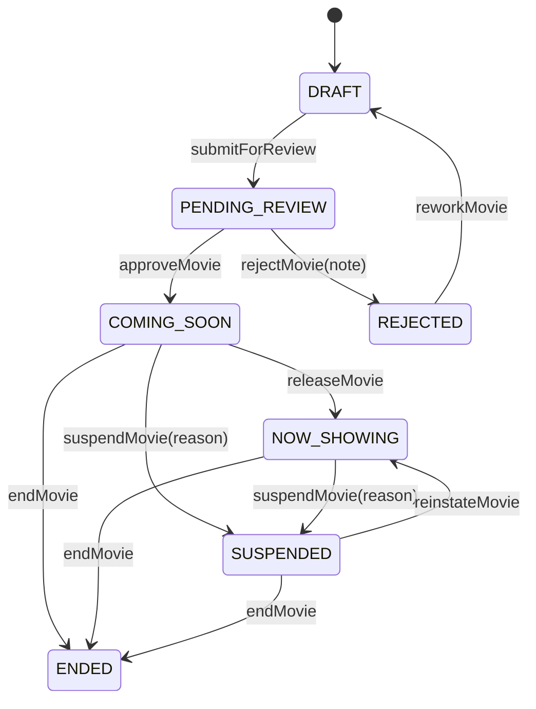
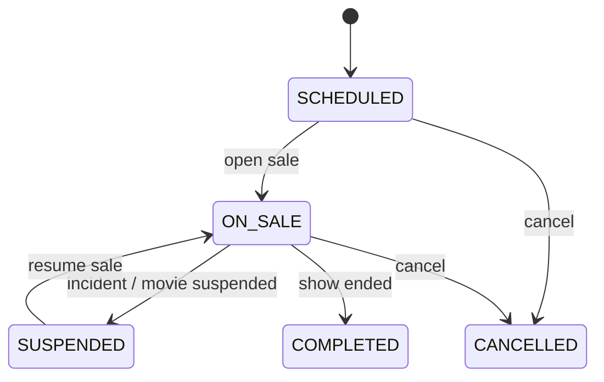

# Movie Service Business Rules

> Scope: `movie-service` module - movie catalog, TMDB import, genres, formats, people/cast, cinema rooms, seats, showtimes, showtime seats, and cross-service contract with booking-service.
>
> Purpose: This document captures the priority business rules commonly expected in cinema/theater operations. Use it as the reference before coding issues, reviewing MRs, or changing API contracts.

## Priority Legend

| Priority | Meaning | Required Before Merge |
| --- | --- | --- |
| P0 | Revenue, booking correctness, data integrity, or customer-visible availability can break. | Must be implemented or explicitly marked as a known blocker. |
| P1 | Important operational rule that prevents admin mistakes or inconsistent catalog data. | Should be implemented in the sprint when touching the related module. |
| P2 | Nice-to-have rule, reporting improvement, or data-quality enhancement. | Can be backlog unless the issue specifically targets it. |

## Core Ownership

| Domain | Owned By `movie-service` | Not Owned By `movie-service` |
| --- | --- | --- |
| Movie catalog | Movie metadata, translations, genres, formats, age rating, images, cast, production company, status lifecycle. | User accounts, customer profiles, payment, promotions. |
| Cinema operations | Rooms, room status, seats, seat layout, maintenance status. | Employee HR profile, staff scheduling. |
| Showtime inventory | Showtime date/time, room allocation, showtime status, showtime-seat snapshot and base prices. | Booking transaction state and payment confirmation. |
| Seat availability contract | Expose showtime seats and receive/reflect reserved/sold/cancelled states when integrated. | Final booking lifecycle is owned by booking-service. |

## Movie Catalog Rules

### MOV-P0-001 - Movie Must Have A Controlled Lifecycle

Business reason: Cinemas should not publish a movie immediately after creation. Catalog data usually needs review for title, age rating, assets, trailer, cast, and showtime readiness.

Allowed lifecycle:

Rules:

- Newly created/imported movies must start as `DRAFT`.
- Public customer APIs must only expose `COMING_SOON` and `NOW_SHOWING`.
- `DRAFT`, `PENDING_REVIEW`, `REJECTED`, `SUSPENDED`, and `ENDED` are admin/internal states.
- A rejected movie must store `rejection_note`.
- A suspended movie must store `suspended_reason`.
- A movie in `DRAFT`, `PENDING_REVIEW`, or `REJECTED` must not be ended directly.
- Status transitions must be explicit API actions, not generic update payload side effects.

Current code reference:

- `MovieStatus`
- `MovieService.createMovie`
- `MovieService.submitForReview`
- `MovieService.approveMovie`
- `MovieService.rejectMovie`
- `MovieService.releaseMovie`
- `MovieService.suspendMovie`
- `MovieService.reinstateMovie`
- `MovieService.endMovie`
- `MovieService.findAllPublic`

Implementation notes:

- The lifecycle exists in service code.
- Review/suspend/reject notes should be checked in validation before merge if an issue touches status APIs.
- Any frontend button should map to a lifecycle action, not mutate `status` directly through the generic update form.

### MOV-P0-002 - Do Not Physically Delete Movies With Business History

Business reason: Movie records are referenced by showtimes, bookings, reports, audits, and historical customer orders.

Rules:

- Movie deletion must be soft deletion by lifecycle state, normally `ENDED`.
- Deletion/end action must be blocked if the movie has future showtimes.
- Existing showtime, booking, or reporting data must remain readable after a movie is ended.
- Admin list may show ended movies; customer list must hide them.

Current code reference:

- `MovieService.deleteMovie`
- `ShowTimeService.existsMovie`
- Error: `ACTIVE_SHOWTIMES_EXIST`

### MOV-P0-003 - Movie Identity Must Prevent Duplicate Imports

Business reason: Duplicated movies split showtimes, revenue reports, cast records, and customer browsing.

Rules:

- `tmdb_id` must be unique when a movie is imported from TMDB.
- `imdb_id` should be unique when present.
- Manual creation should reject duplicate titles when the business treats them as the same movie.
- If a remake or same-title movie exists, staff must distinguish by release year and original title.

Current code reference:

- `Movie.tmdbId`
- `Movie.imdbId`
- `TmdbService.importMovie`
- Error: `TMDB_MOVIE_ALREADY_EXISTS`
- Error: `MOVIE_ALREADY_EXISTS`

Implementation notes:

- Current duplicate guard checks `originalTitle` on manual create.
- For production, prefer duplicate policy: `tmdb_id` first, then `(normalized original_title, release_year)`.

### MOV-P0-004 - Required Metadata Before Public Release

Business reason: A movie cannot be sold confidently if duration, age rating, title, poster, and language display data are incomplete.

Rules before moving to `COMING_SOON` or `NOW_SHOWING`:

- `original_title` is required.
- `duration_minutes` must be positive and operationally realistic.
- At least one customer-facing translation should exist, preferably `vi`.
- At least one genre should exist.
- At least one screening format should exist.
- Age rating should exist before showtimes are opened for sale.
- Poster/thumbnail should exist for customer-facing pages.
- Trailer URL is optional but recommended.

Current code reference:

- `Movie`
- `MovieTranslation`
- `MovieService.createMovie`
- `TmdbService.getDetails`
- `TmdbService.importMovie`

Implementation notes:

- Some required checks are enforced by DB/entity fields.
- Approval-specific completeness validation is recommended as a P0 rule if Sprint 3 includes approval workflow.

### MOV-P1-005 - Translations Are Separate Business Data

Business reason: Cinemas in Vietnam commonly display Vietnamese title/synopsis while still preserving original/English metadata for search and integration.

Rules:

- Store each localized title/synopsis in `movie_translation`.
- Use ISO-like language codes such as `vi`, `en`, `ko`, `ja`, `zh`.
- `original_title` must not be overwritten by Vietnamese display title.
- Customer API may filter translations by `lang`.
- If requested language is missing, fallback should be deterministic: `vi -> en -> original_title`.

Current code reference:

- `MovieTranslation`
- `MovieTranslationId`
- `MovieService.getMovieByLang`
- `TmdbService.saveTranslations`
- `TmdbService.buildTranslationPreview`

Implementation notes:

- Current implementation supports storing `en` and `vi` from TMDB.
- Fallback behavior should be reviewed on frontend and mapper output.

### MOV-P1-006 - Genres And Formats Are Lookup Data

Business reason: Genre/format values power filtering, pricing, analytics, and customer navigation; free text creates reporting chaos.

Rules:

- Genres must be maintained as lookup records, not free-text strings on movie.
- Genre names/codes must be unique.
- Screening formats must be maintained as lookup records, not free-text strings.
- Format surcharge must be controlled at format level when used for pricing.
- A movie can have multiple genres and multiple screening formats.

Current code reference:

- `Genre`
- `ScreeningFormat`
- `Movie.genres`
- `Movie.formats`
- `GenreService`
- `TmdbService.resolveGenres`

### MOV-P1-007 - People Are Reusable; MovieCast Is The Role Assignment

Business reason: One person may be actor in one movie, director in another, or both in the same movie. The role belongs to the movie-person relationship, not to the person record.

Rules:

- `person` stores reusable human profile: name, birth date, nationality, photo, biography, TMDB ID.
- `movie_cast` stores role-specific data: `role_type`, `character_name`, `billing_order`.
- Do not create separate actor/director tables.
- `character_name` should only be used for `ACTOR`.
- `billing_order` should reflect customer-facing credit order for cast display.
- `(movie_id, person_id, role_type)` must be unique.
- Deleting a movie can cascade its cast assignments, but deleting a person referenced by cast should be restricted.

Current code reference:

- `Person`
- `MovieCast`
- `CastRequest`
- `CastResponse`
- `MovieService.saveCast`
- `TmdbService.saveCast`
- `TmdbService.buildCastPreview`

### MOV-P1-008 - Movie Images Should Support Multiple Display Purposes

Business reason: Cinemas need poster, thumbnail, banner, carousel, and gallery images in different contexts.

Rules:

- Poster and thumbnail on movie are primary convenience fields.
- Additional images should be stored in `movie_image`.
- Images should have display order and purpose/type when the UI needs carousel or gallery.
- Upload must reject unsupported types and oversized files.
- Customer pages should never depend on local temporary files.

Current code reference:

- `Movie.posterUrl`
- `Movie.thumbnailUrl`
- `Movie.images`
- `MovieService.uploadMovieImage`
- Error: `INVALID_IMAGE_FILE`

Current limit:

- Accepted MIME types: JPEG/JPG/PNG/WebP.
- Max upload size: 5 MB.

### MOV-P1-009 - Movie Has No Standalone End Date

Business reason: A movie's exhibition window is per cinema cluster, not a single global date on the movie itself. `Movie.endDate` was a vestigial field left over from a pre-refactor lifecycle and was never the authoritative source for when a movie stops showing.

Rules:

- `movie.end_date` does not exist; the movie entity only carries `releaseDate`.
- The actual exhibition window (when a cluster stops showing a movie) is tracked per cluster on `MovieAvailability.showingEndDate`.
- Neither the Movie Editor UI nor the create/update APIs accept an end date for a movie.

Current code reference:

- `Movie` (no `endDate` field)
- `MovieAvailability.showingEndDate`

## TMDB Import Rules

### TMDB-P0-001 - TMDB Import Must Be Idempotent

Business reason: Staff may search/import the same movie more than once. The system must avoid duplicates.

Rules:

- Import by TMDB ID must check existing `tmdb_id`.
- Import should be transactional: movie, translations, cast, company, genres, formats, and age rating should either all save or fail together.
- Failed optional TMDB sub-calls such as credits/translations may degrade gracefully, but core movie details failure should fail the import.

Current code reference:

- `TmdbService.importMovie`
- `TmdbService.fetchMovieDetail`
- `TmdbService.fetchCredits`
- `TmdbService.fetchTranslations`

### TMDB-P1-002 - TMDB Is A Data Source, Not The Source Of Business Truth

Business reason: TMDB data can be incomplete, localized differently, or inappropriate for local cinema operations.

Rules:

- Imported movies still start as `DRAFT`.
- Staff must review before public release.
- Local age rating should prefer Vietnam certification where available.
- If Vietnam certification is absent, US MPAA may be mapped to local codes as fallback.
- Production companies and people should be upserted, not blindly duplicated.
- TMDB poster path should be converted to a full image URL.

Current code reference:

- `TmdbService.US_CERT_TO_LOCAL`
- `TmdbService.resolveAgeRating`
- `TmdbService.upsertCompany`
- `TmdbService.upsertPerson`
- `TmdbService.buildPosterUrl`

### TMDB-P1-003 - TMDB Failure Must Not Look Like A Validation Error

Business reason: Staff needs to know whether they entered bad data or the external provider/network failed.

Rules:

- TMDB network/API failure should return a gateway-style error.
- DNS/network/API-key errors should be logged with technical detail server-side.
- Client-facing message should be clear but not expose API key or sensitive config.

Current code reference:

- Error: `TMDB_API_ERROR`
- `TmdbService.search`
- `TmdbService.fetchMovieDetail`

## Showtime Rules

### SHOW-P0-001 - Showtime Must Not Overlap In The Same Room

Business reason: A physical room cannot screen two movies at the same time.

Rules:

- For the same cinema room and show date, time ranges must not overlap.
- End time is calculated from start time plus movie duration.
- Overlap must be checked against both:
  - showtimes in the current request batch
  - showtimes already saved in the database
- Update must exclude the current showtime from the overlap check.

Current code reference:

- `ShowTimeService.validateLocalRequests`
- `ShowTimeService.validateWithDatabase`
- `ShowTimeService.createStandalone`
- `ShowTimeService.update`
- Error: `SHOWTIME_CONFLICT_IN_REQUEST`
- Error: `SHOWTIME_CONFLICT_IN_DATABASE`

### SHOW-P0-002 - Showtime Must Follow Operating Hours

Business reason: Cinemas have opening/closing hours and cannot schedule shows outside operational time.

Rules:

- Opening time: 08:00.
- Closing time: 23:00.
- Showtime start must be at or after opening time.
- Showtime end must be at or before closing time.
- End time should use movie duration, not user input.

Current code reference:

- `ShowTimeService.OPENING_TIME`
- `ShowTimeService.CLOSING_TIME`
- `ShowTimeService.createStandalone`
- `ShowTimeService.update`
- Error: `INVALID_SHOWTIME`

Implementation note:

- Legacy validation `validateStartTimes` checks start time only; current standalone create/update checks end time too. Prefer the stricter create/update rule.

### SHOW-P0-003 - Showtime Must Be Scheduled In Advance

Business reason: Cinemas need time for content review, staff planning, room preparation, ticket publication, and marketing.

Rules:

- Showtime date must be at least today plus 3 days.
- The rule applies to both create and update.
- Same-day or next-day emergency scheduling should require a separate privileged override if ever supported.

Current code reference:

- `ShowTimeService.validateShowDates`
- `ShowTimeService.createStandalone`
- `ShowTimeService.update`
- Error: `INVALID_SHOWDATE`

### SHOW-P0-004 - Showtime Deletion Must Not Break Future Sales

Business reason: A showtime with future business impact should not disappear without cancellation workflow.

Rules:

- Do not hard delete a future showtime.
- If future showtime has sales/reservations, use cancellation status and reason instead of deletion.
- Hard delete should be limited to draft/test/no-business-history cases.
- Customer-visible APIs must not show cancelled showtimes as available.

Current code reference:

- `ShowTimeService.deleteById`
- `ShowTimeStatus.CANCELLED`
- Error: `ACTIVE_SHOWTIMES_EXIST`

Implementation notes:

- Current delete checks future showtime and blocks deletion.
- A dedicated cancel API with `cancellation_reason`, `cancelled_at`, and `cancelled_by` is recommended.

### SHOW-P0-005 - Showtime Status Controls Selling

Business reason: Displaying a showtime is not the same as selling tickets.

Recommended lifecycle:

Rules:

- `SCHEDULED`: created but not necessarily open for sale.
- `ON_SALE`: customers can book.
- `SUSPENDED`: temporarily unavailable; existing seat states should be preserved.
- `CANCELLED`: customers cannot book; showtime seats should become unavailable/cancelled.
- `COMPLETED`: historical only.

Current code reference:

- `ShowTimeStatus`
- `ShowTime.status`

Implementation notes:

- Current create uses `SCHEDULED`.
- Open-sale/cancel/complete transitions should be implemented as explicit APIs if not already done.

### SHOW-P1-006 - Showtime Language And Subtitle Must Be Explicit

Business reason: Customers choose showtimes partly based on audio/subtitle language.

Rules:

- `language_code` represents audio language.
- `subtitle_code` represents subtitle language.
- Default audio language may be `vi`, but staff should be able to set it.
- Customer UI should display language/subtitle when multiple variants exist.

Current code reference:

- `ShowTime.languageCode`
- `ShowTime.subtitleCode`
- `ShowTimeService.createStandalone`

## Seat And Pricing Rules

### SEAT-P0-001 - Showtime Seats Must Be Snapshots

Business reason: If the room layout or seat price changes later, already-created showtimes must remain historically consistent.

Rules:

- `seat` is the room master seat.
- `showtime_seat` is the seat snapshot for a specific showtime.
- Snapshot fields include `seat_code`, `seat_type`, and `price`.
- Changing room master seats should not silently change existing showtime seats.
- `(showtime_id, seat_id)` must be unique.

Current code reference:

- `Seat`
- `ShowtimeSeat`
- `ShowTimeService.getSeatsByShowtime`

Implementation notes:

- Current code lazy-generates showtime seats when seats are requested.
- For production, prefer generating showtime seats when opening sale to avoid first-customer latency and race conditions.

### SEAT-P0-002 - Seat Availability Must Be State-Based

Business reason: Booking concurrency depends on clear seat states.

Rules:

- `AVAILABLE`: customer can select.
- `RESERVED`: temporarily held during checkout.
- `SOLD`: confirmed booking/payment.
- `BLOCKED`: unavailable due to maintenance/VIP hold/internal reason.
- `CANCELLED`: no longer sellable because showtime was cancelled.
- Expired reservations must be treated as available and cleaned up.

Current code reference:

- `ShowtimeSeatStatus`
- `ShowtimeSeat.reservedAt`
- `ShowtimeSeat.reservedExpiresAt`
- `ShowTimeService.lockSeats`
- `ShowTimeService.toDto`

Implementation notes:

- Current lock duration in movie-service is 15 minutes.
- Booking-service also has seat lock logic. Decide one owner for final locking to avoid split-brain availability.

### SEAT-P0-003 - Booking-Service Contract Must Be Stable

Business reason: Booking-service depends on movie-service to know valid showtime seats and prices.

Rules:

- `movie-service` should expose immutable showtime-seat IDs/codes for a showtime.
- Booking-service should not invent seat price independently.
- Booking-service may own booking transaction and payment status.
- Movie-service should receive or expose enough state to prevent double selling.
- Cross-service IDs must not rely on database foreign keys across services.

Current code reference:

- `ShowtimeSeat.bookingId`
- `ShowtimeSeatDto`
- `ShowTimeService.getSeatsByShowtime`
- `docs/api-specs/booking-service/API_CONTRACT.md`

Implementation notes:

- `booking_id` is intentionally a cross-service UUID-like value, not a DB FK.
- Price ownership should be clarified before Sprint 3 booking/payment work.

### SEAT-P1-004 - Seat Count Must Respect Room Type

Business reason: Room capacity affects safety, layout, pricing, and operational reporting.

Rules:

- Room creation must reject capacity greater than the room type maximum.
- Seat generation should create exactly the requested capacity.
- `total_seat_capacity` must match generated active seats unless there is a clear maintenance/blocked-seat reason.

Current code reference:

- `CinemaRoomService.createCinemaRoom`
- `RoomType.getMaxSeats`
- Error: `SEAT_QUANTITY_EXCEEDS_LIMIT`

## Cinema Room Rules

### ROOM-P0-001 - Unavailable Rooms Must Not Receive New Showtimes

Business reason: A room under maintenance or closed cannot be scheduled for screenings.

Rules:

- Only `ACTIVE` rooms should be schedulable.
- `MAINTENANCE`, `TEMPORARILY_UNAVAILABLE`, and `CLOSED` rooms should block new showtime creation.
- Existing future showtimes in an unavailable room should be reviewed for cancellation or reassignment.

Current code reference:

- `CinemaRoomStatus`
- `CinemaRoomService.reportMaintenance`
- `CinemaRoomService.setRoomStatus`
- `ShowTimeService.createStandalone`

Implementation note:

- Current showtime creation verifies room existence but should also check room status.

### ROOM-P1-002 - Maintenance Must Be Auditable

Business reason: Room downtime affects revenue and customer experience; operations need reason and resolution history.

Rules:

- Reporting maintenance must create a maintenance record.
- Maintenance should set room status to unavailable.
- Resolution must store `resolved_at`, `resolved`, and `resolution_note`.
- Room should return to `ACTIVE` only when there are no open maintenance records.

Current code reference:

- `CinemaRoomMaintenance`
- `CinemaRoomService.reportMaintenance`
- `CinemaRoomService.resolveMaintenance`

Implementation note:

- Current method name variable `hasOpenMaintenance` appears logically inverted: it stores `isEmpty()`. Keep this in mind during review.

## Audit And Authorization Rules

### AUD-P0-001 - Critical Actions Must Be Audited

Business reason: Catalog publication, movie suspension, room maintenance, and showtime cancellation affect customers and revenue.

Rules:

- Audit create/update/status changes for movies.
- Audit room creation and maintenance changes.
- Audit showtime cancellation/open-sale changes.
- Audit should capture actor/account ID, target entity, action type, old status, new status, note/reason, and timestamp.

Current code reference:

- `MovieActionLog`
- `AuditLogService`
- `MovieService.createMovie`
- `CinemaRoomService.createCinemaRoom`

Implementation notes:

- Current code logs some create actions.
- Status transition methods should consistently log old/new status.

### AUD-P0-002 - Role Permissions Should Match Business Risk

Business reason: Publishing movies, cancelling showtimes, and changing rooms should not be available to every staff role.

Recommended permission model:

| Action | Minimum Role |
| --- | --- |
| View public movies/showtimes | Anonymous/customer |
| Create/edit draft movie | Employee/Admin |
| Submit movie for review | Employee/Admin |
| Approve/reject movie | Admin/Manager |
| Suspend/reinstate movie | Admin/Manager |
| Create/update showtime | Admin/Manager |
| Cancel showtime | Admin/Manager |
| Manage rooms/seats | Admin/Manager |
| Import TMDB data | Employee/Admin |

Implementation notes:

- Keep role checks in Spring Security and/or method-level authorization.
- Do not trust frontend-only hidden buttons as authorization.

## Customer Visibility Rules

### VIS-P0-001 - Customer Catalog Must Only Show Sellable Or Marketable Movies

Business reason: Customers should not see drafts, rejected records, suspended movies, or ended movies.

Rules:

- Public list: only `COMING_SOON` and `NOW_SHOWING`.
- Public detail should reject or hide non-public statuses.
- Customer booking entry should only allow showtimes that are currently sellable.
- Admin list may show all statuses.

Current code reference:

- `MovieService.findAllPublic`

Implementation note:

- Verify public detail endpoint behavior separately; list filtering alone is not enough.

### VIS-P1-002 - Coming Soon And Now Showing Are Different UX States

Business reason: A coming-soon movie is for marketing; a now-showing movie is for conversion/booking.

Rules:

- `COMING_SOON` may show movie detail, trailer, release date, and reminder-like CTA.
- `NOW_SHOWING` may show booking CTA when showtimes are on sale.
- `COMING_SOON` should not imply ticket availability unless showtimes are explicitly open for presale.

## Validation Checklist For Movie-Service MRs

Use this before approving changes touching movie-service:

- [ ] Does this change preserve movie lifecycle transitions?
- [ ] Does this change keep public/admin visibility separated?
- [ ] Does this change avoid hard deleting records with business history?
- [ ] Does this change prevent duplicate movies/imports?
- [ ] Does this change validate lookup IDs instead of accepting free text?
- [ ] Does this change avoid room-time overlap for showtimes?
- [ ] Does this change keep showtime within operating hours?
- [ ] Does this change block scheduling too close to today?
- [ ] Does this change respect room status before scheduling?
- [ ] Does this change keep seat price/seat state consistent for booking-service?
- [ ] Does this change produce useful business error codes?
- [ ] Does this change update API contract docs when request/response changes?
- [ ] Does this change include tests for the touched P0 rules?

## Recommended Sprint 3 Focus

For Sprint 3, prioritize these movie-service rules first:

1. Enforce movie approval completeness before `PENDING_REVIEW -> COMING_SOON`.
2. Add/verify public detail filtering for non-public movie statuses.
3. Add explicit showtime open-sale/cancel APIs instead of relying on delete.
4. Block showtime creation for non-active rooms.
5. Clarify seat price ownership between movie-service and booking-service.
6. Generate showtime seats at sale-opening time or protect lazy generation with concurrency-safe logic.
7. Add audit logs for all movie/showtime status transitions.
8. Update `docs/api-specs/movie-service/API_CONTRACT.md` after finalizing endpoint behavior.

## Source References In This Repository

- `server/movie-service/src/main/java/movieservice/service/MovieService.java`
- `server/movie-service/src/main/java/movieservice/service/ShowTimeService.java`
- `server/movie-service/src/main/java/movieservice/service/TmdbService.java`
- `server/movie-service/src/main/java/movieservice/service/CinemaRoomService.java`
- `server/movie-service/src/main/java/movieservice/entity/Movie.java`
- `server/movie-service/src/main/java/movieservice/entity/ShowTime.java`
- `server/movie-service/src/main/java/movieservice/entity/ShowtimeSeat.java`
- `server/movie-service/src/main/java/movieservice/enums/MovieStatus.java`
- `server/movie-service/src/main/java/movieservice/enums/ShowTimeStatus.java`
- `server/movie-service/src/main/java/movieservice/exception/MovieErrorCode.java`
- `docs/db/movie_db_v2.dbml`
- `docs/api-specs/movie-service/API_CONTRACT.md`
