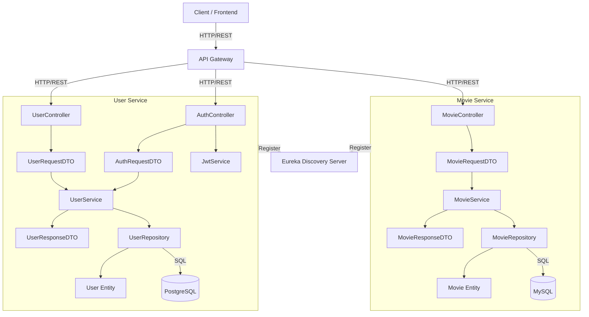

# Sprint 1 Component-Level Architecture Diagram

## Overview

This document describes the internal component architecture of the User Service and Movie Service in Sprint 1.

The architecture follows a layered design:

* Controller Layer
* DTO Layer
* Service Layer
* Entity Layer
* Repository Layer

All requests are routed through the API Gateway. Services register themselves with Eureka Discovery Server for service discovery.

---

## Component Architecture Diagram

## User Service

### Controller Layer

* AuthController
* UserController

### DTO Layer

* AuthRequestDTO
* UserRequestDTO
* UserResponseDTO

### Service Layer

* UserService
* JwtService

### Entity Layer

* User

### Repository Layer

* UserRepository

### Database

* PostgreSQL

### Request Flow

API Gateway → Controller → DTO → Service → Entity → Repository → PostgreSQL

---

## Movie Service

### Controller Layer

* MovieController

### DTO Layer

* MovieRequestDTO
* MovieResponseDTO

### Service Layer

* MovieService

### Entity Layer

* Movie

### Repository Layer

* MovieRepository

### Database

* MySQL

### Request Flow

API Gateway → Controller → DTO → Service → Entity → Repository → MySQL

---

## Service Discovery

Both services register themselves with Eureka Discovery Server during startup.

* User Service → Eureka Discovery Server
* Movie Service → Eureka Discovery Server

This enables dynamic service discovery and request routing through the API Gateway.

---

## Communication Protocols

| Source      | Destination   | Protocol             |
| ----------- | ------------- | -------------------- |
| Client      | API Gateway   | HTTP/REST            |
| API Gateway | Controllers   | HTTP/REST            |
| Controller  | DTO           | Object Mapping       |
| DTO         | Service       | Method Call          |
| Service     | Entity        | Business Processing  |
| Entity      | Repository    | JPA/Hibernate        |
| Repository  | Database      | SQL                  |
| Service     | Eureka Server | Service Registration |

---

## Architectural Pattern

The system follows:

* API Gateway Pattern
* Database-per-Service Pattern
* Service Discovery Pattern (Eureka)
* Layered Architecture (Controller → DTO → Service → Entity → Repository)
* Synchronous Communication using HTTP/REST
* Independent Databases for each Microservice