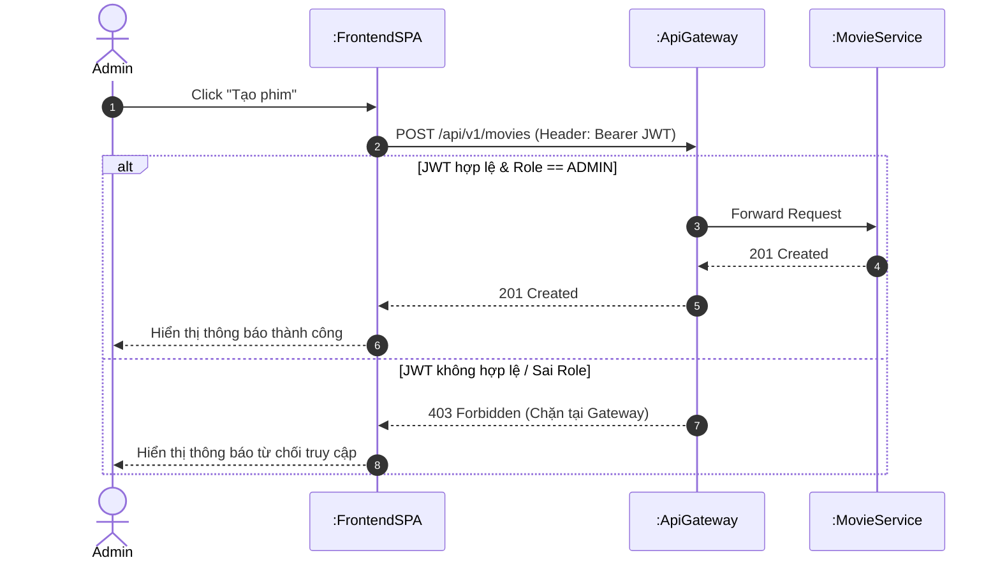

# Sequence Diagram Design Guideline

## 1. Introduction
Tài liệu này quy định các tiêu chuẩn, ký hiệu (notation) và cấu trúc bắt buộc khi vẽ Sequence Diagram cho dự án **Movie Theater Management System**. Việc tuân thủ hướng dẫn này giúp đảm bảo tính đồng bộ, chuyên nghiệp và giúp Mentor dễ dàng thẩm định luồng đi của hệ thống.

---

## 2. Recommended Tools
Team thống nhất sử dụng một trong hai công cụ sau để vẽ nhằm đảm bảo khả năng chỉnh sửa chéo:
*   **Draw.io (giao diện kéo thả):** Sử dụng bộ thư viện hình khối chuẩn `UML`.
*   **PlantUML / Mermaid (gõ code sinh hình):** Khuyên dùng vì dễ lưu trữ, quản lý phiên bản (version control) bằng text ngay trên Git.

---

## 3. Lifelines & Naming Conventions
Các cấu phần tham gia vào biểu đồ (Lifelines) phải được sắp xếp theo thứ tự từ **Trái qua Phải** theo đúng luồng đi của dữ liệu. Tên cấu phần phải viết theo chuẩn PascalCase hoặc camelCase rõ ràng:

1.  **Actor:** Người dùng tương tác trực tiếp (`:Customer` hoặc `:Admin`).
2.  **Frontend Layout/Component:** Giao diện ứng dụng (`:FrontendSPA`).
3.  **API Gateway:** Cổng kiểm soát tập trung (`:ApiGateway`).
4.  **Backend Controller:** Nơi tiếp nhận HTTP Request (`:MovieController`, `:AuthController`).
5.  **Backend Service:** Nơi xử lý Business Logic (`:MovieService`, `:UserService`).
6.  **Repository:** Lớp tương tác CSDL (`:MovieRepository`, `:UserRepository`).
7.  **Database:** Hệ quản trị CSDL vật lý (`:MySQL_DB` hoặc `:PostgreSQL_DB`).

---

## 4. Message Notations (Quy chuẩn mũi tên)
Đây là phần dễ sai nhất và cần đặc biệt lưu ý. Mọi thành viên phải dùng chính xác loại mũi tên cho từng mục đích để thể hiện đúng bản chất giao tiếp. Dưới đây là quy chuẩn chi tiết (áp dụng cú pháp Mermaid - công cụ được khuyên dùng):

*   **1. Synchronous Call (Gọi đồng bộ):**
    *   **Ý nghĩa:** Khối gọi phải *chờ* khối được gọi xử lý xong và trả về kết quả thì mới đi tiếp. Điển hình là các lệnh gọi HTTP Request (REST API) hoặc hàm đợi kết quả.
    *   **Ký hiệu (Mermaid):** Mũi tên nét liền, có đầu nhọn (`->>`).
    *   *Ví dụ:* `Frontend->>Gateway: POST /api/v1/login`

*   **2. Asynchronous Call (Gọi bất đồng bộ):**
    *   **Ý nghĩa:** Khối gọi "bắn" thông điệp đi và tiếp tục xử lý việc của mình mà *không cần chờ* phản hồi (Fire-and-forget). Thường dùng cho Message Broker (Kafka/RabbitMQ) hoặc gửi Email.
    *   **Ký hiệu (Mermaid):** Mũi tên nét liền, đầu mở (`-)`).
    *   *Ví dụ:* `Service-)Kafka: Produce "TicketBookedEvent"`

*   **3. Return Message (Kết quả trả về):**
    *   **Ý nghĩa:** Phản hồi lại cho một lệnh gọi Synchronous trước đó (HTTP Response, Return data từ Database).
    *   **Ký hiệu (Mermaid):** Mũi tên nét đứt, có đầu nhọn (`-->>`).
    *   *Ví dụ:* `Gateway-->>Frontend: 200 OK (Kèm JWT Token)`

*   **4. Self-Message (Gọi hàm nội bộ):**
    *   **Ý nghĩa:** Một thành phần tự gọi một hàm (thường là logic/private method) của chính nó.
    *   **Ký hiệu (Mermaid):** Mũi tên vòng lại chính lifeline đó.
    *   *Ví dụ:* `MovieService->>MovieService: validateRequestData()`

*   **5. Notes (Ghi chú bổ sung):**
    *   **Ý nghĩa:** Dùng để giải thích thêm các logic phức tạp (cấu trúc JSON, thuật toán hash, logic check quyền) mà trên phần text của mũi tên không đủ chỗ hiển thị.
    *   **Cú pháp (Mermaid):** `Note right of [Lifeline]: [Nội dung]`
    *   *Ví dụ:* `Note right of ApiGateway: Verify JWT Signature & Extract Role`

---

## 5. Blueprint: Handling JWT Authentication & Authorization
Đối với các API yêu cầu bảo mật (như Admin thêm phim), luồng check quyền tại API Gateway bắt buộc phải được vẽ bằng khối **`alt` (Alternative Fragment)** để thể hiện hai trường hợp:

*   **Trường hợp hợp lệ (Valid Token & Role):** Tiếp tục chuyển hướng (Forward) request vào microservice phía sau.
*   **Trường hợp không hợp lệ (Invalid/Expired/Wrong Role):** Chặn đứng request ngay tại Gateway và trả về lỗi `401 Unauthorized` hoặc `403 Forbidden` về Frontend.

### Ví dụ bằng mã Mermaid (Có thể copy test trên chat hoặc stack edit):

---

## 6. Checklist Trước Khi Tạo Merge Request
Trước khi tạo Merge Request (MR) có đính kèm hoặc cập nhật tài liệu thiết kế Sequence Diagram, thành viên cần tự rà soát lại các tiêu chí sau:

- [ ] **Lifelines & Naming:** Đã xác định đầy đủ các thành phần tham gia (Frontend, Gateway, Service, Repository, Database) và tên tuân thủ chuẩn PascalCase/camelCase chưa?
- [ ] **Message Notations:** Đã sử dụng ĐÚNG loại mũi tên cho từng mục đích chưa? (Đồng bộ: `->`, Bất đồng bộ: `->>`, Trả về kết quả: `-->`).
- [ ] **Security (JWT):** Đối với các API cần quyền truy cập, đã bổ sung khối `alt` thể hiện việc kiểm tra JWT và chặn lỗi (401/403) tại API Gateway chưa?
- [ ] **Error Handling:** Đã thể hiện các kịch bản ngoại lệ / thất bại (Ví dụ: Dữ liệu không hợp lệ, Database lỗi, API 3rd party timeout) qua các khối rẽ nhánh (`alt`, `opt`) chưa?
- [ ] **Format Review:** Bản thiết kế đã được viết bằng dạng text (Mermaid/PlantUML) để dễ review source trên GitLab chưa? (Hạn chế chỉ nén/gửi ảnh `.png`).