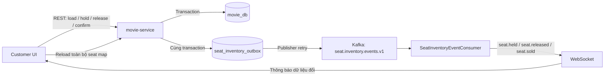
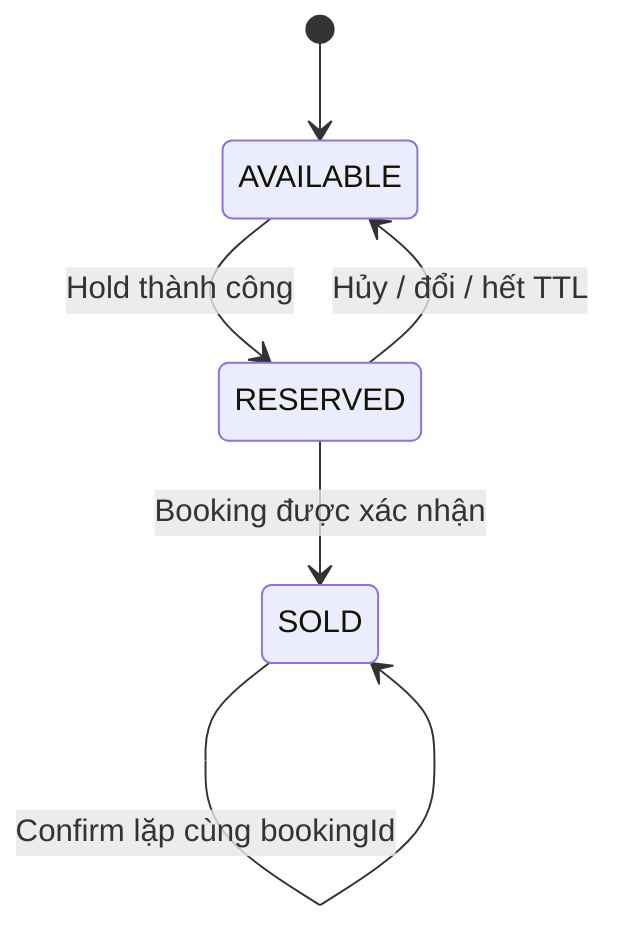

# P1 — Đặc tả giữ ghế real-time và vận hành ổn định

## 1. Mục tiêu

P1 hoàn thiện trải nghiệm giữ ghế sau khi khách chọn suất chiếu:

- chống hai khách giữ hoặc mua cùng một ghế;
- đồng bộ thay đổi ghế gần real-time giữa nhiều trình duyệt;
- dùng thời hạn giữ ghế do server quyết định;
- cho phép đổi hoặc hủy lựa chọn trước khi thanh toán;
- giới hạn lạm dụng bằng quota và rate limit;
- quan sát, retry và đối soát inventory trong vận hành;
- phát sự kiện tin cậy để các service khác có thể tích hợp.

Nguyên tắc quan trọng nhất:

> REST API và PostgreSQL là nguồn sự thật. WebSocket chỉ thông báo rằng dữ liệu đã thay đổi để client tải lại seat map từ REST.

WebSocket không được tự chuyển trạng thái ghế, gia hạn thời gian giữ ghế hoặc xác nhận thanh toán.

---

## 2. Phạm vi và trạng thái triển khai

| Hạng mục | Trạng thái | Service chịu trách nhiệm |
|---|---|---|
| Atomic hold bằng database lock | Hoàn thành | `movie-service` |
| Ownership, expiry và idempotency | Hoàn thành | `movie-service` |
| TTL theo WEB/MOBILE/COUNTER | Hoàn thành | `movie-service` |
| Giới hạn ghế trên một hold | Hoàn thành | `movie-service` |
| Rate limit theo account/IP/showtime | Hoàn thành | `movie-service` |
| Mã lỗi lock/deadlock có thể retry | Hoàn thành | `movie-service` |
| WebSocket chỉ phát 3 loại sự kiện inventory | Hoàn thành | `movie-service`, API Gateway |
| Client reload seat map khi nhận event/reconnect | Hoàn thành | React client |
| Countdown theo `expiresAt` từ server | Hoàn thành | React client |
| Đổi/hủy ghế trước thanh toán | Hoàn thành | React client, `movie-service` |
| Metrics inventory/hold | Hoàn thành | `movie-service` |
| Reconciliation nội bộ inventory | Hoàn thành | `movie-service` |
| Transactional outbox và Kafka delivery | Hoàn thành phía producer | `movie-service` |
| Booking/payment consumer nghiệp vụ | Chưa nối end-to-end | `booking-service`, `payment-service` |
| Đối soát chéo booking/payment với inventory | Chưa thể hoàn tất | Cần application API/event consumer của `booking-service` và `payment-service` |

`booking-service` và `payment-service` hiện chưa có application layer đầy đủ để xác nhận một luồng thanh toán thật. Vì vậy P1 hiện bảo đảm inventory và giao diện giữ ghế, đồng thời cung cấp event contract tin cậy; chưa tuyên bố luồng thanh toán liên service đã hoàn thiện.

---

## 3. Kiến trúc



Đặc tính delivery:

- ghi business state và outbox trong cùng transaction;
- Kafka delivery theo hướng **at-least-once**;
- event có thể được nhận lặp;
- client không áp dụng event trực tiếp nên event lặp không làm sai inventory;
- sau mọi event hoặc reconnect, client tải lại state chuẩn từ REST.

---

## 4. Trạng thái inventory



### Quy tắc

1. Một hold là all-or-nothing: một ghế không hợp lệ thì toàn bộ request rollback.
2. Ghế phải thuộc đúng showtime.
3. Ghế couple/sofa được xử lý theo inventory group hiện có.
4. Chỉ owner đã xác thực mới được release hoặc confirm hold.
5. Retry cùng `Idempotency-Key` và cùng selection trả lại kết quả cũ.
6. Dùng lại key cho selection khác bị từ chối.
7. Confirm lặp với cùng `bookingId` là idempotent.
8. Hold quá hạn không thể confirm.

---

## 5. API contract

### 5.1 Lấy chính sách giữ ghế

`GET /api/showtimes/seat-hold-policy`

Header tùy chọn:

```http
X-Booking-Channel: WEB
```

Kết quả:

```json
{
  "code": 1000,
  "result": {
    "channel": "WEB",
    "ttlSeconds": 600,
    "maxSeatsPerBooking": 8
  }
}
```

### 5.2 Lấy seat map chuẩn

`GET /api/showtimes/{showtimeId}/seat-map`

Đây là endpoint client phải gọi:

- khi mở trang;
- sau khi nhận WebSocket event;
- sau khi WebSocket reconnect;
- khi tab quay lại foreground;
- theo chu kỳ fallback nếu socket bị chặn.

### 5.3 Tạo atomic hold

`POST /api/showtimes/{showtimeId}/seat-holds`

Headers:

```http
Authorization: Bearer <access-token>
Idempotency-Key: hold-<uuid>
X-Booking-Channel: WEB
Content-Type: application/json
```

Body:

```json
{
  "seatIds": [1001, 1002]
}
```

Kết quả chính:

```json
{
  "code": 1000,
  "result": {
    "holdId": "hold-uuid",
    "showtimeId": 340,
    "seatIds": [1001, 1002],
    "seats": [],
    "totalPrice": 180000,
    "expiresAt": "2026-07-28T20:15:00",
    "replayed": false
  }
}
```

Client phải dùng `expiresAt`, không tự cộng thêm một số phút cố định.

### 5.4 Hủy hoặc đổi lựa chọn

Hủy hold:

`DELETE /api/showtimes/{showtimeId}/seat-holds/{holdId}`

Đổi ghế là một workflow:

1. release hold cũ;
2. reload seat map;
3. chọn ghế mới;
4. tạo hold mới với `Idempotency-Key` mới.

Không sửa trực tiếp danh sách ghế của một hold đã tồn tại.

### 5.5 Xác nhận inventory đã bán

`POST /api/showtimes/{showtimeId}/seat-holds/{holdId}/confirm`

Body:

```json
{
  "bookingId": "b8f41c7b-f8e8-4d86-9525-382835f54adb"
}
```

Endpoint này dành cho bước compensation/saga của backend booking sau khi điều kiện xác nhận booking được đáp ứng. Frontend không được tự gọi để bỏ qua nghiệp vụ booking/payment.

---

## 6. WebSocket contract

Endpoint:

```text
/ws/seat-inventory?showtimeId={showtimeId}
```

API Gateway đã route WebSocket về `movie-service`.

Chỉ ba event public:

| Event | Ý nghĩa |
|---|---|
| `seat.held` | Một nhóm ghế vừa được giữ |
| `seat.released` | Hold bị hủy, đổi hoặc hết hạn |
| `seat.sold` | Nhóm ghế đã được xác nhận bán |

Payload:

```json
{
  "eventId": "uuid",
  "eventType": "seat.held",
  "showtimeId": 340,
  "holdId": "hold-uuid",
  "seatIds": [1001, 1002],
  "expiresAt": "2026-07-28T20:15:00",
  "bookingId": null,
  "occurredAt": "2026-07-28T20:05:00"
}
```

Client chỉ kiểm tra event có thuộc whitelist và đúng showtime, sau đó gọi lại REST seat map. Không dùng payload socket để tự đánh dấu ghế.

---

## 7. Countdown và reconnect

### Countdown

```text
remaining = expiresAt(server) - currentTime(client)
```

- `expiresAt` luôn lấy từ response của hold;
- về 0 thì UI ngừng cho thanh toán và reload seat map;
- không reset countdown khi component render lại;
- không kéo dài TTL khi reconnect.

### Reconnect

1. socket disconnect;
2. UI hiển thị `Reconnecting`;
3. reconnect theo exponential backoff, tối đa 15 giây;
4. kết nối lại thành công;
5. bỏ mọi giả định local và gọi lại toàn bộ seat map;
6. REST polling 30 giây là fallback.

---

## 8. Cấu hình vận hành

Giá trị mặc định:

| Chính sách | Giá trị |
|---|---:|
| WEB TTL | 10 phút |
| MOBILE TTL | 8 phút |
| COUNTER TTL | 3 phút |
| Tối đa ghế/booking | 8 |
| Rate window | 1 phút |
| Tối đa/account/window | 12 |
| Tối đa/IP/window | 30 |
| Tối đa/showtime/window | 120 |

Environment variables:

```text
SHOWTIME_SEAT_HOLD_MAX_SEATS
SHOWTIME_SEAT_HOLD_TTL_WEB
SHOWTIME_SEAT_HOLD_TTL_MOBILE
SHOWTIME_SEAT_HOLD_TTL_COUNTER
SHOWTIME_SEAT_HOLD_RATE_WINDOW
SHOWTIME_SEAT_HOLD_RATE_ACCOUNT
SHOWTIME_SEAT_HOLD_RATE_IP
SHOWTIME_SEAT_HOLD_RATE_SHOWTIME
SHOWTIME_SEAT_HOLD_CLEANUP_DELAY_MS
SHOWTIME_SEAT_HOLD_RECONCILIATION_DELAY_MS
SHOWTIME_SEAT_HOLD_EVENT_TOPIC
```

TTL không được hard-code ở frontend hoặc request DTO.

---

## 9. Rate limit và lỗi có thể retry

Rate limit được tính độc lập theo:

- authenticated account;
- client IP;
- showtime.

Nếu bất kỳ quota nào vượt giới hạn, request bị từ chối với HTTP `429`.

| Code | Trường hợp | HTTP | Retry |
|---:|---|---:|---|
| 2125 | Selection không hợp lệ | 400 | Không |
| 2127 | Thiếu idempotency key | 400 | Không |
| 2128 | Key đã dùng cho payload khác | 409 | Không với key cũ |
| 2129 | Không có owner hợp lệ | 401/403 | Sau khi đăng nhập |
| 2130 | Hold đã hết hạn | 409 | Tạo hold mới |
| 2140 | Không tìm thấy hold | 404 | Không |
| 2141 | Owner không khớp | 403 | Không |
| 2142 | Ghế đã sold | 409 | Chọn ghế khác |
| 2143 | Rate limit | 429 | Theo cửa sổ rate limit |
| 2144 | Lock timeout/deadlock/serialization conflict | 503 | Có |

Lỗi `2144` có:

```http
Retry-After: 1
```

và payload:

```json
{
  "retryable": true,
  "retryAfterSeconds": 1
}
```

Client chỉ retry cùng request với cùng `Idempotency-Key`, có backoff và giới hạn số lần thử.

---

## 10. Metrics

Actuator expose `metrics` và `prometheus`.

| Metric | Ý nghĩa |
|---|---|
| `seat_holds_created_total` | Số hold mới |
| `seat_holds_released_total` | Số hold được hủy/đổi |
| `seat_holds_expired_total` | Số hold hết TTL |
| `seat_hold_conflicts_total` | Số xung đột giữ ghế |
| `seat_holds_sold_total` | Số hold chuyển SOLD |
| `seat_hold_reconciliation_mismatches_total` | Số sai lệch đối soát |
| `seat_holds_active` | Hold đang còn hiệu lực |
| `seat_hold_conversion_to_paid_ratio` | `sold / created` |

Conversion hiện phản ánh inventory đã confirm. Khi payment service hoàn thiện, dashboard nên phân biệt thêm payment-authorized, payment-failed và paid.

---

## 11. Reconciliation

Job chạy định kỳ và:

1. release `RESERVED` không còn đủ owner/hold/expiry;
2. phát `seat.released` qua outbox khi tự sửa;
3. phát hiện `SOLD` thiếu `bookingId` và đưa vào manual review, không tự release;
4. sửa `showtime.soldSeats` theo số ghế SOLD thực tế;
5. dọn rate-limit window cũ;
6. tăng mismatch metric.

Không tự mở bán lại ghế SOLD không rõ booking vì có nguy cơ bán trùng một ghế đã thanh toán.

### Ranh giới hiện tại

Job mới đối soát được trạng thái trong `movie_db`. Đối soát chéo:

```text
booking CONFIRMED ↔ showtime_seat SOLD ↔ payment PAID
```

cần event consumer hoặc internal API của `booking-service` và `payment-service`. Đây là phần tiếp theo trước khi công bố production-ready end-to-end.

---

## 12. Transactional outbox

Database migration `V51__seat_hold_realtime_operations.sql` tạo:

- `seat_hold_rate_window`;
- `seat_inventory_outbox`.

Business transaction ghi inventory và outbox cùng lúc. Scheduler retry các record chưa publish lên topic:

```text
seat.inventory.events.v1
```

Yêu cầu cho consumer tương lai:

- deduplicate theo `eventId`;
- xử lý idempotent;
- không phụ thuộc thứ tự tuyệt đối giữa các aggregate khác nhau;
- lưu consumer offset/inbox nếu event làm thay đổi business state;
- không xem WebSocket fanout là integration event cho booking/payment.

---

## 13. Definition of Done

- [x] Database là nguồn sự thật cho hold.
- [x] WebSocket chỉ broadcast `seat.held`, `seat.released`, `seat.sold`.
- [x] Countdown lấy từ `expiresAt`.
- [x] Reconnect reload toàn bộ seat map.
- [x] Có đổi và hủy ghế trước thanh toán.
- [x] TTL cấu hình theo channel.
- [x] Giới hạn số ghế.
- [x] Rate limit account/IP/showtime.
- [x] Lock timeout/deadlock có stable retry contract.
- [x] Có metrics inventory.
- [x] Có local reconciliation.
- [x] Có producer transactional outbox.
- [ ] Booking consumer xác minh hold và tạo pending booking.
- [ ] Payment consumer xác nhận hoặc compensation.
- [ ] Cross-service reconciliation booking/inventory/payment.
- [ ] Integration test thật: hold → pending booking → payment → sold.

