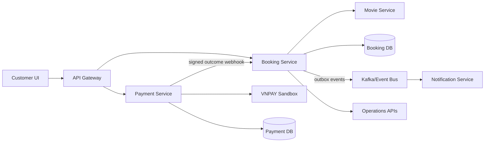
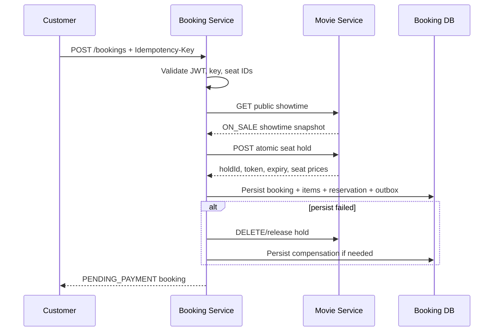
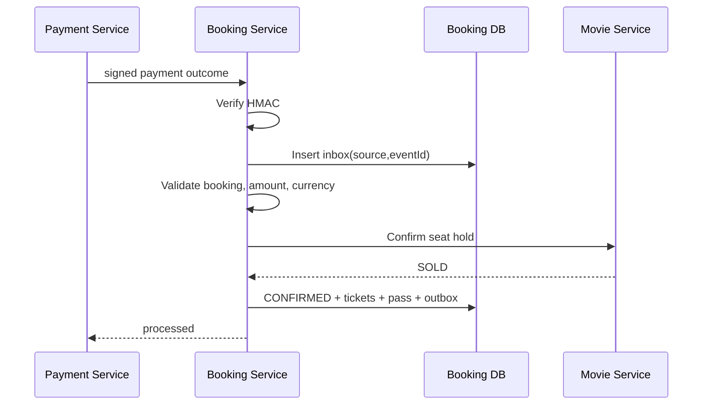

# Booking Service — Technical Specification

> Phiên bản: 1.0  
> Cập nhật: 29/07/2026

## 1. Kiến trúc



### Ownership

- Movie DB: showtime, room, seat layout, `showtime_seat`, hold và final price.
- Booking DB: booking, item snapshot, inventory reservation reference, inbox/outbox, compensation, reconciliation, ticket và check-in.
- Payment DB: payment/refund ledger.
- Không có cross-database foreign key.

## 2. Thành phần chính

| Component | Trách nhiệm |
|---|---|
| `BookingOrchestrationService` | Validate request, load public showtime, atomic hold, persist booking và compensate khi lỗi |
| `BookingPersistenceService` | Lưu aggregate, item/price/showtime snapshot và idempotency record |
| `MovieInventoryClient` | Giao tiếp với Movie Service qua HTTP |
| `PaymentWebhookService` | Verify HMAC trên raw body và parse payment outcome |
| `PaymentProcessingStateService` | Inbox dedupe, validate money, confirm/release inventory, update state và issue ticket |
| `BookingExpiryScheduler` | Xử lý pending booking hết hạn |
| `CompensationWorker` | Retry release/confirm cần phục hồi |
| `OutboxPublisher` | Publish event từ transactional outbox |
| `BookingCancellationService` | Pending cancellation hoặc tạo confirmed refund request |
| `TicketPassService` | Issue opaque pass, owner query và atomic/idempotent check-in |
| `BookingClusterAccessPolicy` | Enforce cluster scope cho operations |
| `BookingReconciliationService` | Query case cần đối soát theo cluster |
| `BookingAbuseGuard` | Giới hạn booking pending theo account và request rate theo cửa sổ thời gian |
| `CounterSaleService` | Hold/confirm inventory, ghi counter payment và tạo confirmed counter booking |
| `PaymentApplicationService` | Tạo payment attempt, payment URL, xử lý IPN/return và refund |
| `VnpaySigner` | Tạo và xác thực secure hash theo contract VNPAY |
| `PaymentOutcomePublisher` | Gửi normalized outcome có chữ ký sang Booking Service |
| `PaymentJobs` | Retry outcome delivery và rà soát payment pending |

## 3. Luồng tạo booking



## 4. Luồng payment confirmation



Duplicate inbox event returns the stored outcome without repeating business effects.

## 5. Data model

Các aggregate/table chính:

- `booking`
- `booking_item`
- `booking_inventory_reservation`
- `booking_request_idempotency`
- `payment_event_inbox`
- `booking_outbox`
- `compensation_task`
- `booking_reconciliation`
- `booking_refund`
- `ticket`
- `booking_ticket_pass`
- `ticket_check_in`

### Booking snapshot

`booking` lưu showtime/movie/cluster/room/date/time snapshot và money totals.  
`booking_item` lưu `showtimeSeatId`, seat code/type, unit/final price và currency.

### External references

`booking_inventory_reservation` lưu `holdId`, hold token/reference, expiry và inventory status; đây không phải bản sao authoritative của seat state.

## 6. Transaction boundaries

- DB transaction không bao trùm network transaction.
- External hold xảy ra trước booking DB commit.
- Nếu DB commit thất bại, release hold theo compensation.
- Payment inbox, booking transition, ticket issuance và outbox phải commit cùng transaction.
- Worker dùng stable operation identity để retry idempotently.

## 7. Concurrency và idempotency

### Seat hold

Movie Service khóa/conditional-update authoritative `showtime_seat`. Stable seat ordering giảm deadlock; selection all-or-nothing.

### Booking request

Unique scope:

```text
callerAccountId + operation + Idempotency-Key
```

Lưu canonical request hash để phát hiện same-key/different-payload.

### Payment webhook

Unique scope:

```text
source + eventId
```

### Check-in

Unique scope:

```text
callerScope + Idempotency-Key
```

Ticket state transition thực hiện atomically.

## 8. Security

- JWT xác định customer; không tin `accountId` từ request body.
- Customer query luôn kiểm tra ownership.
- Operations API yêu cầu ADMIN/EMPLOYEE.
- Employee phải có verified cluster claims hoặc internal assignment lookup.
- Webhook dùng HMAC-SHA256 trên raw payload.
- Ticket pass là opaque token; lưu hash và dùng server-side secret/key version.
- Không log token, credential hoặc raw payment secret.

## 9. Failure handling

| Failure | Xử lý |
|---|---|
| Seat unavailable | Rollback toàn selection, trả `409` |
| Hold thành công nhưng persist lỗi | Release ngay hoặc compensation task |
| Invalid webhook signature | Reject, không đổi state |
| Duplicate webhook | Return stored result |
| Payment mismatch | Không confirm, tạo error/reconciliation |
| Confirm inventory timeout | Retry/compensation/reconciliation, không đoán failed |
| Payment success sau expiry | Reconciliation; không tự chiếm ghế lại |
| Outbox publish lỗi | Retry publisher; consumer idempotent |
| Check-in duplicate | Replay cùng key hoặc conflict nếu key mới |

## 10. Scheduler/worker

- Booking expiry worker: tìm pending booking quá hạn và release hold.
- Compensation worker: retry tác vụ phục hồi có backoff/attempt limit.
- Outbox publisher: publish unpublished events.
- Payment delivery worker: retry normalized payment outcome chưa giao thành công.
- Payment reconciliation worker: rà soát attempt còn pending hoặc kết quả chưa xác định.
- Job phải re-entrant và idempotent.

## 11. Trạng thái triển khai P0/P1

### P0 đã triển khai

- Booking orchestration, authoritative snapshot và compensation khi local persist lỗi.
- Movie inventory API boundary; Booking Service không truy cập Movie DB.
- VNPAY Sandbox payment session, secure-hash verification và signed normalized outcome.
- Payment inbox deduplication, amount/currency validation, inventory confirmation và ticket issuance.
- Expiry, release hold, compensation retry, outbox và reconciliation record.
- Customer detail, history và ticket pass.

### P1 đã triển khai ở mức demo/integration

- Cluster-scoped booking/reconciliation query và fail-closed Employee authorization.
- Opaque ticket pass và idempotent check-in.
- Counter sale có terminal, payment ledger, receipt reference và inventory state machine chung.
- Pending cancellation; confirmed cancellation/refund orchestration.
- Transactional outbox/inbox, trạng thái `DEAD`, Redis rate limit và DB active-booking cap.
- Actuator `health`, `info`, `metrics`; metrics không public.

### Production hardening còn lại

- Production merchant credentials và provider refund/settlement adapter.
- Identity Service phải phát hành cluster assignment claims cho Employee.
- Dashboard/alert tập trung, distributed tracing và thao tác manual re-drive bản ghi `DEAD`.
- Full Docker E2E, multi-service concurrency/race và load test.

## 12. Test strategy

### Unit

- Money calculation và snapshot.
- State transition guards.
- HMAC/inbox duplicate.
- Ticket pass encode/decode.
- Cluster access.
- Booking abuse guard.
- VNPAY signer.

### Concurrency

- Hai transaction giữ cùng seat/group.
- Duplicate create booking.
- Duplicate webhook/confirmation.
- Duplicate check-in.

### Integration

```text
ON_SALE showtime
-> load seats
-> concurrent hold
-> PENDING_PAYMENT
-> signed payment success
-> SOLD inventory
-> CONFIRMED booking
-> ticket pass
-> check-in
```

### Race

- expiry và payment success đồng thời;
- cancellation và payment success đồng thời;
- compensation retry sau downstream timeout.

### Kết quả xác minh module ngày 29/07/2026

- Booking Service: module test pass.
- Payment Service: clean test pass, gồm VNPAY signing.
- Movie Service: targeted inventory/pricing/seat-hold tests pass.
- Frontend: production build pass.

Các kết quả trên chưa thay thế full Docker E2E đa service.

## 13. Cấu hình nhạy cảm

Các secret phải lấy từ environment/secret manager:

- webhook HMAC secret;
- ticket pass secret;
- internal service credential;
- Kafka/payment credentials.

Không dùng default secret trong production.
