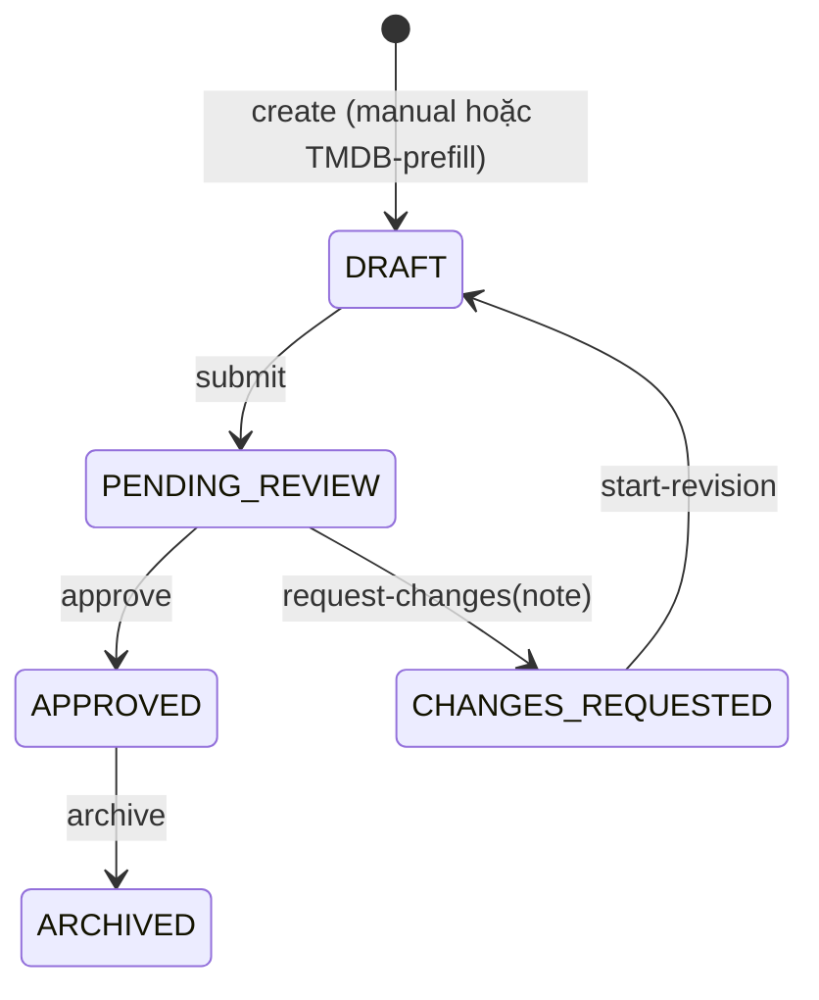

# Movie Creation Flow — Specification & Test Plan

## 1. Document Information

| Trường | Giá trị |
|---|---|
| Tên tài liệu | Movie Creation Flow — Specification & Test Plan |
| Module | `movie-service` (backend) + Movie Editor / TMDB catalog / Movie Management (frontend) |
| Phiên bản | 1.0 |
| Ngày kiểm tra | 2026-07-20 |
| Branch hiện tại | `docs/movie-creation-flow-test-spec` (tạo từ `develop`) |
| Commit hiện tại | `83a83c5` — "Merge branch 'fix/drop-movie-end-date-column' into 'develop'" |
| Người dùng mục tiêu | Developer (backend/frontend), Tester/QA, Reviewer (MR review), Product/Business (đọc phần Executive Summary + Gaps) |
| Phạm vi | Toàn bộ vòng đời tạo/lưu/cập nhật/xét duyệt phim: manual creation, TMDB-assisted creation, review/approval, request-changes/revision, media, authorization, business rules liên quan |
| Ngoài phạm vi | Movie Availability (per-cluster exhibition lifecycle — `movie_availability`, `MovieAvailabilityController`), Showtime/booking, Cinema Cluster/Room, Seat layout. Các module này chỉ được nhắc tới khi cần thiết để phân biệt ranh giới với Movie content lifecycle. |

> **Cập nhật sau khi phát hành tài liệu:** Gap #1 (P1 — TMDB one-shot import không có UI trigger) và Gap #2 (P0 — `rejectionNote` không hiển thị) đã được xử lý — xem `fix/movie-rejection-note-visibility` và `feat/tmdb-import-ui`. Mục 2/9/19/20 bên dưới vẫn giữ nguyên mô tả tại thời điểm audit ban đầu (commit `83a83c5`) làm hồ sơ; Flow B (Mục 7) chưa được viết lại đầy đủ theo hành vi mới, đây là việc cần làm tiếp theo (tài liệu hoá lại luồng "Use this movie" nay thực sự gọi `POST /api/movies/tmdb/import` qua `MovieEditorPage.persistCurrentDraft()`, kèm resolve genre/runtime/age-rating thật thay vì tạo genre `ACTIVE` phía client).

**Nguyên tắc đọc tài liệu:** mọi khẳng định trong tài liệu này đều bắt nguồn từ source code tại commit nêu trên. Khi một chi tiết không thể xác minh chắc chắn từ code đã đọc, tài liệu ghi rõ **"Chưa xác minh từ implementation"** kèm file cần kiểm tra thêm, thay vì suy đoán.

---

## 2. Executive Summary

**Có 2 cách tạo phim, nhưng chỉ 1 con đường ghi dữ liệu thật:**

1. **Manual creation** — `MovieEditorPage` (route `/admin/movies/new/manual`) → `POST /api/movies` (`createMovie`, dùng `CreateMovieRequest`).
2. **"TMDB-assisted" creation** — `TmdbCatalogPage` (route `/admin/movies/new/catalog`) cho phép browse/preview dữ liệu TMDB (đọc-only, không ghi DB), sau đó bấm "Use this movie" sẽ **điều hướng sang chính `MovieEditorPage`** (route `/admin/movies/new/manual?tmdbId=...`) với dữ liệu TMDB được truyền qua `router state` để prefill form. Việc lưu thật sự **vẫn đi qua `POST /api/movies` (`createMovie`) giống hệt manual creation** — **không** gọi endpoint `POST /api/movies/tmdb/import` (`TmdbService.importMovie`).

Điều này được xác nhận bằng chính test của repo: `TmdbCatalogPage.test.tsx` có assertion `expect(mocks.tmdbImport).not.toHaveBeenCalled()` — đây là **thiết kế có chủ đích**, không phải bug bị bỏ sót.

Hệ quả quan trọng: backend có sẵn một endpoint `POST /api/movies/tmdb/import` được implement rất đầy đủ (duplicate-check theo `tmdbId`/`imdbId`, resolve runtime/genre/age-rating/company/trailer/poster, tạo genre `PENDING_REVIEW` khi cần, ...) và có unit test riêng (`TmdbServiceTest`, `TmdbCompanyResolutionTest`, `TmdbTrailerSelectionTest`, `TmdbImageSelectionTest`) — nhưng **không có UI nào gọi tới nó**. Nó chỉ test được qua Postman/API trực tiếp, không qua UI. Xem Gap #1 ở Mục 20.

Ngược lại, **TMDB media import ở cấp độ ảnh** (`POST /api/movies/{id}/images/tmdb-import`, chọn poster/backdrop/still cụ thể) **có** được UI gọi thật (từ `TmdbMediaPicker` bên trong `MovieEditorPage`, sau khi movie đã được lưu).

**Ai được tạo/sửa/submit/approve:**

- `ADMIN` và `EMPLOYEE`: tạo draft, cập nhật draft, submit for review, start-revision.
- Chỉ `ADMIN`: approve, request-changes, archive, TMDB genre-sync.
- `CUSTOMER`/anonymous: chỉ đọc `GET /api/movies/public`, `/public/{id}` (chỉ thấy movie `APPROVED` và có availability window công khai qua cluster — xem `MOVIE_LIFECYCLE_CONTRACT.md`).

**Flow nào đã ổn:**

- Create/update draft (partial-update semantics đã có unit test kỹ — `MovieServiceTest`, `MovieMapperTest`).
- Submit → Approve / Request Changes → Start Revision (state machine đơn giản, rõ ràng, có readiness gate 2 tầng qua `MovieReadinessValidator`).
- Authorization ở tầng `@PreAuthorize` đã được audit riêng (`docs/api-specs/movie-service/AUTHORIZATION_MATRIX.md`) và không có gap mới phát hiện trong lần rà soát này.
- Reconcile translations/cast theo composite key (không xoá-làm-lại toàn bộ) — tránh mất dữ liệu khi partial update.

**Flow nào còn thiếu / có rủi ro (chi tiết ở Mục 20):**

- **Rejection note (`rejectionNote`) không bao giờ được trả về hoặc hiển thị cho EMPLOYEE** — bị set ở backend (`Movie.rejectionNote`) nhưng `MovieResponse` DTO và `MovieMapper` không map field này ra ngoài, và không UI nào (kể cả `PendingReviewModal`, `ManageMoviePage`) hiển thị nó. EMPLOYEE biết movie bị "Changes Requested" nhưng không biết lý do qua hệ thống.
- **TMDB one-shot import endpoint (`POST /api/movies/tmdb/import`) không được UI nào gọi** — toàn bộ logic resolve genre/company/age-rating/runtime của nó chỉ test được qua Postman.
- **`requireReadyForRelease()` trong `MovieReadinessValidator` là dead code** — không có method nào trong `MovieService` gọi nó (tàn dư từ lifecycle cũ có `COMING_SOON`/`NOW_SHOWING`).
- **`MOVIE_LIFECYCLE_CONTRACT.md` ghi sai tên error code cho optimistic-lock conflict** — tài liệu nói `409 MOVIE_CONCURRENT_MODIFICATION`, nhưng thực tế `OptimisticLockingFailureException` được xử lý bởi `GlobalExceptionHandler` (dùng chung toàn hệ thống) trả về `GlobalErrorCode.CONCURRENT_MODIFICATION` (code `1010`), không có `MOVIE_CONCURRENT_MODIFICATION` nào tồn tại trong `MovieErrorCode`.
- Không có endpoint xoá phim (`DELETE /api/movies/{id}`) — đã bị loại bỏ có chủ đích, thay bằng `archive`. Một số tài liệu cũ (`docs/MOVIE_SERVICE_BUSINESS_RULES.md` MOV-P0-002) vẫn còn nhắc `MovieService.deleteMovie` — **không còn tồn tại trong code hiện tại**, đây là tài liệu-code mismatch cần cập nhật riêng.

**Đánh giá mức độ sẵn sàng: `Academic-ready`.**

Bằng chứng: state machine, validation 2 tầng (DTO `@Valid` + `MovieReadinessValidator`), authorization, và test coverage cho phần lõi (create/update/transition) đều có và được test khá kỹ (`MovieServiceTest`, `MovieReadinessValidatorTest`, `MovieMapperTest`, `TmdbServiceTest`...). Tuy nhiên tài liệu này tìm thấy 1 gap ảnh hưởng trực tiếp trải nghiệm nghiệp vụ cốt lõi (EMPLOYEE không thấy lý do bị từ chối), và 1 tính năng lớn (TMDB one-shot import) tồn tại ở backend nhưng không thể demo qua UI — hai điểm này đủ để chưa gọi là "Production-ready" hay thậm chí "Production-oriented" cho đến khi được xử lý.

---

## 3. Domain Terminology

| Thuật ngữ | Tên tiếng Việt | Ý nghĩa trong hệ thống |
|---|---|---|
| Movie Draft | Bản nháp phim | `Movie.status = DRAFT`. Trạng thái duy nhất có thể sửa trực tiếp qua `PUT /api/movies/{id}`. |
| Content Approval | Phê duyệt nội dung | Chuyển `PENDING_REVIEW → APPROVED` qua `POST /api/movies/{id}/approve`. Chỉ là quyết định biên tập, **không** làm phim lên sóng/mở bán ở đâu cả. |
| Exhibition Lifecycle | Vòng đời khai thác/chiếu phim | Thuộc về `MovieAvailability` (bảng `movie_availability`, ngoài phạm vi tài liệu này) — theo từng cụm rạp (`cluster`), tách biệt hoàn toàn khỏi `Movie.status`. |
| Readiness Gate | Điều kiện sẵn sàng | `MovieReadinessValidator` — tập hợp rule phải thoả trước khi submit/approve, thu thập **tất cả** vi phạm cùng lúc thay vì dừng ở lỗi đầu tiên. |
| Display Status | Trạng thái hiển thị | `NOW_SHOWING`/`COMING_SOON` — tính toán tại thời điểm đọc (không lưu DB), dựa trên `Movie.status = APPROVED` + `MovieAvailability` + showtime. |
| TMDB Preview | Bản xem trước dữ liệu TMDB | `GET /api/movies/tmdb/{tmdbId}/details` — đọc thuần, không ghi DB, không gọi `save()` ở bất kỳ repository nào. |
| Import (TMDB) | Nhập dữ liệu | Có 2 nghĩa khác nhau cần phân biệt rõ: (a) endpoint `POST /api/movies/tmdb/import` — tạo movie trực tiếp từ TMDB, **hiện không có UI gọi**; (b) hành vi UI thật — dùng TMDB preview để **prefill** form Manual Editor rồi lưu qua `createMovie` như bình thường. |
| Re-sync | Đồng bộ lại | Không có endpoint re-sync tự động trong code hiện tại. `trailerSource`/`taglineSource` (`TMDB`/`MANUAL`) tồn tại để một cơ chế re-sync trong tương lai biết trường nào là do TMDB đặt (có thể ghi đè an toàn) và trường nào do admin sửa tay (không được ghi đè) — nhưng bản thân job re-sync **chưa được implement**. |
| Provenance | Nguồn gốc dữ liệu | `trailerSource`, `taglineSource` (`Movie` entity) — `TMDB` = tự động lấy lúc import/prefill, `MANUAL` = admin nhập/sửa tay. |
| Readiness Violation | Vi phạm điều kiện sẵn sàng | `ReadinessViolation{field, rule}` — 1 phần tử trong mảng `result.violations` khi submit/approve thất bại. |
| Reconcile (translations/cast) | Đối chiếu & hợp nhất | Khi update, không xoá-toàn-bộ-rồi-tạo-lại; so khớp theo composite key (`languageCode` cho translation, `(personId, roleType)` cho cast), chỉ update/insert/xoá đúng phần thay đổi. |
| Genre `PENDING_REVIEW` | Thể loại chờ duyệt | Genre được tự tạo khi TMDB trả về 1 thể loại chưa map được với local DB và admin chọn "create as pending" — chặn `submitForReview` cho tới khi 1 genre-admin promote nó lên `ACTIVE`. |

---

## 4. Actors and Authorization Matrix

Nguồn: `@PreAuthorize` trên `MovieController`, `TmdbController`, `MovieImageController` (đọc trực tiếp từ code, đối chiếu khớp với `docs/api-specs/movie-service/AUTHORIZATION_MATRIX.md` đã có).

| Chức năng | ADMIN | EMPLOYEE | CUSTOMER | Anonymous | Endpoint/Code Reference |
|---|---:|---:|---:|---:|---|
| Xem public movie catalog | Allow | Allow | Allow | Allow | `GET /api/movies/public`, `/public/{id}` — không `@PreAuthorize`, lọc bằng `MovieService.isPubliclyVisible()` |
| Xem internal movie (đầy đủ workflow state) | Allow | Allow | Deny | Deny | `GET /api/movies/{id}`, `GET /api/movies`, `GET /api/movies/all` — `@PreAuthorize("hasRole('ADMIN') or hasRole('EMPLOYEE')")` |
| Tạo draft | Allow | Allow | Deny | Deny | `POST /api/movies` — `MovieController.createMovie` |
| Cập nhật draft | Allow | Allow | Deny | Deny | `PUT /api/movies/{id}` — chỉ khi `status == DRAFT`, ngược lại `409 MOVIE_NOT_EDITABLE` |
| Submit for Review | Allow | Allow | Deny | Deny | `POST /api/movies/{id}/submit` |
| Approve | Allow | Deny | Deny | Deny | `POST /api/movies/{id}/approve` — `@PreAuthorize("hasRole('ADMIN')")` |
| Request Changes | Allow | Deny | Deny | Deny | `POST /api/movies/{id}/request-changes` |
| Start Revision | Allow | Allow | Deny | Deny | `POST /api/movies/{id}/start-revision` |
| Archive | Allow | Deny | Deny | Deny | `POST /api/movies/{id}/archive` |
| Import từ TMDB (browse/preview/one-shot import) | Allow | Allow | Deny | Deny | `TmdbController` — tất cả endpoint `hasAnyRole('ADMIN','EMPLOYEE')` |
| TMDB genre-sync (report unmapped) | Allow | Deny | Deny | Deny | `POST /api/movies/tmdb/genres/sync` — `hasRole('ADMIN')` |
| Quản lý movie image (list/add/delete/tmdb-import ảnh) | Allow | Allow | Deny | Deny | `MovieImageController` — tất cả `hasAnyRole('ADMIN','EMPLOYEE')` |
| Upload ảnh (Cloudinary) | Allow | Allow | Deny | Deny | `POST /api/movies/images` |
| Xem audit log của 1 movie | — | — | — | — | **Không có endpoint đọc `movie_action_log`/`movie_status_history` qua API.** Chưa xác minh từ implementation liệu có endpoint nào khác expose 2 bảng này — grep trong `movieservice/controller` không thấy repository nào cho 2 bảng này được expose qua REST. |

Ghi chú:
- Không có khái niệm "own draft only" ở tầng `@PreAuthorize` cho Movie (khác với Cinema Cluster/Room, nơi có ownership check trong service) — bất kỳ EMPLOYEE nào cũng sửa được draft của EMPLOYEE khác. **Chưa xác minh** đây có phải hành vi mong muốn hay là gap — không thấy rule nghiệp vụ nào trong `docs/MOVIE_SERVICE_BUSINESS_RULES.md` nói về ownership cho Movie draft.
- `MOVIE_IMAGE_NOT_FOUND`/`TMDB_IMAGE_NOT_FOUND` v.v. đều là lỗi nghiệp vụ (400/404/409), không phải lỗi phân quyền.

---

## 5. Movie Data Model

### 5.1 Core Identity

| Field (JSON) | Field (DB) | Kiểu | Nguồn |
|---|---|---|---|
| `movieId` | `movie_id` | `BIGSERIAL` | PK, generated |
| `tmdbId` | `tmdb_id` | `INTEGER`, `UNIQUE` | Optional, dùng dedup TMDB |
| `imdbId` | `imdb_id` | `VARCHAR(20)`, `UNIQUE` | Optional |
| `originalTitle` | `original_title` | `VARCHAR(500) NOT NULL` | Bắt buộc |
| `originalLanguage` | `original_language` | `CHAR(2)`, default `'en'` | ISO 639-1 |
| `durationMinutes` | `duration_minutes` | `SMALLINT`, `CHECK 1..600` | Bắt buộc |
| `country` | `country` | `VARCHAR(100)` | Optional |
| `releaseDate` | `release_date` | `DATE` | Optional ở tầng DTO, nhưng bắt buộc gián tiếp qua readiness gate release (xem 5.3) |

### 5.2 Localized Content

Bảng `movie_translation` — PK composite `(movie_id, language_code)` — thay thế hoàn toàn cho 2 cột cũ `movie_name_vn`/`movie_name_english` (đã bị xoá khỏi schema, xem `V8__drop_legacy_movie_columns.sql`).

| Field | Kiểu | Bắt buộc | Ghi chú |
|---|---|---:|---|
| `languageCode` | `CHAR(2)` | Có (composite key) | vd `vi`, `en` |
| `title` | `VARCHAR(500) NOT NULL` | Có | |
| `synopsis` | `TEXT` | Không | |
| `tagline` | `VARCHAR(500)` | Không | Thêm ở `V7__add_movie_tagline.sql` |

Reconcile theo `languageCode` khi update (`MovieService.reconcileTranslations`) — gửi `languageCode` trùng nhau 2 lần trong 1 request → `400 DUPLICATE_TRANSLATION_LANGUAGE` (2034).

### 5.3 Classification and Release Metadata

| Field | Kiểu | Rule |
|---|---|---|
| `genres` (`genreIds` khi request) | M:N qua `movie_genre` | Bắt buộc ≥ 1 khi **submit** (không bắt buộc khi save draft) |
| `ageRating` (`ageRatingId`) | FK `age_rating` | Bắt buộc khi **approve**; nếu là `C` (cấm chiếu) → luôn bị chặn approve (`CLASSIFICATION_C_BANNED_FROM_PUBLIC_RELEASE`) |
| `formats` (`formatIds`) | M:N qua `movie_format` | Bắt buộc ≥ 1 khi **submit** |
| `releaseDate` | `DATE` | Không bắt buộc ở DTO/submit/approve gate. Chỉ được kiểm tra trong `collectReleaseOnlyViolations()` (release gate) — **nhưng gate này là dead code**, xem Mục 6. |
| ~~`endDate`~~ | — | **Đã bị xoá hoàn toàn** khỏi entity, DTO và DB (migration `V9__drop_movie_end_date.sql`). Exhibition window thật sự nằm ở `MovieAvailability.showingEndDate` (per cluster), ngoài phạm vi tài liệu này. |

### 5.4 Credits

Bảng `movie_cast` — thay thế hoàn toàn 2 cột cũ `actor VARCHAR`/`director VARCHAR` (đã bị xoá, xem `V8__drop_legacy_movie_columns.sql`).

| Field | Kiểu | Ghi chú |
|---|---|---|
| `personId` | FK `person` | Bắt buộc |
| `roleType` | `VARCHAR(20)`, CHECK `ACTOR\|DIRECTOR\|WRITER\|PRODUCER\|COMPOSER` | Bắt buộc. Backend uppercase hoá khi reconcile (`roleType.toUpperCase()`) |
| `characterName` | `VARCHAR(255)` | Chỉ có ý nghĩa với `ACTOR` (theo comment DB), nhưng **không có validation nào chặn** điền `characterName` cho `DIRECTOR` |
| `billingOrder` | `SMALLINT` | 1 = top billing |

Unique constraint: `(movie_id, person_id, role_type)` — cùng 1 người, cùng 1 vai trò không được lặp lại; trùng trong request → `400 DUPLICATE_CAST_ENTRY` (2035).

### 5.5 Media

**Ảnh** (`movie_image`, entity `MovieImage`):

| Field | Kiểu | Ghi chú |
|---|---|---|
| `imageUrl` | `VARCHAR(500) NOT NULL` | |
| `imageType` | Enum `POSTER\|BACKDROP\|STILL\|PROMOTIONAL\|LOGO` | |
| `displayOrder` | `INTEGER` | |
| `caption` | `VARCHAR(255)` | |
| `source` | `TMDB\|MANUAL\|CLOUDINARY` | |
| `externalPath` | `VARCHAR(500)` | TMDB `file_path`, dùng dedup qua `uq_movie_image_source_path (movie_id, source, external_path)` |
| `languageCode`, `width`, `height`, `aspectRatio` | | Chỉ có ý nghĩa khi `source = TMDB` |
| `isDefault` | `BOOLEAN` | Ảnh được đề xuất/mặc định cho `imageType` đó lúc import |

Giới hạn khi import từ TMDB (`MovieImageService.enforcePerTypeLimits`): tối đa **1 poster**, **1 backdrop** mỗi request; **stills** giới hạn theo `tmdb.image.max-stills` (mặc định 10, config). Vượt quá → `400 MOVIE_IMAGE_TYPE_LIMIT_EXCEEDED`.

**Poster/thumbnail chính** (`Movie.posterUrl`/`thumbnailUrl`) là field tiện lợi riêng trên `Movie`, độc lập với bảng `movie_image`.

**Trailer** (`Movie.trailerUrl` + provenance, thêm ở `V5__add_movie_trailer_provenance.sql`):

| Field | Ghi chú |
|---|---|
| `trailerUrl` | Luôn được build lại từ `trailerProvider` + `trailerExternalKey`, không bao giờ là URL thô từ payload TMDB |
| `trailerProvider` | Chỉ `YOUTUBE` được hỗ trợ |
| `trailerExternalKey`, `trailerLanguageCode`, `trailerVideoType` (`TRAILER`/`TEASER`), `trailerOfficial` | |
| `trailerSource` | `TMDB` (tự chọn lúc prefill) hoặc `MANUAL` (admin nhập tay) — khi admin sửa `trailerUrl` thủ công qua `PUT`, service tự set lại `trailerSource = MANUAL` và xoá 4 field provenance còn lại |

**Official trailer selection logic** (`TmdbService.selectTrailer`): chỉ xét video từ YouTube; ưu tiên `official=true`, sau đó ngôn ngữ `vi > en`; ưu tiên type `Trailer`, chỉ fallback `Teaser` nếu không có `Trailer` nào (luôn kèm warning `TRAILER_FALLBACK_TEASER:<key>`); không có video nào phù hợp → trả `null` + warning `TRAILER_NOT_FOUND`, **không chặn** preview/import.

### 5.6 Lifecycle and Audit

| Field | Ghi chú |
|---|---|
| `status` | Enum 5 giá trị, xem Mục 6 |
| `rejectionNote` | Set khi `request-changes`. **Không xuất hiện trong `MovieResponse` DTO** (xem Gap #2, Mục 20) |
| `version` | `@Version` optimistic lock — conflict → `409`, `GlobalErrorCode.CONCURRENT_MODIFICATION` (1010), dùng chung toàn hệ thống, không phải mã riêng của movie-service |
| `createdAt`/`updatedAt`/`createdBy`/`updatedBy` | Audit chuẩn. `createdBy`/`updatedBy` **không được set ở `MovieService`** khi tạo/sửa — chỉ được set trong `transitionTo()` (`movie.setUpdatedBy(actor)`) khi chuyển trạng thái. **Chưa xác minh** liệu `createMovie`/`updateMovie` có set `createdBy`/`updatedBy` ở đâu khác (không thấy trong `MovieService.java`) — nhiều khả năng 2 field này luôn `null` sau khi tạo/sửa thường, chỉ có giá trị sau lần transition đầu tiên. |
| `movie_status_history` | 1 dòng/lần chuyển trạng thái: `fromStatus`, `toStatus`, `actor`, `reason`, `createdAt`. Không có endpoint đọc bảng này qua API (xem Mục 4). |
| `movie_action_log` (entity `MovieActionLog`) | Audit log tổng quát hơn (không riêng cho status transition) — chỉ thấy 1 lần gọi `auditLogService.logAction(...)` trong `MovieService.createMovie()`; **không** thấy gọi trong `updateMovie()`, submit/approve/reject/archive (các hàm này tự ghi vào `movie_status_history` thay vì `movie_action_log`). Hai bảng audit này đang overlap một phần, không thống nhất. |
| TMDB provenance | `trailerSource`, `taglineSource` — xem 5.5 |

---

## 6. Movie Lifecycle

**Chỉ có 1 lifecycle ở tầng Movie: content-review lifecycle.** Exhibition lifecycle (khi nào 1 rạp cụ thể đang chiếu phim) hoàn toàn nằm ở `MovieAvailability`, ngoài phạm vi tài liệu này — 2 khái niệm được tách bạch rõ trong code (comment trong `Movie.java`, `MovieController.java`, `MOVIE_LIFECYCLE_CONTRACT.md`).



- `DRAFT` là trạng thái **duy nhất** có thể sửa trực tiếp qua `PUT /api/movies/{id}`.
- `APPROVED` **không** đồng nghĩa với "đang chiếu"/"công khai ở đâu đó" — nó chỉ là quyết định biên tập. Việc phim có xuất hiện ở `GET /api/movies/public` hay không phụ thuộc hoàn toàn vào có `MovieAvailability` nào ở trạng thái `PLANNED`/`OPEN` cho movie đó không (xem `MovieService.isPubliclyVisible`).
- `archive` bị chặn (`409 MOVIE_HAS_ACTIVE_AVAILABILITY`) nếu còn `MovieAvailability` nào `PLANNED`/`OPEN`.
- Không có transition nào quay lại từ `ARCHIVED`.

### Transition Matrix

| From | Command | To | Role | Preconditions | API | Failure Code |
|---|---|---|---|---|---|---|
| — | (implicit) create | `DRAFT` | ADMIN, EMPLOYEE | `originalTitle` không trùng (case-insensitive) với movie khác | `POST /api/movies` | `409 MOVIE_ALREADY_EXISTS` (2014); `404 GENRE_NOT_FOUND`/`FORMAT_NOT_FOUND`/`AGE_RATING_NOT_FOUND`/`COMPANY_NOT_FOUND`/`PERSON_NOT_FOUND` nếu ID tham chiếu sai |
| `DRAFT` | `submit` | `PENDING_REVIEW` | ADMIN, EMPLOYEE | Không có genre nào `PENDING_REVIEW`; `MovieReadinessValidator.requireReadyForReview` pass (title, ngôn ngữ 2 ký tự, duration > 0, ≥1 genre, ≥1 format) | `POST /api/movies/{id}/submit` | `400 GENRE_PENDING_REVIEW` (2040); `400 MOVIE_NOT_READY_FOR_REVIEW` (2041, kèm `result.violations[]`) |
| bất kỳ status khác `DRAFT` | `submit` | — | — | — | `POST /api/movies/{id}/submit` | `400 INVALID_STATUS_TRANSITION` (2020) — vì `requireStatus()` kiểm tra đúng-status trước |
| `PENDING_REVIEW` | `approve` | `APPROVED` | ADMIN | `requireReadyForReview` **và** `requireReadyForApproval` pass (ageRating tồn tại và ≠ `C`, có poster, có synopsis (gốc hoặc bản dịch), có ít nhất 1 bản dịch có title, không còn genre `PENDING_REVIEW`) | `POST /api/movies/{id}/approve` | `400 MOVIE_NOT_READY_FOR_APPROVAL` (2042, kèm `result.violations[]`) |
| `PENDING_REVIEW` | `request-changes` | `CHANGES_REQUESTED` | ADMIN | Body `{note}` không rỗng (`@NotBlank`) | `POST /api/movies/{id}/request-changes` | `400` validation nếu `note` rỗng |
| `CHANGES_REQUESTED` | `start-revision` | `DRAFT` | ADMIN, EMPLOYEE | — | `POST /api/movies/{id}/start-revision` | `400 INVALID_STATUS_TRANSITION` nếu không đúng `CHANGES_REQUESTED` |
| `APPROVED` | `archive` | `ARCHIVED` | ADMIN | Không còn `MovieAvailability` nào `PLANNED`/`OPEN` | `POST /api/movies/{id}/archive` | `409 MOVIE_HAS_ACTIVE_AVAILABILITY` (2071) |
| bất kỳ | mọi transition | — | — | Version stale (đã bị actor khác sửa) | (tất cả endpoint transition + `PUT`) | `409`, `GlobalErrorCode.CONCURRENT_MODIFICATION` (1010) |

**Ghi chú quan trọng — dead code trong readiness gate:** `MovieReadinessValidator.requireReadyForRelease()` (kèm `collectReleaseOnlyViolations()` — kiểm tra `releaseDate` đã tới chưa, và tuỳ `movie.readiness.require-showtime-for-release` config, có showtime tương lai chưa) **không được `MovieService` gọi ở bất kỳ đâu**. Đây là tàn dư từ lifecycle cũ (trước khi tách content/exhibition) khi từng có `COMING_SOON → NOW_SHOWING`. Có unit test riêng cho nó (`MovieReadinessValidatorTest` — `releaseGatePassesForACompleteMovieWhenShowtimePolicyDisabled` v.v.) nhưng test này chỉ gọi thẳng `validator.requireReadyForRelease(movie)`, không đi qua `MovieService` — nghĩa là code này có test nhưng không có caller thật. Không xoá trong tài liệu này vì việc dọn dẹp thuộc phạm vi code, không phải phạm vi tài liệu.

---

## 7. End-to-End Creation Flows

### Flow A — Manual Movie Creation

| Bước | Actor | UI Action | API Call | Expected Status | Database Effect | Failure Handling |
|---|---|---|---|---|---|---|
| 1 | ADMIN/EMPLOYEE | Vào `/admin/movies`, bấm "Add Movie" → điều hướng `/admin/movies/new` (`MovieCreationStartPage`) | — | — | — | — |
| 2 | ADMIN/EMPLOYEE | Bấm "Create manually" | Điều hướng `/admin/movies/new/manual` | — | — | — |
| 3 | ADMIN/EMPLOYEE | Điền form (`MovieEditorPage`, state cục bộ `FormState`) | — (chưa gọi API) | — | — | Required-field validation chỉ ở tầng UI/DTO `@Valid`, chưa có readiness gate (đó là DRAFT, được phép thiếu) |
| 4 | ADMIN/EMPLOYEE | Form có thay đổi so với `emptyForm` | — | — | — | `editorFingerprint()` dùng để phát hiện dirty state (so sánh JSON snapshot) |
| 5 | ADMIN/EMPLOYEE | Bấm "Save Draft" lần đầu (route `/new/manual`, chưa có `movieId`) | `POST /api/movies` (`createMovie`, qua `buildMoviePayload()` → `CreateMovieRequest`) | `200`, `result` = `MovieResponse` mới với `status=DRAFT` | Insert `movie` + (nếu có) `movie_translation`, `movie_cast`; ghi 1 dòng `movie_action_log` ("Created movie: ...") | `409 MOVIE_ALREADY_EXISTS` nếu trùng `originalTitle`; `404 *_NOT_FOUND` nếu genre/format/ageRating/company/person ID sai |
| 6 | Hệ thống | Sau khi tạo thành công | Điều hướng route từ `/new/manual` sang `/admin/movies/{movieId}/edit` (không reload trang) | — | — | **Chưa xác minh chi tiết cơ chế điều hướng** — cần đọc thêm phần còn lại của `MovieEditorPage.tsx` (handleSave, khoảng dòng 400-520) để xác nhận `navigate()` được gọi ở đâu chính xác |
| 7 | ADMIN/EMPLOYEE | Sửa tiếp, bấm "Save Draft" lần 2 | `PUT /api/movies/{id}` (`updateMovie`) | `200`, `result` = `MovieResponse` đã cập nhật | Partial update: chỉ field có mặt trong request mới thay đổi; genres/formats distinct() trước khi so sánh | `409 MOVIE_NOT_EDITABLE` nếu status đã khác `DRAFT` (ví dụ 2 tab cùng sửa, 1 tab đã submit trước) |
| 8 | ADMIN/EMPLOYEE | Bấm "Submit for Review" | `saveDraftThenSubmit()`: `PUT`/`POST` lưu trước, rồi `POST /api/movies/{id}/submit` | `200`, `status=PENDING_REVIEW` | Insert 1 dòng `movie_status_history` (`DRAFT→PENDING_REVIEW`) | `400 MOVIE_NOT_READY_FOR_REVIEW` (kèm `violations[]`) — draft **vẫn được lưu** dù submit thất bại (2 bước tách rời) |
| 9 | ADMIN | Vào Movie Management, thấy badge "Pending Review", bấm review | `GET /api/movies/{id}` (load full detail cho `PendingReviewModal`) | `200` | — | — |
| 10 | ADMIN | Bấm "Approve" hoặc "Reject" (UI label; backend gọi là request-changes) | `POST /api/movies/{id}/approve` hoặc `POST /api/movies/{id}/request-changes` (`{note}`, tối thiểu 10 ký tự ở tầng UI — `MIN_NOTE_LENGTH`) | `200` | `movie_status_history` +1 dòng; nếu reject: `movie.rejection_note` được set | `400 MOVIE_NOT_READY_FOR_APPROVAL` (kèm `violations[]`, UI dịch field name qua `READINESS_FIELD_LABELS`) |
| 11 | EMPLOYEE | Nếu bị Request Changes: thấy badge "Changes Requested" trên Movie Management | Không có API nào trả `rejectionNote` về | — | — | **Gap**: EMPLOYEE không thấy được lý do bị từ chối qua UI (xem Mục 20) |
| 12 | EMPLOYEE | Bấm "Start Revision" | `POST /api/movies/{id}/start-revision` | `200`, `status=DRAFT` | `movie_status_history` +1 dòng (`CHANGES_REQUESTED→DRAFT`) | `400 INVALID_STATUS_TRANSITION` nếu không đúng status |
| 13 | EMPLOYEE | Sửa lại, submit lại | (lặp lại bước 7-8) | | | |
| 14 | Trạng thái cuối | — | — | `APPROVED` (nếu được duyệt) | — | Phim vẫn **không public** cho tới khi có `MovieAvailability` — ngoài phạm vi tài liệu này |

### Flow B — TMDB-assisted Movie Creation (đúng như implementation, KHÔNG như mô tả "one-shot import" truyền thống)

| Bước | Actor | UI Action | API Call | Expected Status | Database Effect | Failure Handling |
|---|---|---|---|---|---|---|
| 1 | ADMIN/EMPLOYEE | `/admin/movies/new` → bấm "Import from catalog" | Điều hướng `/admin/movies/new/catalog` (`TmdbCatalogPage`) | — | — | — |
| 2 | ADMIN/EMPLOYEE | Chọn tab Now Playing / Upcoming / Search | `GET /api/movies/tmdb/now-playing?region=VN&page=N`, `/upcoming`, hoặc `/search?q=...` | `200`, `result: TmdbSearchItem[]` (kèm `alreadyImported`, `localMovieId` nếu đã có trong DB) | Không ghi DB | `502 TMDB_API_ERROR` nếu TMDB lỗi; UI hiện thông báo riêng khi HTTP 429 (rate limit) |
| 3 | ADMIN/EMPLOYEE | Click 1 phim trong danh sách | `GET /api/movies/tmdb/{tmdbId}/details` | `200`, `result: TmdbMovieDetails` (đầy đủ metadata + `media` (poster/backdrop/still candidates) + `warnings[]`) | **Read-only tuyệt đối** — `TmdbService.getDetails()` không gọi `save()` ở bất kỳ repository nào | `502 TMDB_API_ERROR` |
| 4 | ADMIN/EMPLOYEE | Xem preview (title, overview, genres với mapping status, companies, cast, warnings) | — | — | — | Nếu phim đã có trong DB (`item.alreadyImported`), nút chuyển thành "View existing movie" → điều hướng `/admin/movies/{localMovieId}/edit` thay vì tạo mới |
| 5 | ADMIN/EMPLOYEE | Bấm "Use this movie" | **Không gọi API nào** — điều hướng `/admin/movies/new/manual?tmdbId={tmdbId}`, truyền `{tmdbItem, tmdbDetails}` qua `router state` | — | — | — |
| 6 | Hệ thống | `MovieEditorPage` nhận `location.state`/`searchParams`, prefill `FormState` từ `TmdbMovieDetails` | — | — | — | **Chưa xác minh chi tiết** cơ chế prefill (đoạn code đọc `useLocation()`/`useSearchParams()` để dựng `FormState` ban đầu chưa được đọc đầy đủ trong lần rà soát này — cần kiểm tra `MovieEditorPage.tsx` phần `useEffect` load theo `tmdbId`) |
| 7 | ADMIN/EMPLOYEE | Xem warnings đã phân loại (`classifyWarnings`/`groupWarnings` từ `utils/tmdbWarnings.ts`), resolve genre chưa map **thủ công trong form** (không qua API `selectedGenreMappings` như backend hỗ trợ) | — | — | — | **Chưa xác minh** — cần đọc `utils/tmdbWarnings.ts` và phần JSX xử lý genre-unmapped trong `MovieEditorPage.tsx` để khẳng định chính xác cơ chế; nhiều khả năng UI tự thêm 1 genre mới qua `POST /api/genres` (`createGenre`) chứ không qua flow `selectedGenreMappings`/`createPendingGenres`/`ignoredGenres` của `TmdbImportRequest` (endpoint đó không được gọi) |
| 8 | ADMIN/EMPLOYEE | Chọn poster/backdrop/still qua `TmdbMediaPicker` (candidates lấy từ `details.media`) | Chưa gọi API — chỉ lưu `pendingMediaSelections` cục bộ | — | — | — |
| 9 | ADMIN/EMPLOYEE | Bấm "Save Draft" | `POST /api/movies` (`createMovie`, **cùng hàm/endpoint với Flow A**, `tmdbId` được gửi kèm như 1 field scalar bình thường trong `CreateMovieRequest`) | `200` | Insert `movie` (có `tmdbId`) — **không** đi qua `TmdbService.importMovie()`, nên **không** có duplicate-check theo `tmdbId`/`imdbId` ở tầng TMDB-specific — chỉ có `UNIQUE` constraint DB-level (`movie.tmdb_id`) làm lưới an toàn cuối cùng | `409` (translated từ `DataIntegrityViolationException` → `DATA_INTEGRITY_VIOLATION`, **không phải** `TMDB_MOVIE_ALREADY_EXISTS`) nếu 2 người cùng prefill 1 tmdbId và cùng save gần như đồng thời |
| 10 | Hệ thống | Ngay sau khi save thành công, nếu có `pendingMediaSelections` | `POST /api/movies/{movieId}/images/tmdb-import` (`importTmdbImages`) | `200`, `result.images[]` | Insert `movie_image` (source=`TMDB`) | `409 TMDB_IMAGE_ALREADY_IMPORTED`, `400 TMDB_IMAGE_NOT_FOUND`/`MOVIE_IMAGE_TYPE_LIMIT_EXCEEDED` |
| 11-13 | — | Submit for Review / Review / Approve | Giống hệt Flow A từ bước 8 trở đi | | | |

Trả lời trực tiếp các câu hỏi bắt buộc của Mục 7 (Flow B) trong đề bài gốc:

- **Preview có side effect không?** Không. `getDetails()` không `save()` bất kỳ đâu (comment trong code khẳng định rõ, và có unit test riêng đảm bảo hành vi read-only cho company/person: `previewCompany()`/`previewCastMember()` không gọi `upsertCompany()`/`upsertPerson()`).
- **API nào chỉ fetch, API nào ghi DB?** Chỉ fetch: toàn bộ `TmdbController` (`search`, `now-playing`, `upcoming`, `{id}/details`, `genres/sync`). Ghi DB: `POST /api/movies/tmdb/import` (**không được UI gọi**) và `POST /api/movies/{id}/images/tmdb-import` (được UI gọi thật).
- **Khi nào genre mới được tạo, status gì?** Chỉ trong `TmdbService.resolveGenresForImport()` — tức chỉ khi đi qua endpoint `/tmdb/import` (hiện không được gọi từ UI). Genre tạo mới luôn ở `PENDING_REVIEW`. Nếu UI thực tế đang tự gọi `POST /api/genres` khi user "tạo genre mới" trong form thường (route không đi qua TMDB-specific logic) thì genre đó được tạo ở trạng thái gì phụ thuộc vào `GenreController`/`GenreService` — **ngoài phạm vi rà soát sâu của tài liệu này, cần kiểm tra `GenreService.java` nếu cần chính xác tuyệt đối**.
- **Khi nào movie record được tạo?** Chỉ khi user bấm "Save Draft" trên `MovieEditorPage` (`createMovie`) — không phải ngay khi "Use this movie".
- **Dữ liệu TMDB nào được lưu/bỏ qua?** Lưu: title/originalLanguage/duration/releaseDate/country/poster/thumbnail/trailer(qua selection)/synopsis/tagline/translations/cast — tất cả đi qua form nên **có thể bị admin sửa trước khi lưu** (khác với import qua endpoint TMDB thật, nơi dữ liệu được lưu ngay từ draft TMDB). Screening format **không bao giờ** được suy ra từ TMDB (kể cả ở endpoint `/tmdb/import` thật — luôn thêm warning `SCREENING_FORMAT_NOT_SET`).
- **Cơ chế re-sync hiện tại?** Không có. `trailerSource`/`taglineSource` tồn tại nhưng không có job/endpoint re-sync nào gọi tới.
- **Cách tránh null overwrite?** `UpdateMovieRequest` dùng `NullValuePropertyMappingStrategy.IGNORE` — field không gửi/`null` không ghi đè giá trị hiện có. Riêng với luồng TMDB-assisted hiện tại (đi qua `createMovie` thường), toàn bộ field trong `CreateMovieRequest` được set 1 lần lúc tạo — không có khái niệm "null overwrite" cho creation.
- **Media import failure ảnh hưởng draft thế nào?** Nếu `importTmdbImages` thất bại sau khi movie đã được tạo thành công, movie **vẫn tồn tại** ở DB (2 lời gọi API tách rời, không có transaction bao trùm cả 2). **Chưa xác minh** UI xử lý lỗi này ra sao (rollback local state, thông báo gì) — cần đọc tiếp đoạn `handleSave` đầy đủ trong `MovieEditorPage.tsx`.
- **Duplicate TMDB movie xử lý ra sao?** Ở luồng UI thật (không qua `/tmdb/import`): `TmdbCatalogPage` disable việc tạo mới nếu `item.alreadyImported=true` (dựa vào `movieRepository.findExistingTmdbIdsWithMovieId` — kiểm tra hàng loạt theo `tmdbId`, không N+1) và chuyển hướng sang "View existing movie". Nếu 2 người dùng cùng prefill từ 1 `tmdbId` gần như đồng thời (race), chỉ có `UNIQUE` constraint DB-level bắt lỗi, trả về generic `409 DATA_INTEGRITY_VIOLATION` — không thân thiện bằng `409 TMDB_MOVIE_ALREADY_EXISTS` mà endpoint `/tmdb/import` thật sự có.

### Flow C — Edit Existing Draft

| Bước | Hành vi | Ghi chú |
|---|---|---|
| Load dữ liệu | `GET /api/movies/{id}` → `movieToForm()` map `MovieResponse` sang `FormState` | |
| Detect unsaved changes | So sánh `editorFingerprint(currentForm)` với snapshot lúc load | |
| Cập nhật scalar | Set thẳng vào `FormState`, chỉ field thay đổi được gửi đi khi save (nhờ cách `buildMoviePayload` build lại toàn bộ object mỗi lần — **thực chất luôn gửi full snapshot của form hiện tại**, không phải diff-only; "partial update" ở đây là partial ở phía **backend** (field vắng mặt trong JSON = giữ nguyên), không phải partial ở phía **frontend request** (frontend luôn gửi đầy đủ field nó biết) | Cần phân biệt rõ 2 khái niệm "partial" này khi test |
| Empty collection vs missing collection | `genreIds: []` (mảng rỗng) → xoá hết genre hiện có; field `genreIds` hoàn toàn vắng mặt trong JSON → giữ nguyên. Với cách `buildMoviePayload()` luôn set `genreIds: sourceForm.genreIds` (không có nhánh `undefined`), **UI thực tế không bao giờ tạo ra case "field vắng mặt" cho genres/formats/companyIds khi save từ Movie Editor** — case đó chỉ test được trực tiếp qua Postman | |
| Media update | Xử lý tách rời qua `MovieImageController` (list/add/delete) + `TmdbMediaPicker`, không nằm trong `CreateMovieRequest`/`UpdateMovieRequest` | |
| Save failure | Nếu `PUT` thất bại (409/400), `MovieEditorActionBar` set status `save-error`, giữ nguyên form, không mất dữ liệu người dùng đã nhập | |
| Exit warning | **Chưa xác minh** — cần kiểm tra có `beforeunload`/route-guard nào cảnh báo mất dữ liệu chưa lưu hay không (không thấy trong các đoạn đã đọc) | |

### Flow D — Request Changes and Revision

| Bước | Hành vi |
|---|---|
| Admin request changes | `PendingReviewModal` bắt buộc `note` ≥ 10 ký tự (UI-side `MIN_NOTE_LENGTH`); backend chỉ bắt buộc `@NotBlank` (≥ 1 ký tự không-blank) — **UI strict hơn backend** |
| Reason bắt buộc | Có, ở cả 2 tầng (UI 10 ký tự, backend not-blank) |
| Employee xem reason | **Không xem được qua API/UI nào** — xem Gap #2 |
| Start revision | `POST /api/movies/{id}/start-revision`, không cần payload |
| Update rồi resubmit | Giống Flow A bước 7-8 |
| Audit history | Ghi vào `movie_status_history` (có `reason`) nhưng **không expose qua API nào** |

### Flow E — Admin-created Movie

- Admin tạo movie: **vẫn là `DRAFT`**, không có logic đặc biệt nào tự động approve khi actor là ADMIN. `MovieService.createMovie()` luôn set `MovieStatus.DRAFT` bất kể ai gọi.
- Admin **phải** submit rồi tự approve — không có shortcut "create-and-approve" trong 1 lời gọi.
- Frontend và backend **khớp nhau** ở điểm này — `MovieCreationStartPage`/`MovieEditorPage` không phân nhánh UI theo role cho hành vi tạo mới, chỉ ẩn/hiện nút approve/reject theo `useRole().can` ở bước review.

---

## 8. Business Rules Catalogue

| Rule ID | Business Rule | Enforcement Layer | Error Code | Implemented |
|---|---|---|---|---|
| MOV-CREATE-01 | `originalTitle` không được trùng (case-insensitive) khi tạo mới | Service (`existsByOriginalTitleIgnoreCase`) | `MOVIE_ALREADY_EXISTS` (2014) | Implemented |
| MOV-CREATE-02 | `originalTitle` bắt buộc, ≤ 500 ký tự | DTO `@NotBlank @Size` | Validation lỗi generic (`GlobalErrorCode.INVALID_KEY`) | Implemented |
| MOV-CREATE-03 | `originalLanguage` bắt buộc, đúng 2 ký tự | DTO `@NotBlank @Size(min=2,max=2)` | Validation lỗi generic | Implemented |
| MOV-CREATE-04 | `durationMinutes` bắt buộc, ≥ 1 | DTO `@NotNull @Min(1)` | Validation lỗi generic | Implemented |
| MOV-CREATE-05 | Ít nhất 1 `genreId`, tất cả phải tồn tại | DTO `@NotEmpty` + Service | `GENRE_NOT_FOUND` (2010) | Implemented |
| MOV-CREATE-06 | Ít nhất 1 `formatId`, tất cả phải tồn tại | DTO `@NotEmpty` + Service | `FORMAT_NOT_FOUND` (2018) | Implemented |
| MOV-CREATE-07 | `ageRatingId`/`companyIds` nếu gửi phải tồn tại | Service | `AGE_RATING_NOT_FOUND` (2016) / `COMPANY_NOT_FOUND` (2017) | Implemented |
| MOV-CREATE-08 | Translation trùng `languageCode` trong 1 request bị từ chối | Service (`reconcileTranslations`/`saveTranslations`, so bằng `Map`) | `DUPLICATE_TRANSLATION_LANGUAGE` (2034) | Implemented (chỉ chặn ở **update**; ở **create**, `saveTranslations()` không dedupe — 2 translation cùng `languageCode` trong `CreateMovieRequest` sẽ chỉ thất bại ở tầng DB composite-key insert thứ 2, trả lỗi generic, **không** phải 2034) |
| MOV-CREATE-09 | Cast trùng `(personId, roleType)` trong 1 request bị từ chối | Service | `DUPLICATE_CAST_ENTRY` (2035) | Implemented (cùng ghi chú như trên — chỉ chặn tường minh ở **update**, không ở **create**) |
| MOV-UPDATE-01 | Chỉ `DRAFT` mới sửa trực tiếp được | Service | `MOVIE_NOT_EDITABLE` (2069) | Implemented |
| MOV-UPDATE-02 | Field vắng mặt/null trong `UpdateMovieRequest` không ghi đè giá trị hiện có (scalar) | MapStruct `@BeanMapping(IGNORE)` | — | Implemented, có test (`MovieMapperTest`) |
| MOV-UPDATE-03 | Genre/format ID trùng lặp trong request không bị từ chối oan (distinct trước khi so sánh size) | Service | — | Implemented |
| MOV-UPDATE-04 | Sửa `trailerUrl` thủ công → tự set `trailerSource=MANUAL`, xoá provenance TMDB | Service | — | Implemented |
| MOV-UPDATE-05 | Sửa `tagline` thủ công → tự set `taglineSource=MANUAL` | Service | — | Implemented |
| MOV-REVIEW-01 | Không thể submit khi còn genre `PENDING_REVIEW` | Service | `GENRE_PENDING_REVIEW` (2040) | Implemented |
| MOV-REVIEW-02 | Submit yêu cầu title/ngôn ngữ/duration/genre/format hợp lệ | `MovieReadinessValidator` | `MOVIE_NOT_READY_FOR_REVIEW` (2041) | Implemented |
| MOV-REVIEW-03 | Approve yêu cầu thêm ageRating hợp lệ (≠ `C`), poster, synopsis, ít nhất 1 bản dịch có title, không còn genre pending | `MovieReadinessValidator` | `MOVIE_NOT_READY_FOR_APPROVAL` (2042) | Implemented |
| MOV-REVIEW-04 | Request-changes bắt buộc `note` không rỗng | DTO `@NotBlank` | Validation lỗi generic | Implemented |
| MOV-REVIEW-05 | `rejectionNote` phải được EMPLOYEE đọc lại để sửa | — | — | **Not Implemented** — field không có trong `MovieResponse`, không UI nào hiển thị (xem Gap #2) |
| MOV-REVIEW-06 | Release gate (release date đã tới, showtime tương lai nếu bật config) | `MovieReadinessValidator.requireReadyForRelease` | `MOVIE_NOT_READY_FOR_RELEASE` (2043) | **Blocked by Existing Bug / Dead Code** — không có caller trong `MovieService` |
| MOV-TMDB-01 | Import (endpoint `/tmdb/import`) phải idempotent theo `tmdbId`/`imdbId` | Service | `TMDB_MOVIE_ALREADY_EXISTS` (2021) | Implemented **nhưng không có UI trigger** |
| MOV-TMDB-02 | Genre TMDB chưa map không được tự tạo `ACTIVE`, không được âm thầm bỏ qua | Service | `UNRESOLVED_GENRE_MAPPING` (2039) | Implemented ở endpoint `/tmdb/import` (không có UI trigger); hành vi tương đương ở UI thật (form thường) **chưa xác minh** |
| MOV-TMDB-03 | Runtime bắt buộc; nếu TMDB không có phải được admin xác nhận | Service | `MISSING_RUNTIME` (2038) | Implemented (endpoint `/tmdb/import` only) — ở UI thật, `durationMinutes` bắt buộc ngay từ `CreateMovieRequest.@NotNull @Min(1)` nên hiệu ứng tương đương đạt được gián tiếp |
| MOV-TMDB-04 | Poster/thumbnail không bao giờ là cùng 1 URL copy 2 lần | Service (`resolvePosterMedia`, dùng chung preview + import) | — | Implemented |
| MOV-TMDB-05 | Trailer chỉ chọn từ YouTube, ưu tiên official + vi/en + Trailer > Teaser | Service (`selectTrailer`) | — | Implemented, có test riêng |
| MOV-TMDB-06 | Company TMDB upsert theo `tmdbCompanyId` trước, tên chính xác sau; không ghi đè field local bằng `null` | Service (`upsertCompany`/`enrichCompany`) | — | Implemented (chỉ ở endpoint `/tmdb/import`) |
| MOV-MEDIA-01 | Tối đa 1 poster, 1 backdrop mỗi lần import ảnh từ TMDB; stills giới hạn theo config | Service | `MOVIE_IMAGE_TYPE_LIMIT_EXCEEDED` (2086) | Implemented |
| MOV-MEDIA-02 | Không import trùng ảnh TMDB đã có (theo `source + external_path`) | Service + DB unique index | `TMDB_IMAGE_ALREADY_IMPORTED` (2085) (race) hoặc skip êm kèm warning `DUPLICATE_IMAGES_SKIPPED:n` | Implemented |
| MOV-MEDIA-03 | Upload ảnh thủ công giới hạn 5MB, JPEG/PNG/WebP | Service | `INVALID_IMAGE_FILE` (5002) | Implemented |
| MOV-AUTH-01 | Chỉ ADMIN/EMPLOYEE thao tác nội bộ; chỉ ADMIN approve/reject/archive | `@PreAuthorize` | 403 (Spring Security) | Implemented |
| MOV-AUTH-02 | Public chỉ thấy movie `APPROVED` + có availability công khai | Service logic | — (404 nếu không thấy) | Implemented |
| MOV-SCHED-01 | Không có scheduler nào chạm vào `Movie.status` | `MovieScheduler` (chỉ đóng `MovieAvailability`) | — | Implemented (bằng cách không làm gì — đúng theo thiết kế tách bạch content/exhibition) |

---

## 9. API Catalogue

**Lookup APIs** (không phải trọng tâm nhưng cần cho prerequisite ID):

| API ID | Method | Endpoint | Actor | Purpose | Code Reference |
|---|---|---|---|---|---|
| LOOKUP-01 | GET | `/api/genres` | Auth | Danh sách genre | `GenreController` |
| LOOKUP-02 | GET | `/api/age-ratings` | Auth | Danh sách age rating | `AgeRatingController` |
| LOOKUP-03 | GET | `/api/screening-formats` | Auth | Danh sách format | `ScreeningFormatController` |
| LOOKUP-04 | GET | `/api/companies?q=` | Auth | Tìm production company | `ProductionCompanyController` |
| LOOKUP-05 | GET | `/api/persons?q=` / `/search?q=` | Auth | Tìm person (cast) | `PersonController` |

**Movie CRUD & Lifecycle:**

| API ID | Method | Endpoint | Actor | Purpose | Side Effect | Code Reference |
|---|---|---|---|---|---|---|
| MOV-API-01 | POST | `/api/movies` | ADMIN, EMPLOYEE | Tạo draft | Insert `movie` (+ translations/cast nếu có) | `MovieController.createMovie` |
| MOV-API-02 | GET | `/api/movies/{id}?lang=` | ADMIN, EMPLOYEE | Chi tiết nội bộ (đầy đủ workflow state) | Không | `MovieController.findById` |
| MOV-API-03 | GET | `/api/movies?page&size&status&genreId&date` | ADMIN, EMPLOYEE | Danh sách phân trang có filter | Không | `MovieController.getPage` |
| MOV-API-04 | GET | `/api/movies/all` | ADMIN, EMPLOYEE | Toàn bộ danh sách (không phân trang) | Không | `MovieController.getAll` |
| MOV-API-05 | GET | `/api/movies/public?clusterId=` | Tất cả | Danh sách công khai | Không | `MovieController.getPublic` |
| MOV-API-06 | GET | `/api/movies/public/{id}?clusterId=` | Tất cả | Chi tiết công khai | Không | `MovieController.getPublicById` |
| MOV-API-07 | PUT | `/api/movies/{id}` | ADMIN, EMPLOYEE | Cập nhật draft (partial) | Update `movie` + reconcile translations/cast | `MovieController.updateMovie` |
| MOV-API-08 | POST | `/api/movies/{id}/submit` | ADMIN, EMPLOYEE | `DRAFT→PENDING_REVIEW` | Insert `movie_status_history` | `MovieController.submit` |
| MOV-API-09 | POST | `/api/movies/{id}/approve` | ADMIN | `PENDING_REVIEW→APPROVED` | Insert `movie_status_history` | `MovieController.approve` |
| MOV-API-10 | POST | `/api/movies/{id}/request-changes` | ADMIN | `PENDING_REVIEW→CHANGES_REQUESTED` | Set `rejection_note`, insert `movie_status_history` | `MovieController.requestChanges` |
| MOV-API-11 | POST | `/api/movies/{id}/start-revision` | ADMIN, EMPLOYEE | `CHANGES_REQUESTED→DRAFT` | Insert `movie_status_history` | `MovieController.startRevision` |
| MOV-API-12 | POST | `/api/movies/{id}/archive` | ADMIN | `APPROVED→ARCHIVED` | Insert `movie_status_history` | `MovieController.archive` |
| MOV-API-13 | POST | `/api/movies/images` (multipart) | ADMIN, EMPLOYEE | Upload ảnh lên Cloudinary | Không ghi `movie_image` (chỉ upload, trả URL) | `MovieController.uploadImage` |

**TMDB:**

| API ID | Method | Endpoint | Actor | Purpose | Side Effect | UI có gọi? |
|---|---|---|---|---|---|---|
| TMDB-API-01 | GET | `/api/movies/tmdb/search?q=` | ADMIN, EMPLOYEE | Tìm kiếm TMDB | Không | Có |
| TMDB-API-02 | GET | `/api/movies/tmdb/now-playing?region&page` | ADMIN, EMPLOYEE | Đang chiếu rạp (TMDB) | Không | Có |
| TMDB-API-03 | GET | `/api/movies/tmdb/upcoming?region&page` | ADMIN, EMPLOYEE | Sắp ra mắt (TMDB) | Không | Có |
| TMDB-API-04 | GET | `/api/movies/tmdb/{tmdbId}/details` | ADMIN, EMPLOYEE | Preview chi tiết | Không | Có |
| TMDB-API-05 | POST | `/api/movies/tmdb/import` | ADMIN, EMPLOYEE | Import trực tiếp thành `Movie` mới | Insert `movie`+translations+cast+companies | **Không** — chỉ test được qua Postman |
| TMDB-API-06 | POST | `/api/movies/tmdb/genres/sync` | ADMIN | Báo cáo genre TMDB chưa map | Không | **Chưa xác minh** — không thấy lời gọi trong các file frontend đã đọc |

**Movie Image:**

| API ID | Method | Endpoint | Actor | Purpose | Side Effect |
|---|---|---|---|---|---|
| IMG-API-01 | GET | `/api/movies/{movieId}/images` | ADMIN, EMPLOYEE | Danh sách ảnh | Không |
| IMG-API-02 | POST | `/api/movies/{movieId}/images` | ADMIN, EMPLOYEE | Thêm ảnh thủ công | Insert `movie_image` (source=MANUAL) |
| IMG-API-03 | POST | `/api/movies/{movieId}/images/tmdb-import` | ADMIN, EMPLOYEE | Import ảnh đã chọn từ TMDB | Insert `movie_image` (source=TMDB) |
| IMG-API-04 | DELETE | `/api/movies/{movieId}/images/{imageId}` | ADMIN, EMPLOYEE | Xoá ảnh | Delete `movie_image` |

Không có API nào không tồn tại được đưa vào bảng trên. Các endpoint sau **được nhắc tới trong tài liệu cũ nhưng không còn tồn tại trong code**: `DELETE /api/movies/{id}`, `POST /api/movies/{id}/reject`, `/rework`, `/suspend`, `/end`, `/release`, `/reinstate` — đã bị loại bỏ theo `MOVIE_LIFECYCLE_CONTRACT.md` (mục "Deprecation plan").

---

## 10. Postman Environment

```text
baseUrl=http://localhost:8080
adminToken=
employeeToken=
movieId=
tmdbId=
genreId=
formatId=
ageRatingId=
companyId=
personId=
imageId=
```

Headers dùng chung cho request cần auth:

```text
Authorization: Bearer {{adminToken}}
Content-Type: application/json
```

**Cách lấy từng ID:**

- `adminToken`/`employeeToken`: đăng nhập qua `auth-service` (ngoài phạm vi tài liệu này) với tài khoản role tương ứng, lấy JWT.
- `genreId`: `GET {{baseUrl}}/api/genres` → chọn 1 genre từ seed data (`R__seed_reference_data.sql` seed sẵn 15 genre: Action, Adventure, Animation, Comedy, Crime, Documentary, Drama, Fantasy, Horror, Romance, Science Fiction, Thriller, War, Psychological, Family).
- `formatId`: `GET {{baseUrl}}/api/screening-formats` → seed sẵn 6 format (`2D`, `3D`, `IMAX`, `4DX`, `SCREENX`, `ATMOS`).
- `ageRatingId`: `GET {{baseUrl}}/api/age-ratings` → seed sẵn 6 rating (`P`, `K`, `T13`, `T16`, `T18`, `C`).
- `companyId`: `GET {{baseUrl}}/api/companies` hoặc tạo mới `POST {{baseUrl}}/api/companies`.
- `personId`: `GET {{baseUrl}}/api/persons` hoặc tạo mới `POST {{baseUrl}}/api/persons`.
- `movieId`: lấy từ `result.movieId` sau khi chạy API-MOV-001 (Mục 12), lưu vào environment bằng Postman test script (Mục 13).
- `tmdbId`: 1 ID phim thật trên TMDB, ví dụ `693134` (Dune: Part Two) — dùng cho test preview/import; **cần TMDB API key hợp lệ cấu hình ở `tmdb.api-key`**, nếu không mọi request TMDB trả `502 TMDB_API_ERROR`.
- `imageId`: lấy từ `result.imageId`/`result.images[].imageId` sau khi thêm ảnh (API IMG-API-02/03).

---

## 11. Raw JSON Test Data

### Dataset A — Minimum valid manual draft

```json
{
  "originalTitle": "Test Movie Minimum Draft",
  "originalLanguage": "en",
  "durationMinutes": 100,
  "genreIds": [{{genreId}}],
  "formatIds": [{{formatId}}]
}
```

### Dataset B — Full valid Vietnamese/international movie

```json
{
  "originalTitle": "Dune: Part Two",
  "originalLanguage": "en",
  "durationMinutes": 166,
  "releaseDate": "2024-03-01",
  "country": "USA",
  "ageRatingId": {{ageRatingId}},
  "companyIds": [{{companyId}}],
  "genreIds": [{{genreId}}],
  "formatIds": [{{formatId}}],
  "posterUrl": "https://example.com/poster.jpg",
  "thumbnailUrl": "https://example.com/thumb.jpg",
  "trailerUrl": "https://www.youtube.com/watch?v=Way9Dexny3w",
  "synopsis": "Paul Atreides unites with Chani and the Fremen.",
  "tagline": "Long live the fighters.",
  "translations": [
    { "languageCode": "vi", "title": "Hành Tinh Cát: Phần Hai", "synopsis": "Paul Atreides hợp sức cùng Chani.", "tagline": "Chiến binh trường tồn." },
    { "languageCode": "en", "title": "Dune: Part Two", "synopsis": "Paul Atreides unites with Chani and the Fremen.", "tagline": "Long live the fighters." }
  ],
  "cast": [
    { "personId": {{personId}}, "roleType": "ACTOR", "characterName": "Paul Atreides", "billingOrder": 1 }
  ]
}
```

### Dataset C — Update one scalar field

```json
{ "durationMinutes": 170 }
```

### Dataset D — Replace translations

```json
{
  "translations": [
    { "languageCode": "vi", "title": "Tên Việt Mới", "synopsis": "Nội dung mới." }
  ]
}
```

### Dataset E — Empty collection behavior (xoá hết genre hiện có)

```json
{ "genreIds": [] }
```

### Dataset F — Multiple production companies

```json
{ "companyIds": [{{companyId}}] }
```
*(Lặp lại `companyId` khác nếu muốn test nhiều hơn 1 — API chấp nhận danh sách bất kỳ độ dài; test dedupe bằng cách lặp lại cùng 1 ID 2 lần trong mảng.)*

### Dataset G — Cast with actor and director

```json
{
  "cast": [
    { "personId": {{personId}}, "roleType": "ACTOR", "characterName": "Nhân vật A", "billingOrder": 1 },
    { "personId": {{personId}}, "roleType": "DIRECTOR" }
  ]
}
```
*(Dùng 2 `personId` khác nhau trong test thật — cùng 1 `personId` với 2 `roleType` khác nhau là hợp lệ vì unique key là `(movie_id, person_id, role_type)`.)*

### Dataset H — Invalid runtime

```json
{
  "originalTitle": "Invalid Runtime Movie",
  "originalLanguage": "en",
  "durationMinutes": 0,
  "genreIds": [{{genreId}}],
  "formatIds": [{{formatId}}]
}
```

### Dataset I — Missing original title

```json
{
  "originalLanguage": "en",
  "durationMinutes": 100,
  "genreIds": [{{genreId}}],
  "formatIds": [{{formatId}}]
}
```

### Dataset J — Missing genre

```json
{
  "originalTitle": "No Genre Movie",
  "originalLanguage": "en",
  "durationMinutes": 100,
  "genreIds": [],
  "formatIds": [{{formatId}}]
}
```

### Dataset K — Missing screening format

```json
{
  "originalTitle": "No Format Movie",
  "originalLanguage": "en",
  "durationMinutes": 100,
  "genreIds": [{{genreId}}],
  "formatIds": []
}
```

### Dataset L — Invalid date range

**Ghi chú quan trọng:** field `endDate` **không còn tồn tại** (đã bị xoá — xem Mục 5.3), nên "invalid date range" theo nghĩa cũ (`releaseDate` sau `endDate`) **không còn áp dụng được cho `Movie`**. Dataset này chỉ còn ý nghĩa nếu test ở `MovieAvailability` (`showingEndDate < showingStartDate` → `AVAILABILITY_DATE_RANGE_INVALID`), nằm ngoài phạm vi tài liệu này. Không có "invalid date range" nào có thể test được trên endpoint `POST/PUT /api/movies`.

### Dataset M — Invalid lookup ID

```json
{
  "originalTitle": "Bad Lookup Movie",
  "originalLanguage": "en",
  "durationMinutes": 100,
  "ageRatingId": 999999,
  "genreIds": [{{genreId}}],
  "formatIds": [{{formatId}}]
}
```

### Dataset N — Duplicate TMDB ID (test qua endpoint `/tmdb/import` trực tiếp — Postman only)

```json
{ "tmdbId": {{tmdbId}} }
```
*(Gọi 2 lần liên tiếp — lần 2 phải trả `409 TMDB_MOVIE_ALREADY_EXISTS`.)*

### Dataset O — Pending-review genre (chặn submit)

Không có payload JSON riêng — tạo bằng cách: import qua `/tmdb/import` với 1 `tmdbId` có genre lạ và `createPendingGenres: [<tmdbGenreId>]`, sau đó gọi `POST /api/movies/{id}/submit` trên movie đó, kỳ vọng `400 GENRE_PENDING_REVIEW`.

### Dataset P — Unmapped TMDB genre (test qua `/tmdb/import`)

```json
{ "tmdbId": {{tmdbId}} }
```
Nếu phim có genre TMDB chưa từng map và không gửi `selectedGenreMappings`/`createPendingGenres`/`ignoredGenres` cho genre đó → `400 UNRESOLVED_GENRE_MAPPING`.

### Dataset Q — Selected TMDB media import

```json
{
  "tmdbId": {{tmdbId}},
  "selections": [
    { "filePath": "/abcXYZ123poster.jpg", "imageType": "POSTER", "displayOrder": 0 },
    { "filePath": "/defXYZ456backdrop.jpg", "imageType": "BACKDROP", "displayOrder": 0 }
  ]
}
```
*(`filePath` phải là giá trị thật lấy từ `GET /api/movies/tmdb/{tmdbId}/details` → `result.media.posters[].filePath`/`backdrops[].filePath` — không thể bịa, vì service re-fetch TMDB để xác nhận path còn tồn tại.)*

### Dataset R — Request changes/rejection reason

```json
{ "note": "Poster chất lượng thấp, cần thay bằng ảnh độ phân giải cao hơn." }
```

| Dataset | API sử dụng | Mục tiêu | Expected HTTP | Expected Error/Status |
|---|---|---:|---|---|
| A | `POST /api/movies` | Tạo draft tối thiểu hợp lệ | 200 | `status: "DRAFT"` |
| B | `POST /api/movies` | Tạo draft đầy đủ | 200 | `status: "DRAFT"`, đầy đủ field |
| C | `PUT /api/movies/{{movieId}}` | Update 1 scalar field | 200 | Các field khác giữ nguyên |
| D | `PUT /api/movies/{{movieId}}` | Thay toàn bộ translations | 200 | Translation cũ không còn trong response |
| E | `PUT /api/movies/{{movieId}}` | Xoá hết genre | 200 | `genres: []` |
| F | `PUT /api/movies/{{movieId}}` | Nhiều company | 200 | `companies` đúng số lượng distinct |
| G | `PUT /api/movies/{{movieId}}` | Cast actor + director | 200 | `cast` có cả 2 role |
| H | `POST /api/movies` | Runtime = 0 | 400 | Validation lỗi (`@Min(1)`) |
| I | `POST /api/movies` | Thiếu title | 400 | Validation lỗi (`@NotBlank`) |
| J | `POST /api/movies` | Genre rỗng | 400 | Validation lỗi (`@NotEmpty`) |
| K | `POST /api/movies` | Format rỗng | 400 | Validation lỗi (`@NotEmpty`) |
| L | — | Không áp dụng được cho Movie | — | Xem ghi chú Dataset L |
| M | `POST /api/movies` | ageRatingId không tồn tại | 404 | `AGE_RATING_NOT_FOUND` (2016) |
| N | `POST /api/movies/tmdb/import` | Import trùng tmdbId | 409 | `TMDB_MOVIE_ALREADY_EXISTS` (2021) |
| O | `POST /api/movies/{{movieId}}/submit` | Genre pending review | 400 | `GENRE_PENDING_REVIEW` (2040) |
| P | `POST /api/movies/tmdb/import` | Genre chưa map | 400 | `UNRESOLVED_GENRE_MAPPING` (2039) |
| Q | `POST /api/movies/{{movieId}}/images/tmdb-import` | Import ảnh chọn từ TMDB | 200 | `result.importedCount` > 0 |
| R | `POST /api/movies/{{movieId}}/request-changes` | Request changes hợp lệ | 200 | `status: "CHANGES_REQUESTED"` |

---

## 12. Postman API Test Cases

### API-MOV-001 — Create minimum valid movie draft

**Preconditions**
- Đã đăng nhập bằng EMPLOYEE (`{{employeeToken}}`).
- `{{genreId}}` và `{{formatId}}` tồn tại.

**Request**
- Method: `POST`
- Endpoint: `{{baseUrl}}/api/movies`
- Headers: `Authorization: Bearer {{employeeToken}}`, `Content-Type: application/json`
- Raw JSON: Dataset A (Mục 11)

**Expected Response**
- HTTP status: `200`
- Business response code: `200` (`ApiResponse.code`, set tường minh trong controller)
- Response fields: `result.movieId`, `result.status = "DRAFT"`, `result.originalTitle`
- Movie content status: `DRAFT`
- Database effect: 1 dòng mới trong `movie`

**Post-conditions**
- Lưu `result.movieId` vào `{{movieId}}`.

**Possible Failure**
- Error code: `MOVIE_ALREADY_EXISTS` (2014) nếu `originalTitle` trùng — đổi title rồi thử lại.

---

### API-MOV-002 — Update one scalar field (partial update)

**Preconditions:** `{{movieId}}` tồn tại, đang `DRAFT`.

**Request:** `PUT {{baseUrl}}/api/movies/{{movieId}}`, Dataset C.

**Expected Response**
- HTTP status: `200`
- Response fields: `result.durationMinutes = 170`; mọi field khác (`originalTitle`, `genres`, ...) giữ nguyên giá trị trước đó.
- Database effect: chỉ `duration_minutes` thay đổi ở `movie`.

**Post-conditions:** không.

**Possible Failure**
- `MOVIE_NOT_EDITABLE` (2069) nếu movie không còn `DRAFT`.

---

### API-MOV-003 — Submit for review, missing readiness metadata

**Preconditions:** Tạo 1 movie chỉ có `originalTitle`/`originalLanguage`/`durationMinutes` (không genre/format) — Dataset A nhưng bỏ `genreIds`/`formatIds` (**Chú ý:** DTO validation `@NotEmpty` sẽ chặn tạo movie thiếu genre/format ngay từ create — muốn test riêng "readiness gate" ở submit, phải tạo movie hợp lệ trước rồi update xoá genre bằng Dataset E, sau đó submit).

**Request:** `POST {{baseUrl}}/api/movies/{{movieId}}/submit`

**Expected Response**
- HTTP status: `400`
- Business response code: `2041` (`MOVIE_NOT_READY_FOR_REVIEW`)
- Response fields: `result.violations` là mảng, ví dụ `[{"field":"genres","rule":"AT_LEAST_ONE_REQUIRED"}]`
- Movie content status: vẫn `DRAFT` (transition không xảy ra)

**Post-conditions:** không.

---

### API-MOV-004 — Submit happy path

**Preconditions:** `{{movieId}}` đầy đủ title/language/duration/≥1 genre/≥1 format, đang `DRAFT`.

**Request:** `POST {{baseUrl}}/api/movies/{{movieId}}/submit`

**Expected Response**
- HTTP status: `200`
- `result.status = "PENDING_REVIEW"`
- Database effect: `movie_status_history` +1 dòng (`from_status=DRAFT, to_status=PENDING_REVIEW`)

---

### API-MOV-005 — Approve, missing approval-only metadata

**Preconditions:** Movie ở `PENDING_REVIEW` nhưng thiếu poster/ageRating/synopsis/localized title.

**Request:** `POST {{baseUrl}}/api/movies/{{movieId}}/approve` (dùng `{{adminToken}}`)

**Expected Response**
- HTTP status: `400`
- Business response code: `2042` (`MOVIE_NOT_READY_FOR_APPROVAL`)
- `result.violations` liệt kê đủ các field thiếu cùng lúc (không fail-fast)

---

### API-MOV-006 — Approve happy path

**Preconditions:** Movie `PENDING_REVIEW`, đầy đủ ageRating (≠`C`)/poster/synopsis/≥1 translation có title, không genre pending.

**Request:** `POST {{baseUrl}}/api/movies/{{movieId}}/approve`

**Expected Response**
- HTTP status: `200`
- `result.status = "APPROVED"`

---

### API-MOV-007 — Request changes without reason

**Request:** `POST {{baseUrl}}/api/movies/{{movieId}}/request-changes`, body `{}`

**Expected Response**
- HTTP status: `400`
- Validation lỗi trên field `note` (`@NotBlank`, message "Rejection note must not be blank")

---

### API-MOV-008 — Request changes valid

**Request:** `POST {{baseUrl}}/api/movies/{{movieId}}/request-changes`, Dataset R.

**Expected Response**
- HTTP status: `200`
- `result.status = "CHANGES_REQUESTED"`
- **Lưu ý kiểm tra riêng:** `result` **không chứa** field `rejectionNote`/`note` nào — xác nhận Gap #2 (Mục 20). Gọi tiếp `GET /api/movies/{{movieId}}` để xác nhận `rejectionNote` cũng không xuất hiện ở đó.

---

### API-MOV-009 — Start revision

**Preconditions:** Movie `CHANGES_REQUESTED`.

**Request:** `POST {{baseUrl}}/api/movies/{{movieId}}/start-revision`

**Expected Response**
- HTTP status: `200`, `result.status = "DRAFT"`

---

### API-MOV-010 — Submit twice (idempotency of transition guard)

**Preconditions:** Movie đã ở `PENDING_REVIEW` (đã submit 1 lần).

**Request:** `POST {{baseUrl}}/api/movies/{{movieId}}/submit` (lần 2)

**Expected Response**
- HTTP status: `400`
- Business response code: `2020` (`INVALID_STATUS_TRANSITION`) — vì `requireStatus()` yêu cầu đúng `DRAFT`

---

### API-MOV-011 — Archive blocked by active availability

**Chưa xác minh đầy đủ từ tài liệu này** (tạo `MovieAvailability` ngoài phạm vi) — nếu môi trường có sẵn 1 `movie_availability` `PLANNED`/`OPEN` cho movie này:

**Request:** `POST {{baseUrl}}/api/movies/{{movieId}}/archive`

**Expected Response**
- HTTP status: `409`
- Business response code: `2071` (`MOVIE_HAS_ACTIVE_AVAILABILITY`)

---

### Authentication/Authorization

**API-AUTH-001 — Không token**
- Request: `GET {{baseUrl}}/api/movies` (không header `Authorization`)
- Expected: `401` (Spring Security mặc định — **chưa xác minh** message/code chính xác, cần kiểm tra `SecurityConfig`/JWT filter của toàn hệ thống, ngoài phạm vi `movie-service`)

**API-AUTH-002 — Token hết hạn**
- Expected: `401`. **Chưa xác minh** cơ chế chính xác (JWT filter nằm ở API Gateway hoặc shared module, ngoài phạm vi rà soát sâu của tài liệu này).

**API-AUTH-003 — CUSTOMER tạo movie**
- Request: `POST {{baseUrl}}/api/movies` với token CUSTOMER (`ROLE_MEMBER`), Dataset A.
- Expected: `403` (`GlobalErrorCode.UNAUTHORIZED`, code 1009, message "You do not have permission!", qua `AccessDeniedException` handler).

**API-AUTH-004 — EMPLOYEE tạo draft**
- Expected: `200` (Allow).

**API-AUTH-005 — ADMIN tạo draft**
- Expected: `200` (Allow).

**API-AUTH-006 — EMPLOYEE approve**
- Request: `POST {{baseUrl}}/api/movies/{{movieId}}/approve` với `{{employeeToken}}`.
- Expected: `403`.

**API-AUTH-007 — ADMIN approve**
- Expected: `200` (nếu readiness pass).

### Create Draft

**API-CREATE-001 — Minimum valid payload** → xem API-MOV-001.

**API-CREATE-002 — Full payload** → Dataset B, expect `200`, mọi field map đúng.

**API-CREATE-003..006 — Thiếu từng required field** → Dataset H (runtime), I (title), J (genre), K (format), mỗi cái expect `400`.

**API-CREATE-007 — Invalid lookup ID** → Dataset M, expect `404 AGE_RATING_NOT_FOUND`.

**API-CREATE-008 — Duplicate external ID (tmdbId)**
- Tạo 2 movie cùng `tmdbId` qua `POST /api/movies` (route thường, **không phải** `/tmdb/import`).
- Expected: lần 2 trả `409` nhưng là `DATA_INTEGRITY_VIOLATION` (1006) từ `GlobalExceptionHandler`, **không phải** `TMDB_MOVIE_ALREADY_EXISTS` (2021) — vì route này không có duplicate pre-check theo `tmdbId` như `TmdbService.importMovie()`.

**API-CREATE-009 — Invalid translation**
- Body: `{"originalTitle":"X","originalLanguage":"en","durationMinutes":100,"genreIds":[{{genreId}}],"formatIds":[{{formatId}}],"translations":[{"languageCode":"v","title":"Test"}]}` (languageCode 1 ký tự)
- Expected: `400`, validation lỗi trên `translations[0].languageCode` (`@Size(min=2,max=2)`).

**API-CREATE-010 — Invalid cast/person**
- `cast: [{"personId": 999999, "roleType":"ACTOR"}]`
- Expected: `404 PERSON_NOT_FOUND` (2019).

**API-CREATE-011 — Multiple companies** → Dataset F với 2 `companyId` khác nhau, expect `200`, `result.companies.length == 2`.

### Update Draft

**API-UPDATE-001..007** → Dataset C/D/E/F/G tương ứng, tất cả expect `200`.

**API-UPDATE-008 — Missing field** → body `{}`, expect `200`, không field nào thay đổi.

**API-UPDATE-009 — Null field**
- Body: `{"country": null}`
- **Chưa xác minh chính xác 100%:** theo `NullValuePropertyMappingStrategy.IGNORE`, gửi tường minh `null` cũng được MapStruct bỏ qua giống như field vắng mặt — `country` hiện tại phải giữ nguyên, không bị xoá về `null`. Cần Postman xác nhận thực tế vì đây là hành vi dễ hiểu sai.

**API-UPDATE-010 — Movie không tồn tại**
- `PUT {{baseUrl}}/api/movies/999999`
- Expected: `404 MOVIE_NOT_FOUND` (2002).

**API-UPDATE-011 — Movie không còn editable**
- Update 1 movie đã `PENDING_REVIEW`/`APPROVED`/`CHANGES_REQUESTED`/`ARCHIVED`.
- Expected: `409 MOVIE_NOT_EDITABLE` (2069).

### Submit for Review

Xem API-MOV-003, API-MOV-004, API-MOV-010.

**API-SUBMIT-004 — Pending-review genre**
- Chuẩn bị 1 movie có genre trạng thái `PENDING_REVIEW` (tạo qua `/tmdb/import` với `createPendingGenres`, hoặc **chưa xác minh** có cách nào tạo genre `PENDING_REVIEW` thuần qua `POST /api/genres` không — cần đọc `GenreController`/`GenreService` nếu cần).
- Expected: `400 GENRE_PENDING_REVIEW` (2040).

**API-SUBMIT-005 — Save thành công nhưng submit thất bại**
- Lưu ý: `saveDraftThenSubmit()` ở frontend tách 2 lời gọi API riêng biệt — draft **luôn được lưu** trước khi submit được thử. Test bằng cách: update draft xoá hết genre (Dataset E) rồi gọi submit ngay — draft đã lưu (genres rỗng) thành công (`200`), submit thất bại (`400 MOVIE_NOT_READY_FOR_REVIEW`). Xác nhận `GET /api/movies/{{movieId}}` sau đó cho thấy genres thật sự đã bị xoá dù submit fail.

### Review

**API-REVIEW-001 — Admin approve** → API-MOV-006.
**API-REVIEW-002 — Employee approve** → API-AUTH-006 (403).
**API-REVIEW-003 — Request changes không có reason** → API-MOV-007.
**API-REVIEW-004 — Request changes hợp lệ** → API-MOV-008.
**API-REVIEW-005 — Start revision** → API-MOV-009.
**API-REVIEW-006 — Resubmit** → lặp lại API-MOV-004 sau API-MOV-009.

### TMDB

**API-TMDB-001 — Load catalog**
- `GET {{baseUrl}}/api/movies/tmdb/now-playing?region=VN&page=1`
- Expected: `200`, `result` là mảng `TmdbSearchResultItem`.

**API-TMDB-002 — Search**
- `GET {{baseUrl}}/api/movies/tmdb/search?q=Dune`
- Expected: `200`.

**API-TMDB-003 — Detail preview**
- `GET {{baseUrl}}/api/movies/tmdb/{{tmdbId}}/details`
- Expected: `200`, có `media`, `warnings`, `genres[].mappingStatus`.

**API-TMDB-004 — Preview không ghi database**
- Gọi API-TMDB-003 2 lần liên tiếp, kiểm tra `GET /api/movies/all` không có movie mới nào xuất hiện.

**API-TMDB-005 — Unmapped genre** → Dataset P.

**API-TMDB-006 — Resolve/map genre**
```json
{ "tmdbId": {{tmdbId}}, "selectedGenreMappings": { "878": {{genreId}} } }
```
(878 = TMDB genre id "Science Fiction", ví dụ) — Expected: `200`, import thành công, không có `UNRESOLVED_GENRE_MAPPING`.

**API-TMDB-007 — Import movie** → Dataset N (lần đầu, expect `200`).

**API-TMDB-008 — Duplicate import** → Dataset N (lần hai, expect `409 TMDB_MOVIE_ALREADY_EXISTS`).

**API-TMDB-009 — Trailer selection** — **Không có endpoint riêng để test độc lập**; verify gián tiếp qua `result.trailerUrl`/`trailerProvider` sau API-TMDB-003/007.

**API-TMDB-010 — Image selection** → Dataset Q.

**API-TMDB-011 — TMDB timeout/rate limit**
- **Chưa xác minh cách giả lập trong Postman** (phụ thuộc TMDB thật) — nếu TMDB trả lỗi/mạng lỗi, `RestClientException` → `502 TMDB_API_ERROR` (2022) cho mọi endpoint TMDB.

**API-TMDB-012 — Partial TMDB data (thiếu runtime)**
```json
{ "tmdbId": {{tmdbId}} }
```
Nếu phim TMDB không có runtime và không gửi `confirmedRuntimeMinutes` → `400 MISSING_RUNTIME` (2038). Gửi kèm `confirmedRuntimeMinutes: 120` để vượt qua.

**API-TMDB-013 — Media import failure**
- Dataset Q với `filePath` giả (không tồn tại thật ở TMDB) → `400 TMDB_IMAGE_NOT_FOUND` (2084).

### Public/Internal Visibility

**API-PUBLIC-001 — Public catalog không thấy DRAFT**
- `GET {{baseUrl}}/api/movies/public` (không cần token) — 1 movie vừa tạo (`DRAFT`) không xuất hiện trong `result`.

**API-PUBLIC-002 — Internal API thấy DRAFT với role hợp lệ**
- `GET {{baseUrl}}/api/movies/{{movieId}}` với `{{employeeToken}}` — thấy đầy đủ kể cả `DRAFT`.

**API-PUBLIC-003 — Anonymous truy cập internal endpoint**
- `GET {{baseUrl}}/api/movies/{{movieId}}` không token → `401`.

**API-PUBLIC-004 — Public detail không làm lộ PENDING_REVIEW**
- `GET {{baseUrl}}/api/movies/public/{{movieId}}` cho 1 movie `PENDING_REVIEW` (chưa `APPROVED`) → `404 MOVIE_NOT_FOUND` — **không** phân biệt được với ID không tồn tại (đúng theo thiết kế chống enumeration, xem comment trong `MovieService.getPublicMovieDetail`).

---

## 13. Postman Test Scripts

Dựa trên response envelope thật `{ code, message, result }` (`movie.theater.common.dto.ApiResponse`).

**Kiểm tra HTTP status + lưu `movieId`:**
```javascript
pm.test("Status is 200", function () {
    pm.response.to.have.status(200);
});

const json = pm.response.json();
if (json.result && json.result.movieId) {
    pm.environment.set("movieId", json.result.movieId);
}
```

**Kiểm tra status DRAFT:**
```javascript
pm.test("Movie status is DRAFT", function () {
    const json = pm.response.json();
    pm.expect(json.result.status).to.eql("DRAFT");
});
```

**Kiểm tra status PENDING_REVIEW:**
```javascript
pm.test("Movie status is PENDING_REVIEW", function () {
    pm.expect(pm.response.json().result.status).to.eql("PENDING_REVIEW");
});
```

**Kiểm tra error code (readiness violation):**
```javascript
pm.test("Business error code matches", function () {
    const json = pm.response.json();
    pm.expect(json.code).to.eql(2041); // MOVIE_NOT_READY_FOR_REVIEW
});

pm.test("Violations array present", function () {
    const json = pm.response.json();
    pm.expect(json.result.violations).to.be.an("array").that.is.not.empty;
});
```

**Kiểm tra response không chứa field nhạy cảm (ví dụ xác nhận Gap #2 — rejectionNote không rò rỉ nhưng cũng không hề xuất hiện):**
```javascript
pm.test("Response does not expose rejectionNote (documents current gap)", function () {
    const json = pm.response.json();
    pm.expect(json.result).to.not.have.property("rejectionNote");
});
```

**Kiểm tra prerequisite/result cho save-then-submit (chạy sau khi update xoá genre rồi submit):**
```javascript
pm.test("Submit failed but draft update already persisted", function () {
    const json = pm.response.json();
    pm.expect(json.code).to.eql(2041);
});
// Chạy tiếp GET /api/movies/{{movieId}} ở request kế tiếp và kiểm tra genres rỗng để xác nhận draft đã lưu.
```

---

## 14. UI Test Scenarios

### Movie Creation Source Selector

```markdown
### UI-MOV-001 — Open movie creation method selector

**Actor:** EMPLOYEE

**Preconditions:**
- Đã đăng nhập, ở trang `/admin/movies`.

**Steps:**
1. Bấm nút "Add Movie".
2. Quan sát overlay xuất hiện (`MovieCreationStartPage`, route `/admin/movies/new`).
3. Bấm phím `Escape`.

**Expected UI:**
- Overlay hiện 2 lựa chọn: "Import from catalog" và "Create manually".
- `Escape` đóng overlay, điều hướng về `/admin/movies`.

**Expected Network:**
- Không có API call nào khi chỉ mở/đóng overlay.

**Expected Database/State:**
- Không thay đổi.

**Failure Variants:**
- Click ra ngoài overlay (backdrop) cũng phải đóng, tương đương `Escape`.
```

```markdown
### UI-MOV-002 — Select Manual creation

**Actor:** EMPLOYEE

**Steps:**
1. Từ `MovieCreationStartPage`, bấm "Create manually".

**Expected UI:**
- Điều hướng `/admin/movies/new/manual`, hiện `MovieEditorPage` với form rỗng (`emptyForm`).

**Expected Network:** không có API call khi mở form rỗng.
```

```markdown
### UI-MOV-003 — Select TMDB catalog

**Actor:** EMPLOYEE

**Steps:**
1. Từ `MovieCreationStartPage`, bấm "Import from catalog".

**Expected UI:**
- Điều hướng `/admin/movies/new/catalog`, hiện `TmdbCatalogPage`, tab mặc định "Now playing".

**Expected Network:**
- Gọi `GET /api/movies/tmdb/now-playing?region=VN&page=1` ngay khi mount.
```

```markdown
### UI-MOV-004 — Permission: CUSTOMER không thấy nút Add Movie

**Actor:** CUSTOMER (nếu route này accessible được — thực tế `/admin/*` thường có route guard riêng)

**Chưa xác minh:** cần kiểm tra `ProtectedRoute`/router config để xác nhận CUSTOMER bị chặn ở tầng route trước khi tới `ManageMoviePage`, không chỉ dựa vào ẩn nút UI.
```

### Manual Movie Editor

```markdown
### UI-MOV-010 — Required-field validation trước khi Save

**Actor:** EMPLOYEE

**Preconditions:** Ở `/admin/movies/new/manual`, form rỗng.

**Steps:**
1. Bấm "Save Draft" ngay mà không điền gì.

**Expected UI:** **Chưa xác minh** — cần đọc phần validate phía client trong `MovieEditorPage.tsx` (hàm `handleSave`) để xác nhận có chặn trước khi gọi API hay để backend trả lỗi rồi mới hiện toast. Nhiều khả năng `durationMinutes` mặc định `120` trong `emptyForm` nên draft rỗng vẫn có thể tạo được nếu chỉ thiếu `originalTitle` — cần verify DTO có `@NotBlank` chặn ở backend (`400`), UI hiển thị lỗi qua `toast.error`.

**Expected Network:** nếu không có chặn phía client, `POST /api/movies` với `originalTitle: ""` → `400` validation.
```

```markdown
### UI-MOV-011 — Dirty state detection

**Actor:** EMPLOYEE

**Steps:**
1. Mở draft đã có sẵn (`/admin/movies/{id}/edit`).
2. Sửa 1 field bất kỳ.

**Expected UI:** `MovieEditorActionBar` chuyển label từ "No unsaved changes" (`pristine`) sang "Unsaved changes" (`dirty`), dựa trên so sánh `editorFingerprint()`.
```

```markdown
### UI-MOV-012 — Save Draft lần đầu và chuyển URL

**Actor:** EMPLOYEE

**Steps:**
1. Ở `/admin/movies/new/manual`, điền `originalTitle`, `durationMinutes`, chọn ≥1 genre/format.
2. Bấm "Save Draft".

**Expected UI:** status chuyển "Saving draft…" → "All changes saved" (`saved`).

**Expected Network:** `POST /api/movies` → `200`.

**Expected Database/State:** 1 dòng `movie` mới, `status=DRAFT`.

**Failure Variants:** trùng `originalTitle` → toast lỗi `MOVIE_ALREADY_EXISTS`, URL không đổi, dữ liệu form không mất.
```

```markdown
### UI-MOV-013 — Save Draft lần hai dùng update

**Actor:** EMPLOYEE

**Preconditions:** Đã ở `/admin/movies/{id}/edit` (sau UI-MOV-012).

**Steps:**
1. Sửa tiếp 1 field.
2. Bấm "Save Draft".

**Expected Network:** `PUT /api/movies/{id}` (không phải `POST` lần 2).
```

```markdown
### UI-MOV-014 — Double-click Save

**Actor:** EMPLOYEE

**Steps:**
1. Click "Save Draft" 2 lần rất nhanh.

**Expected UI:** `MovieEditorActionBar`'s `guard()` (clickGuard ref + 500ms timeout) chặn lần click thứ 2 trong lúc `busy=true`; chỉ 1 request được gửi.
```

```markdown
### UI-MOV-015 — API failure khi save

**Actor:** EMPLOYEE

**Steps:**
1. Set `durationMinutes` = 0 (hoặc field khác gây lỗi backend) rồi Save.

**Expected UI:** status chuyển `save-error`, toast hiện message lỗi, dữ liệu form giữ nguyên (không bị reset).
```

```markdown
### UI-MOV-016 — Back khi có unsaved changes / Reload warning

**Actor:** EMPLOYEE

**Chưa xác minh:** không tìm thấy `beforeunload` handler hay route-leave guard trong các đoạn `MovieEditorPage.tsx` đã đọc. **Cần kiểm tra thêm** phần còn lại của file (ngoài phạm vi đã đọc trong lần rà soát này) trước khi khẳng định có/không có cảnh báo mất dữ liệu.
```

```markdown
### UI-MOV-017 — Desktop/mobile, Dark/light mode

**Actor:** EMPLOYEE/ADMIN

**Chưa xác minh:** không test được bằng cách đọc code tĩnh — cần chạy UI thật trên nhiều kích thước màn hình và cả 2 theme (component dùng CSS variable `var(--bg-main)`, `var(--text-main)` v.v. nên về nguyên tắc đã hỗ trợ dark/light, nhưng cần xác nhận bằng mắt).
```

### TMDB Flow

```markdown
### UI-TMDB-001 — Catalog list, chuyển tab

**Actor:** EMPLOYEE

**Steps:**
1. Ở `TmdbCatalogPage`, chuyển qua tab "Upcoming".
2. Chuyển qua tab "Search", gõ ≥ 2 ký tự.

**Expected Network:** đổi tab reset `page=1`; gõ search debounce 400ms trước khi gọi `GET /api/movies/tmdb/search`.

**Expected UI:** gõ < 2 ký tự ở tab Search hiện thông báo "Enter at least 2 characters...", không gọi API.
```

```markdown
### UI-TMDB-002 — Open preview

**Actor:** EMPLOYEE

**Steps:**
1. Click 1 card phim.

**Expected Network:** `GET /api/movies/tmdb/{tmdbId}/details`.

**Expected UI:** panel bên phải hiện loading rồi hiện đầy đủ metadata; nếu phim `alreadyImported`, nút chính là "View existing movie" (màu vàng) thay vì "Use this movie" (xanh dương).
```

```markdown
### UI-TMDB-003 — Apply movie ("Use this movie")

**Actor:** EMPLOYEE

**Steps:**
1. Từ preview, bấm "Use this movie".

**Expected UI:** điều hướng `/admin/movies/new/manual?tmdbId={id}`, `MovieEditorPage` mở với dữ liệu prefill từ TMDB.

**Expected Network:** **không có API call nào tại thời điểm bấm nút này** (đây là điểm quan trọng nhất cần test, vì trực giác thường nghĩ nó sẽ gọi import — cần khẳng định KHÔNG gọi `/api/movies/tmdb/import`).
```

```markdown
### UI-TMDB-004 — Mapping warnings hiển thị trong editor

**Actor:** EMPLOYEE

**Chưa xác minh chi tiết UI** — cần quan sát thực tế khu vực hiển thị `WARNING_GROUP_LABELS`/`classifyWarnings` trong `MovieEditorPage` sau khi prefill từ TMDB có genre unmapped hoặc thiếu poster/trailer.
```

```markdown
### UI-TMDB-005 — Unmapped genre

**Actor:** EMPLOYEE

**Steps:**
1. Chọn 1 phim TMDB có genre chưa từng map trong hệ thống.

**Expected UI:** warning tương ứng hiện ra; **chưa xác minh** UI có tự động thêm option "tạo genre mới" hay bắt buộc user chọn thủ công từ dropdown genre có sẵn.
```

```markdown
### UI-TMDB-006 — Select official trailer / media

**Actor:** EMPLOYEE

**Steps:**
1. Trong editor (đã prefill từ TMDB), mở `TmdbMediaPicker`, chọn 1 poster + 1 backdrop.
2. Save Draft.

**Expected Network:** `POST /api/movies` (tạo movie) rồi ngay sau đó `POST /api/movies/{movieId}/images/tmdb-import` (chỉ khi `form.tmdbId` có giá trị và có `pendingMediaSelections`).

**Expected Database/State:** `movie_image` có thêm dòng `source=TMDB`.
```

```markdown
### UI-TMDB-007 — Save imported movie / TMDB API unavailable

**Actor:** EMPLOYEE

**Steps:**
1. Với TMDB API key sai/hết hạn, thử load catalog hoặc preview.

**Expected UI:** `errorMessage()` trong `TmdbCatalogPage` hiện thông báo riêng cho HTTP 429 ("TMDB rate limit reached...") hoặc thông báo chung ("The movie catalog is temporarily unavailable.") cho lỗi khác — cả 2 map từ `502 TMDB_API_ERROR`.
```

```markdown
### UI-TMDB-008 — Duplicate movie

**Actor:** EMPLOYEE

**Steps:**
1. Chọn 1 phim TMDB đã có `localMovieId` (badge "Imported" hiện trên card).

**Expected UI:** nút "View existing movie" điều hướng thẳng tới `/admin/movies/{localMovieId}/edit`, không tạo bản ghi mới.
```

### Submit for Review

```markdown
### UI-SUBMIT-001 — Save-before-submit

**Actor:** EMPLOYEE

**Steps:**
1. Sửa 1 field, bấm "Submit for Review" ngay (không bấm Save Draft trước).

**Expected Network:** `saveDraftThenSubmit()` tự gọi `PUT`/`POST` lưu trước, chỉ khi thành công mới gọi `POST .../submit`.

**Expected UI:** label chuyển "Saving…" rồi "Submitting…".
```

```markdown
### UI-SUBMIT-002 — Loading state / Double-click prevention

**Actor:** EMPLOYEE

**Steps:** click "Submit for Review" 2 lần liên tiếp.

**Expected UI:** giống UI-MOV-014, `guard()` chặn lần gọi thứ 2.
```

```markdown
### UI-SUBMIT-003 — Readiness error

**Actor:** EMPLOYEE

**Preconditions:** movie thiếu genre/format.

**Expected UI:** toast lỗi hiện thông báo readiness (cần xem chính xác component hiển thị lỗi submit — **chưa xác minh** style/vị trí hiển thị `violations[]` ở bước submit, khác với `PendingReviewModal` vốn chỉ dùng cho approve).
```

```markdown
### UI-SUBMIT-004 — Submission failure after successful save

**Steps:** như UI-SUBMIT-003 nhưng xác nhận riêng: `MovieEditorActionBar` hiện status `submit-error` ("Submission failed — draft saved") — label này tường minh nói rõ draft **đã** được lưu dù submit thất bại.
```

```markdown
### UI-SUBMIT-005 — Action buttons hidden after transition

**Steps:** sau khi submit thành công (`status=PENDING_REVIEW`).

**Expected UI:** **Chưa xác minh** — cần kiểm tra `MovieEditorPage` có tự ẩn nút Save/Submit khi status không còn `DRAFT` hay vẫn hiện (và dựa vào backend `409 MOVIE_NOT_EDITABLE` để chặn) — hành vi UX khác nhau đáng kể.
```

### Admin Review

```markdown
### UI-REVIEW-001 — Pending Review list

**Actor:** ADMIN

**Steps:** vào Movie Management, lọc theo status "Pending Review".

**Expected UI:** danh sách hiện các movie `PENDING_REVIEW`, mỗi dòng có nút mở `PendingReviewModal`.
```

```markdown
### UI-REVIEW-002 — Open movie detail (review modal)

**Steps:** click "Review" trên 1 movie.

**Expected Network:** `GET /api/movies/{id}` (full detail, không phải `/public/{id}`).

**Expected UI:** modal hiện poster, title (ưu tiên bản dịch `vi`→`en`→`originalTitle`), genres, duration, releaseDate, ageRating, synopsis.
```

```markdown
### UI-REVIEW-003 — Approve

**Steps:** click "Approve" trong modal.

**Expected Network:** `POST /api/movies/{id}/approve`.

**Expected UI:** toast thành công, modal đóng, danh sách reload.

**Failure Variants:** nếu backend trả `violations[]`, toast hiện message kèm danh sách field đã dịch nghĩa qua `READINESS_FIELD_LABELS` (ví dụ "ageRating" → "age rating").
```

```markdown
### UI-REVIEW-004 — Request Changes, missing reason

**Steps:** click "Reject" → để trống ô note → bấm "Confirm Reject".

**Expected UI:** nút "Confirm Reject" bị disable khi `note.trim().length < 10` (`MIN_NOTE_LENGTH`), hiện đếm ký tự đỏ.
```

```markdown
### UI-REVIEW-005 — Updated status/badge

**Steps:** sau khi approve/reject, quay lại danh sách.

**Expected UI:** badge status đổi màu/nhãn theo `MOVIE_CONTENT_STATUS_META` (`APPROVED` xanh lá, `CHANGES_REQUESTED` đỏ).
```

```markdown
### UI-REVIEW-006 — Audit history

**Chưa xác minh — nhiều khả năng Not Implemented:** không tìm thấy component nào hiển thị `movie_status_history` qua UI, và không có endpoint đọc bảng này (xem Mục 4). Test này nên được coi là "expected to fail / feature missing" cho tới khi có endpoint.
```

---

## 15. UI-to-API Traceability Matrix

| UI Action | Component/Page | API | Expected Status | Business Rule | Test Case |
|---|---|---|---|---|---|
| Mở chọn phương thức tạo phim | `MovieCreationStartPage` | — | — | — | UI-MOV-001 |
| Chọn "Create manually" | `MovieCreationStartPage` | — | — | — | UI-MOV-002 |
| Chọn "Import from catalog" | `MovieCreationStartPage` | `GET /tmdb/now-playing` | 200 | — | UI-MOV-003 |
| Save Draft (tạo mới) | `MovieEditorPage` / `MovieEditorActionBar` | `POST /api/movies` | 200 / 400 / 409 | MOV-CREATE-* | UI-MOV-012 |
| Save Draft (đã có id) | `MovieEditorPage` | `PUT /api/movies/{id}` | 200 / 409 | MOV-UPDATE-* | UI-MOV-013 |
| Submit for Review | `MovieEditorActionBar` | `POST /api/movies/{id}/submit` | 200 / 400 | MOV-REVIEW-01/02 | UI-SUBMIT-001..005 |
| Browse TMDB catalog | `TmdbCatalogPage` | `GET /tmdb/now-playing`\|`/upcoming`\|`/search` | 200 / 502 | — | UI-TMDB-001 |
| Preview TMDB movie | `TmdbCatalogPage` | `GET /tmdb/{id}/details` | 200 / 502 | — | UI-TMDB-002 |
| Use this movie | `TmdbCatalogPage` | *(không gọi API)* | — | — | UI-TMDB-003 |
| Chọn media TMDB rồi save | `MovieEditorPage` + `TmdbMediaPicker` | `POST /api/movies` rồi `POST /images/tmdb-import` | 200 | MOV-MEDIA-01/02 | UI-TMDB-006 |
| Approve | `PendingReviewModal` | `POST /api/movies/{id}/approve` | 200 / 400 | MOV-REVIEW-03 | UI-REVIEW-003 |
| Reject/Request Changes | `PendingReviewModal` | `POST /api/movies/{id}/request-changes` | 200 / 400 | MOV-REVIEW-04 | UI-REVIEW-004 |
| Start Revision | `ManageMoviePage` (`handleRework`) | `POST /api/movies/{id}/start-revision` | 200 / 400 | — | — |
| Archive | `ManageMoviePage` (`handleDeleteMovie`, tên hàm gây hiểu nhầm) | `POST /api/movies/{id}/archive` | 200 / 409 | — | — |

Ghi chú: `ManageMoviePage.handleDeleteMovie()` thực chất gọi `movieApi.archiveMovie()`, không xoá gì cả — tên hàm là tàn dư đặt tên từ thời còn `DELETE` endpoint. Không phải bug, nhưng dễ gây hiểu nhầm khi đọc code, nên ghi chú lại ở đây.

---

## 16. Negative and Edge Cases

| Case | Behavior hiện tại | Behavior đề xuất (nếu chưa có) |
|---|---|---|
| Double-click Save/Submit | Chặn ở tầng UI (`MovieEditorActionBar.guard()`, 500ms) | Đã đủ cho UI; backend không có idempotency-key riêng nhưng vì có `@Version`/transition-guard nên double-submit backend tự nhiên trả `400 INVALID_STATUS_TRANSITION` ở lần 2, an toàn |
| Network timeout | **Chưa xác minh** cấu hình timeout của `axiosClient` | Nên có timeout + retry UX rõ ràng — cần đọc `api.ts` |
| Backend 500 | `GlobalExceptionHandler` bắt mọi `RuntimeException` chưa xử lý, trả `500 UNCATEGORIZED_EXCEPTION` (1003), không lộ stack trace | Đã ổn |
| TMDB timeout/rate limit | `RestClientException` → `502 TMDB_API_ERROR`; UI phân biệt riêng 429 | Đã ổn |
| Stale browser state (2 tab cùng sửa 1 draft) | `@Version` optimistic lock ở entity `Movie` → `409 CONCURRENT_MODIFICATION` (1010) lần save thứ 2 | Đã có cơ chế, nhưng UI không có test case xác nhận hiển thị lỗi conflict rõ ràng cho user — **cần bổ sung UI test case riêng** |
| Movie bị transition bởi người khác trong lúc đang edit | Cùng cơ chế `@Version` — `PUT` sau khi status đã đổi (do người khác submit/approve) → `409 MOVIE_NOT_EDITABLE`, không phải lỗi version | Behavior rõ ràng, đúng |
| Invalid/deleted lookup ID | `404 *_NOT_FOUND` tương ứng | Đã ổn |
| Partial media import (1 trong nhiều ảnh lỗi) | **Toàn bộ request thất bại** — `enforcePerTypeLimits`/vòng lặp `for` build `toSave` list trước, `saveAll()` 1 lần; nếu 1 `filePath` không hợp lệ (`TMDB_IMAGE_NOT_FOUND`) → **không ảnh nào được lưu**, kể cả những ảnh hợp lệ trong cùng request | Hành vi "tất cả hoặc không" — nên tài liệu hoá rõ cho tester, không phải partial-success |
| Duplicate cast trong request | `400 DUPLICATE_CAST_ENTRY` (chỉ ở update; ở create rơi vào lỗi DB constraint chung, xem MOV-CREATE-09) | Nên đồng nhất hành vi giữa create/update |
| Duplicate translation language | `400 DUPLICATE_TRANSLATION_LANGUAGE` (chỉ ở update, xem MOV-CREATE-08) | Tương tự |
| Very long title | `@Size(max=500)` chặn ở tầng DTO validation | Đã ổn |
| Unicode/Vietnamese title | Không giới hạn charset — `VARCHAR(500)` PostgreSQL hỗ trợ UTF-8 đầy đủ | Đã ổn |
| Unsupported language code | `@Size(min=2,max=2)` chỉ chặn độ dài, **không chặn mã ngôn ngữ không hợp lệ** (ví dụ `"zz"` vẫn qua được validation) | Chưa có whitelist ISO 639-1 — gap nhỏ, không nghiêm trọng |
| Release date trong quá khứ | **Không bị chặn** ở tầng create/submit/approve — chỉ `collectReleaseOnlyViolations()` (dead code) mới có check `RELEASE_DATE_NOT_REACHED`, và đó là chặn *chưa tới* ngày, không phải chặn *quá khứ* | Rule "release date không được là quá khứ" (nếu có ý định) hiện **không tồn tại** ở đâu cả |
| ~~End date trước release date~~ | Không áp dụng — field đã bị xoá hoàn toàn | — |
| Movie không có poster/trailer | Chặn ở **approve** (`PRIMARY_IMAGE_REQUIRED`), không chặn ở **create**/**submit** | Đã đúng theo thiết kế (draft/pending được phép thiếu) |
| Refresh sau lần create đầu tiên | **Chưa xác minh** — nếu user refresh ngay sau khi `POST` thành công nhưng trước khi URL kịp đổi sang `/edit`, có nguy cơ tạo trùng nếu bấm Save lần nữa. Cần kiểm tra `navigate()` có chạy đồng bộ ngay sau response không. |
| Browser Back | **Chưa xác minh** — điều hướng React Router, không có state đặc biệt được ghi nhận khi đọc code. |
| Concurrent update (2 người sửa cùng lúc) | Xem "Stale browser state" ở trên | |
| Resubmit sau request changes | Hoạt động bình thường: `start-revision` rồi `submit` lại, không giới hạn số lần | |

---

## 17. Database Verification Queries

Tất cả query dưới đây là **read-only**, tên bảng/cột lấy từ schema thật (`V1__baseline_schema.sql` + các migration sau).

```sql
-- Movie theo status
SELECT movie_id, original_title, status, release_date, created_at, updated_at
FROM movie
WHERE status = 'PENDING_REVIEW'
ORDER BY updated_at DESC;

-- Lịch sử chuyển trạng thái của 1 movie
SELECT history_id, from_status, to_status, actor, reason, created_at
FROM movie_status_history
WHERE movie_id = :movieId
ORDER BY created_at ASC;

-- Translations của 1 movie
SELECT language_code, title, synopsis, tagline
FROM movie_translation
WHERE movie_id = :movieId;

-- Genres của 1 movie (kèm status genre để phát hiện PENDING_REVIEW)
SELECT g.genre_id, g.genre_name, g.status
FROM movie_genre mg
JOIN genre g ON g.genre_id = mg.genre_id
WHERE mg.movie_id = :movieId;

-- Formats của 1 movie
SELECT sf.format_id, sf.format_code, sf.format_name
FROM movie_format mf
JOIN screening_format sf ON sf.format_id = mf.format_id
WHERE mf.movie_id = :movieId;

-- Production companies của 1 movie
SELECT pc.company_id, pc.name, pc.tmdb_company_id
FROM movie_production_company mpc
JOIN production_company pc ON pc.company_id = mpc.company_id
WHERE mpc.movie_id = :movieId;

-- Cast của 1 movie
SELECT mc.cast_id, p.full_name, mc.role_type, mc.character_name, mc.billing_order
FROM movie_cast mc
JOIN person p ON p.person_id = mc.person_id
WHERE mc.movie_id = :movieId
ORDER BY mc.billing_order NULLS LAST;

-- Ảnh của 1 movie
SELECT image_id, image_type, source, external_path, is_default, display_order
FROM movie_image
WHERE movie_id = :movieId
ORDER BY display_order NULLS LAST;

-- Audit log tổng quát (movie_action_log) — lưu ý bảng này KHÔNG được ghi ở mọi hành động
SELECT id, account_id, action_type, old_status, new_status, note, created_at
FROM movie_action_log
WHERE movie_id = :movieId
ORDER BY created_at DESC;

-- Kiểm tra duplicate originalTitle (case-insensitive) — phải luôn trống nếu rule MOV-CREATE-01 đúng
SELECT LOWER(original_title) AS title_lower, COUNT(*)
FROM movie
GROUP BY LOWER(original_title)
HAVING COUNT(*) > 1;

-- Kiểm tra orphan: movie_translation không có movie tương ứng (phải luôn trống nhờ FK CASCADE)
SELECT mt.movie_id
FROM movie_translation mt
LEFT JOIN movie m ON m.movie_id = mt.movie_id
WHERE m.movie_id IS NULL;

-- Kiểm tra genre PENDING_REVIEW đang được gắn vào movie nào (để tái hiện GENRE_PENDING_REVIEW)
SELECT m.movie_id, m.original_title, g.genre_name
FROM movie m
JOIN movie_genre mg ON mg.movie_id = m.movie_id
JOIN genre g ON g.genre_id = mg.genre_id
WHERE g.status = 'PENDING_REVIEW';

-- Xác nhận 10 cột legacy đã bị xoá khỏi bảng movie (nếu câu lệnh này chạy được mà không lỗi "column does not exist" là đúng)
SELECT movie_id FROM movie LIMIT 0; -- chạy \d movie trong psql để xem danh sách cột thật, đối chiếu với Mục 5
```

---

## 18. Test Data Cleanup

- **Có thể hard-delete trong local/test:** dữ liệu tự tạo qua Dataset A-M (movie test, kèm cascade translations/cast/images/status-history nhờ `ON DELETE CASCADE` trên các FK về `movie_id`).
- **Cần archive thay vì xoá:** bất kỳ movie nào đã có `MovieAvailability` hoặc `ShowTime` liên kết — `show_time.movie_id` là `ON DELETE RESTRICT`, nghĩa là **xoá thẳng `movie` sẽ tự thất bại ở DB level** nếu còn showtime, không cần logic nghiệp vụ chặn thêm.
- **Thứ tự cleanup thủ công (nếu cần xoá tay qua SQL, chỉ trên local/test DB):**
  1. `DELETE FROM movie_image WHERE movie_id = :id;`
  2. `DELETE FROM movie_cast WHERE movie_id = :id;`
  3. `DELETE FROM movie_translation WHERE movie_id = :id;` *(hoặc để CASCADE tự lo nếu xoá thẳng `movie`)*
  4. `DELETE FROM movie_status_history WHERE movie_id = :id;`
  5. `DELETE FROM movie_production_company WHERE movie_id = :id;`
  6. `DELETE FROM movie_genre WHERE movie_id = :id;`, `DELETE FROM movie_format WHERE movie_id = :id;`
  7. `DELETE FROM movie WHERE movie_id = :id;` — chỉ chạy được nếu không còn `show_time` tham chiếu.

  **⚠️ CHỈ DÙNG CHO LOCAL/TEST DATABASE. Không chạy các câu lệnh `DELETE` này trên dữ liệu demo hoặc production.**

- Vì hầu hết FK từ các bảng con về `movie` đã là `ON DELETE CASCADE` (xem `V1__baseline_schema.sql`), bước 1-6 thường **không cần thiết** — chỉ cần `DELETE FROM movie WHERE movie_id = :id;` là đủ, miễn không còn `show_time` tham chiếu.

---

## 19. Traceability Matrix

| Requirement/Rule | Backend Code | Frontend Code | API Test | UI Test | Status |
|---|---|---|---|---|---|
| Tạo draft, chặn trùng title | `MovieService.createMovie` | `MovieEditorPage` → `createMovie` | API-MOV-001, API-CREATE-008 | UI-MOV-012 | Implemented |
| Partial update, không ghi đè null | `MovieMapper.updateMovieFromRequest` | `buildMoviePayload` | API-MOV-002, API-UPDATE-009 | UI-MOV-013 | Implemented |
| Submit readiness gate | `MovieReadinessValidator.requireReadyForReview` | `MovieEditorActionBar` | API-MOV-003/004 | UI-SUBMIT-003 | Implemented |
| Approve readiness gate | `MovieReadinessValidator.requireReadyForApproval` | `PendingReviewModal` | API-MOV-005/006 | UI-REVIEW-003 | Implemented |
| Request changes + reason | `MovieService.requestChanges` | `PendingReviewModal` | API-MOV-007/008 | UI-REVIEW-004 | Implemented (ghi), **Not Implemented** (đọc lại) |
| Release readiness gate | `MovieReadinessValidator.requireReadyForRelease` | — | — (không caller) | — | Dead code |
| TMDB one-shot import | `TmdbService.importMovie` | — (không caller) | API-TMDB-007/008 | — | Implemented (backend), Not wired (frontend) |
| TMDB media import | `MovieImageService.importFromTmdb` | `TmdbMediaPicker` | API-TMDB-010 | UI-TMDB-006 | Implemented |
| Authorization (role gate) | `@PreAuthorize` mọi endpoint | `useRole().can` | API-AUTH-* | — | Implemented |
| Public visibility (ẩn non-APPROVED) | `MovieService.isPubliclyVisible` | — | API-PUBLIC-* | — | Implemented |
| Audit trail đọc được qua UI/API | `movie_status_history`, `movie_action_log` | — | — | UI-REVIEW-006 | Not Implemented (ghi có, đọc không) |

---

## 20. Implementation Gaps and Recommendations

| Gap | Evidence | Impact | Priority | Recommendation |
|---|---|---|---|---|
| **#1 — TMDB one-shot import (`POST /api/movies/tmdb/import`) không có UI trigger** — **[ĐÃ FIX, xem `feat/tmdb-import-ui`]** | `TmdbCatalogPage.tsx` "Use this movie" chỉ điều hướng + truyền `router state`, không gọi `movieApi.tmdbImport()`; `TmdbCatalogPage.test.tsx` có assertion tường minh `expect(mocks.tmdbImport).not.toHaveBeenCalled()` | Toàn bộ logic nghiệp vụ TMDB-specific (duplicate theo `tmdbId`/`imdbId` ngay từ đầu, resolve genre `selectedGenreMappings`/`createPendingGenres`/`ignoredGenres`, `confirmedRuntimeMinutes`, `confirmedAgeRatingId`) không thể demo qua UI; đường thật (qua form thường) không có các bảo vệ tương đương (ví dụ: 2 người cùng prefill 1 `tmdbId` chỉ được bắt bởi `DB UNIQUE constraint` → lỗi generic `DATA_INTEGRITY_VIOLATION` thay vì `TMDB_MOVIE_ALREADY_EXISTS`) | P1 | **Đã chọn hướng (a)**: `MovieEditorPage.persistCurrentDraft()` nay gọi `POST /api/movies/tmdb/import` thật khi lưu lần đầu 1 draft có nguồn gốc TMDB, dùng đúng resolution đã thu thập trong panel "TMDB Import Review" (map/create-pending/ignore), rồi `PUT` tiếp để áp local edit. Tác dụng phụ: sửa luôn 1 bug liên quan — "Create new" trước đây gọi thẳng `POST /api/genres` tạo genre `ACTIVE` ngay lập tức, bỏ qua hoàn toàn cơ chế `PENDING_REVIEW`; nay đúng theo thiết kế backend. |
| **#2 — `rejectionNote` không được trả về/hiển thị ở đâu cho EMPLOYEE** | `MovieResponse.java` không có field `rejectionNote`; `MovieMapper.toMovieResponse()` không map nó; `PendingReviewModal.tsx`, `ManageMoviePage.tsx` không đọc/hiển thị nó ở đâu (đối chiếu với Cinema Cluster — `ClusterReviewModal`/`ClusterDetailPage` **có** hiển thị `cluster.rejectionNote`, cho thấy đây là pattern đã biết nhưng chưa áp dụng cho Movie) | EMPLOYEE thấy badge "Changes Requested" nhưng không biết phải sửa gì — phải hỏi trực tiếp ADMIN ngoài hệ thống | P0 (chặn 1 vòng nghiệp vụ cốt lõi: request-changes → revision) | Thêm `rejectionNote` vào `MovieResponse` + `@Mapping` tương ứng trong `MovieMapper`; hiển thị trong `ManageMoviePage`/1 modal xem chi tiết cho EMPLOYEE, theo đúng pattern đã có ở Cinema Cluster |
| **#3 — `requireReadyForRelease()`/`collectReleaseOnlyViolations()` là dead code** | Grep toàn bộ `MovieService.java` không có lời gọi nào tới `requireReadyForRelease`; chỉ có unit test gọi trực tiếp validator | Không ảnh hưởng hành vi hiện tại (không ai gọi), nhưng gây hiểu nhầm khi đọc code/tài liệu — tưởng đâu có "release gate" đang hoạt động | P2 | Xoá hẳn method + test liên quan, hoặc nếu có kế hoạch dùng lại (ví dụ khi có "release" command trong tương lai), ghi chú rõ TODO/issue tham chiếu ngay tại code |
| **#4 — `MOVIE_LIFECYCLE_CONTRACT.md` ghi sai tên error code cho optimistic-lock conflict** | Tài liệu ghi `409 MOVIE_CONCURRENT_MODIFICATION`/`AVAILABILITY_CONCURRENT_MODIFICATION`; thực tế `GlobalExceptionHandler.handlingOptimisticLocking()` luôn trả `GlobalErrorCode.CONCURRENT_MODIFICATION` (1010) dùng chung toàn hệ thống — không có 2 mã riêng theo tên đó trong `MovieErrorCode` | Tester dựa vào tài liệu cũ sẽ assert sai `code` trong Postman test | P2 | Sửa `MOVIE_LIFECYCLE_CONTRACT.md` cho khớp code thật |
| **#5 — `docs/MOVIE_SERVICE_BUSINESS_RULES.md` (MOV-P0-002) còn nhắc `MovieService.deleteMovie`** | Method này không tồn tại trong `MovieService.java` hiện tại — đã được thay bằng `archiveMovie` theo `MOVIE_LIFECYCLE_CONTRACT.md` (mục Deprecation) | Tài liệu-code mismatch, gây nhầm lẫn khi review issue cũ | P2 | Cập nhật `MOV-P0-002` để phản ánh đúng cơ chế archive hiện tại |
| **#6 — MOV-CREATE-08/09 (duplicate translation/cast) không được chặn nhất quán giữa create và update** | `MovieService.updateMovie()` gọi `reconcileTranslations`/`reconcileCast` (có dedupe tường minh, trả `400`); `createMovie()` gọi thẳng `saveTranslations`/`saveCast` (không dedupe, dựa vào DB constraint) | Hành vi lỗi không nhất quán: cùng 1 loại input sai nhưng trả lỗi khác nhau tuỳ create/update | P2 | Thêm cùng logic dedupe vào nhánh create, hoặc factor ra 1 hàm dùng chung |
| **#7 — Không có endpoint đọc `movie_status_history`/`movie_action_log`** | Grep toàn bộ `movieservice/controller` không thấy | Không thể xây UI "audit history" cho Movie dù dữ liệu đã có sẵn trong DB | P1 | Thêm `GET /api/movies/{id}/status-history` (tương tự cluster audit log đã có) |
| **#8 — `unsupported language code` không được validate theo whitelist ISO 639-1** | `originalLanguage`/`translations[].languageCode` chỉ có `@Size(min=2,max=2)`, không check danh sách hợp lệ | Có thể lưu `"zz"`, `"xx"` là ngôn ngữ không tồn tại | P2 | Thêm `@Pattern` hoặc validator whitelist nếu cần chặt chẽ hơn |
| **#9 — Partial media-import failure là "tất cả hoặc không", không phải partial-success** | `MovieImageService.importFromTmdb()` build cả list `toSave` trước, gọi `saveAll()` 1 lần — 1 `filePath` sai khiến toàn bộ request throw trước khi `saveAll` được gọi | UI có thể hiểu nhầm là "ảnh hợp lệ vẫn được lưu, chỉ ảnh lỗi bị bỏ qua" nếu không đọc kỹ code | P2 | Tài liệu hoá rõ hành vi này cho UI/QA; cân nhắc đổi sang per-item best-effort nếu nghiệp vụ muốn partial-success |

---

## 21. Demo Smoke Test Checklist

- [ ] Login EMPLOYEE
- [ ] Manual create draft (Dataset A hoặc qua UI-MOV-012)
- [ ] Save lần đầu (`POST /api/movies` → `200`, `status=DRAFT`)
- [ ] Update draft (đổi 1 field, `PUT` → `200`)
- [ ] Submit for Review (`POST .../submit` → `200`, `status=PENDING_REVIEW`)
- [ ] Login ADMIN
- [ ] Open Pending Review (`PendingReviewModal`, `GET /api/movies/{id}`)
- [ ] Approve hoặc Request Changes (`POST .../approve` hoặc `.../request-changes`)
- [ ] Verify movie visibility (`GET /api/movies/public` — movie **không** xuất hiện vì chưa có `MovieAvailability`, đây là hành vi đúng, không phải bug)
- [ ] Verify audit/status (`GET /api/movies/{id}` — `status` đúng; **không thể** verify `movie_status_history` qua API do Gap #7, chỉ verify được qua SQL trực tiếp Mục 17)

---

## 22. Regression Checklist

- [ ] Create draft: minimum payload, full payload, thiếu từng required field, duplicate title
- [ ] Create draft: invalid lookup ID (genre/format/ageRating/company/person) đều trả đúng `404 *_NOT_FOUND`
- [ ] Update draft: partial update không xoá field vắng mặt; empty array (`[]`) xoá đúng field đó
- [ ] Update draft: chặn khi status ≠ `DRAFT` (`409 MOVIE_NOT_EDITABLE`)
- [ ] Reconcile translations/cast: update giữ nguyên `castId`/`createdAt` cho phần tử không đổi, chỉ update/insert/xoá đúng phần thay đổi
- [ ] Submit: chặn khi thiếu genre/format/title/language/duration hợp lệ (`violations[]` đầy đủ, không fail-fast)
- [ ] Submit: chặn khi còn genre `PENDING_REVIEW`
- [ ] Approve: chặn khi thiếu ageRating/poster/synopsis/localized-title, và khi ageRating = `C`
- [ ] Request Changes: bắt buộc `note`; note không được trả lại qua bất kỳ API nào (xác nhận Gap #2 vẫn tồn tại hoặc đã fix)
- [ ] Start Revision: đưa đúng về `DRAFT`, cho phép sửa lại
- [ ] Archive: chặn khi còn `MovieAvailability` `PLANNED`/`OPEN`
- [ ] Optimistic lock: 2 request update/transition đồng thời trên cùng movie → request thứ 2 nhận `409 CONCURRENT_MODIFICATION` (1010)
- [ ] Public API: không bao giờ trả `DRAFT`/`PENDING_REVIEW`/`CHANGES_REQUESTED`/`ARCHIVED`; ID bị ẩn trả `404` giống ID không tồn tại
- [ ] TMDB: preview không ghi DB (chạy 2 lần, danh sách movie không đổi)
- [ ] TMDB: "Use this movie" (điều hướng + prefill) vẫn không gọi API nào; lần "Save Draft" đầu tiên sau đó mới gọi `POST /api/movies/tmdb/import` thật (đã đổi hành vi kể từ `feat/tmdb-import-ui` — trước đó gọi `createMovie` thường)
- [ ] TMDB: resolve genre "Create new" trong panel Import Review không còn gọi `POST /api/genres` ngay lập tức — genre chỉ thực sự được tạo (dạng `PENDING_REVIEW`) khi bấm Save Draft, qua `createPendingGenres` của `/tmdb/import`
- [ ] TMDB: khi TMDB không có runtime, badge "TMDB HAD NO RUNTIME — CONFIRM" hiện cạnh Duration; giá trị form được gửi làm `confirmedRuntimeMinutes` khi import
- [ ] TMDB media import: đúng giới hạn 1 poster/1 backdrop/N stills; dedupe theo `(movie_id, source, external_path)`
- [ ] Authorization: đúng ma trận Mục 4 cho toàn bộ endpoint movie/tmdb/image
- [ ] Migration: `V1`..`V9` + `R` áp dụng sạch trên DB rỗng (`FlywayMigrationIntegrationTest`)
- [ ] Không còn tham chiếu nào tới 10 cột legacy đã xoá (`actor`, `director`, `content`, `movie_name_vn`, `movie_name_english`, `movie_production_company` (cột cũ), `large_image`, `small_image`, `create_at`, `duration`) hoặc `end_date`

---

## Phụ lục — Danh sách file đã đọc trực tiếp để viết tài liệu này

**Backend:** `MovieController`, `MovieService`, `MovieReadinessValidator`, `MovieScheduler`, `MovieMapper`, `MovieErrorCode`, `TmdbController`, `TmdbService`, `MovieImageController`, `MovieImageService`, entities (`Movie`, `MovieTranslation`, `MovieCast`, `MovieImage`, `MovieStatusHistory`, `MovieActionLog`, `Genre`), enums (`MovieStatus`, `MovieImageType`, `GenreStatus`), DTOs (`CreateMovieRequest`, `UpdateMovieRequest`, `MovieResponse`, `TranslationRequest`, `CastRequest`, `RejectRequest`, `TmdbImportRequest`, `ReadinessViolation`), `ApiResponse`, `GlobalExceptionHandler`, `GlobalErrorCode`, `MovieReadinessException`, `MovieReadinessExceptionHandler`.

**Frontend:** `movieApi.ts` (phần Movie/TMDB/Image API + type liên quan), `MovieEditorPage.tsx` (phần đầu: imports, types, form state, `movieToForm`; **chưa đọc hết** phần `handleSave`/TMDB-prefill `useEffect`), `MovieCreationStartPage.tsx`, `TmdbCatalogPage.tsx`, `PendingReviewModal.tsx`, `ManageMoviePage.tsx` (một phần), `MovieEditorActionBar.tsx`, `movieDraftActions.ts`, `buildMoviePayload.ts`, `useRole.ts`, `movieContentStatus.ts`.

**Database:** `V1__baseline_schema.sql` (đầy đủ), `V3__add_movie_image_and_tmdb_provenance.sql`, `V5__add_movie_trailer_provenance.sql`, `V6__movie_multi_production_company.sql`, `V7__add_movie_tagline.sql`, `V8__drop_legacy_movie_columns.sql`, `V9__drop_movie_end_date.sql`, `R__seed_reference_data.sql` (một phần).

**Docs:** `docs/api-specs/movie-service/MOVIE_LIFECYCLE_CONTRACT.md`, `docs/api-specs/movie-service/AUTHORIZATION_MATRIX.md`, `docs/issues/ISSUE_TEMPLATE.md`.

**Chưa đọc / cần kiểm tra thêm nếu cần độ chính xác tuyệt đối:** phần còn lại của `MovieEditorPage.tsx` (đặc biệt `handleSave`, TMDB-prefill logic, exit/reload warning), `MovieEditorWorkflow.tsx`, `TmdbMediaPicker.tsx` (chi tiết UI), `utils/tmdbWarnings.ts`, `GenreController`/`GenreService.java`, `SecurityConfig` gốc, backend/frontend test files (`MovieServiceTest.java`, `MovieReadinessValidatorTest.java`, `TmdbServiceTest.java`, `TmdbCatalogPage.test.tsx` đầy đủ, v.v. — đã tham chiếu gián tiếp qua tên test case nhưng chưa đọc toàn bộ nội dung từng test).
